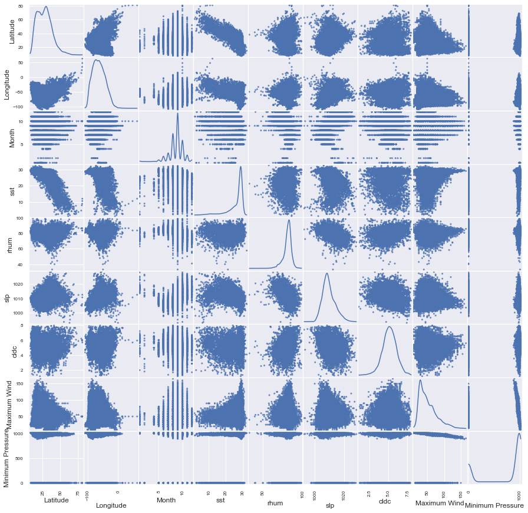
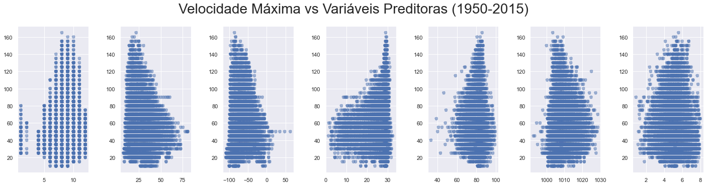
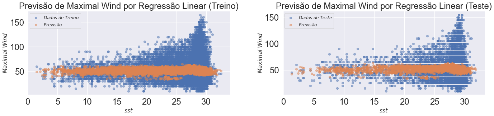
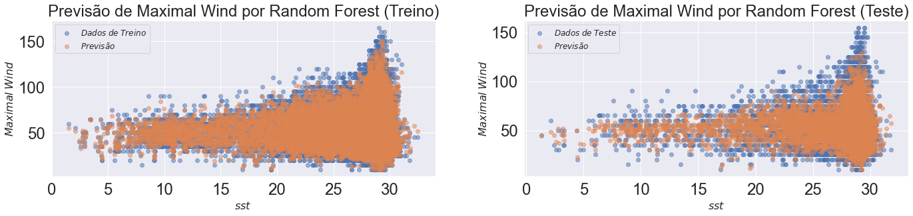
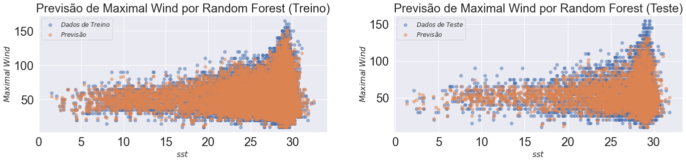
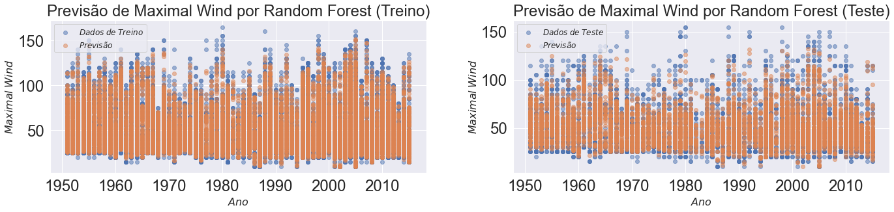
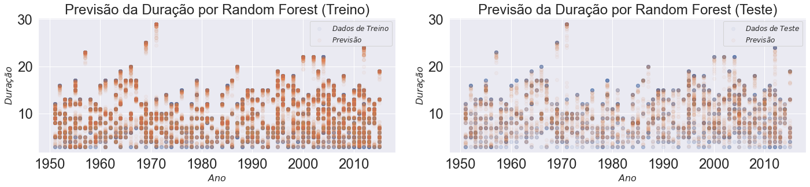
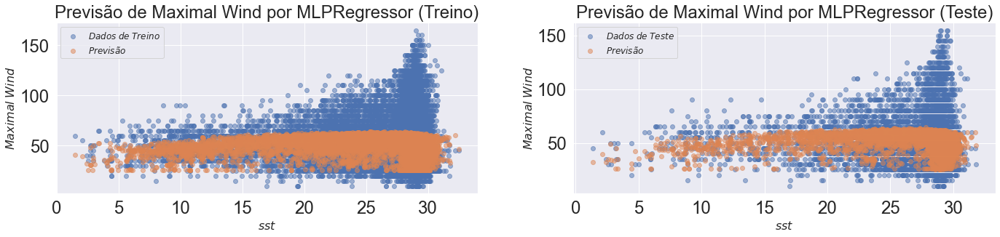

# Aplicação de Modelos de Regressão

[Notebook referência](https://github.com/reneroliveira/Hurricane_Project/blob/master/Notebooks/Analises_variaveis.ipynb)

Nesta página iremos mostrar os diversos algoritmos aplicados aos dados visando ajustar uma boa regressão que ajudasse a prever as velocidades dos ventos de um determinado evento (Tropical Storm ou Hurricane) ou a duração dos mesmos.
Algumas pequenas transformações foram necessárias para ajuste das variáveis preditoras a serem consideradas em cada modelo. Para detalhes sobre o carregamento e preparação dos dados, veja o notebook referência.


## Análises Iniciais

Segue abaixo o resultado da aplicação de uma regressão linear simples usando como variável alvo a velocidade de vento, dado usado em vários indicadores de destrutibilidade. Interessante notar os parâmetros com coeficientes positivos.


<details>
<summary>Código</summary>
```python
X_train2 = sm.add_constant(X_train) #np.array(X_train).reshape(X_train.shape[0],1)
OLS_obj = OLS(y_train_mw, X_train2)
OLSModel = OLS_obj.fit()

r2_train = OLSModel.rsquared

print(f'R^2_train = {r2_train}')

print(f'Parâmetro_const  = {OLSModel.params[0]}')
print(f'Parâmetro_Year  = {OLSModel.params[1]}')
print(f'Parâmetro_Month  = {OLSModel.params[2]}')
print(f'Parâmetro_Latitude  = {OLSModel.params[3]}')
print(f'Parâmetro_Longitude  = {OLSModel.params[4]}')
print(f'Parâmetro_sst  = {OLSModel.params[5]}')
print(f'Parâmetro_rhum  = {OLSModel.params[6]}')
print(f'Parâmetro_wspd  = {OLSModel.params[7]}')
print(f'Parâmetro_slp  = {OLSModel.params[8]}')
print(f'Parâmetro_cldc  = {OLSModel.params[9]}')

```
</details>

    R^2_train = 0.02385621171100183
    Parâmetro_const  = 47.35464784180999
    Parâmetro_Year  = 0.09050506606867095
    Parâmetro_Month  = -0.05872870746380546
    Parâmetro_Latitude  = -0.08576970286238517
    Parâmetro_Longitude  = 1.880119707824508
    Parâmetro_sst  = 0.15179194438994867
    Parâmetro_rhum  = 0.028283243122749335
    Parâmetro_wspd  = 0.028283243122749446
    Parâmetro_slp  = 0.14971356534654948
    Parâmetro_cldc  = -1.5161434590996923


Os códigos abaixos nos geram visualizações que podem trazer insights a respeito da relação entre as variáveis. A escolha das variáveis preditoras que servem de entrada para os modelos mais a frente foram pensadas também pela observação destes gráficos.


<details>
<summary>Código</summary>
```python
df = pd.concat([X_train, y_train_mw, y_train_mp], axis=1)
scatter_matrix(df, alpha=0.8, figsize=(15, 15), diagonal='kde');

```
</details>




<details>
<summary>Código</summary>
```python
# A princípio, não queremos que se faça alguma previsão com base no valor numérico do ano
# Além disso, a variável wspd está altamente correlacionada com a rhum, podendo ser mantida apenas a última
X_train = data_atl_merged.drop(['Year', 'wspd'], 1)

#   Mês      Latitude    Longitude    Temperatura, Umidade, Sea Level Pressure, Cloudiness]
# ['Month', 'Latitude', 'Longitude', 'sst',       'rhum',  'slp',              'cldc']

fig, ax = plt.subplots(1,7)#, figsize=(16,10))
fig.suptitle('Velocidade Máxima vs Variáveis Preditoras (1950-2015)', fontsize=28, y=1.06)

ax[0].scatter(X_train['Month'], X_train['Maximum Wind'], alpha = 0.5, ls = '--') 
ax[1].scatter(X_train['Latitude'], X_train['Maximum Wind'], alpha = 0.5, ls = '--') 
ax[2].scatter(X_train['Longitude'], X_train['Maximum Wind'], alpha = 0.5, ls = '--') 
ax[3].scatter(X_train['sst'], X_train['Maximum Wind'], alpha = 0.5, ls = '--') 
ax[4].scatter(X_train['rhum'], X_train['Maximum Wind'], alpha = 0.5, ls = '--') 
ax[5].scatter(X_train['slp'], X_train['Maximum Wind'], alpha = 0.5, ls = '--') 
ax[6].scatter(X_train['cldc'], X_train['Maximum Wind'], alpha = 0.5, ls = '--') 

fig.set_figheight(5)
fig.set_figwidth(20)
fig.tight_layout(pad=2.0)
```
</details>




Uma primeira tentativa de ajuste foi feito através da centralização das variáveis preditoras em relação à média, adicionando também termos polinomiais de segunda ordem. No entanto, os resultados do ajuste não mostraram ganhos significativos para o modelo de Regressão Linear Múltipla, e até prejudicaram modelos mais complexos, como Random Forest, Multi Layer Perceptron, entre outros utilizados mais a frente. Detalhes desta parte do código acesse o notebook referência, no link do início desta página.


## Modelos com Separação em Conjuntos de Treino e Teste

Separamos os dados em conjuntos de treino e de teste. Deste modo, podemos ajustar o algoritmo utilizando os dados de treino, e tentar utilizar esses dados de teste para previsão de outros dados, inclusive futuros.


### Regressão Linear

<details>
<summary>Código</summary>
```python
X_train2 = sm.add_constant(X_train) #np.array(X_train).reshape(X_train.shape[0],1)
X_test2 = sm.add_constant(X_test) #np.array(X_train).reshape(X_train.shape[0],1)
OLS_obj = OLS(y_train_mw, X_train2)
OLSModel = OLS_obj.fit()

r2_train = OLSModel.rsquared
r2_test = 1 - ((OLSModel.predict(X_test2)-y_test_mw)*(OLSModel.predict(X_test2)-y_test_mw)).sum() / ((y_test_mw.mean()-y_test_mw)*(y_test_mw.mean()-y_test_mw)).sum()
print(f'R^2_train = {r2_train}')
print(f'R^2_test  = {r2_test}')
'''
print(f'Parâmetro_const  = {OLSModel.params[0]}')
print(f'Parâmetro_Month  = {OLSModel.params[1]}')
print(f'Parâmetro_Latitude  = {OLSModel.params[2]}')
print(f'Parâmetro_Longitude  = {OLSModel.params[3]}')
print(f'Parâmetro_sst  = {OLSModel.params[4]}')
print(f'Parâmetro_rhum  = {OLSModel.params[5]}')
print(f'Parâmetro_slp  = {OLSModel.params[6]}')
print(f'Parâmetro_cldc  = {OLSModel.params[7]}')

print(f'Parâmetro_Month^2  = {OLSModel.params[8]}')
print(f'Parâmetro_Latitude^2  = {OLSModel.params[9]}')
print(f'Parâmetro_Longitude^2  = {OLSModel.params[10]}')
print(f'Parâmetro_sst^2  = {OLSModel.params[11]}')
print(f'Parâmetro_rhum^2  = {OLSModel.params[12]}')
print(f'Parâmetro_slp^2  = {OLSModel.params[13]}')
print(f'Parâmetro_cldc^2  = {OLSModel.params[14]}')
'''
```
</details>

    R^2_train = 0.019806236602926464
    R^2_test  = 0.01874952522766249


Veja abaixo as previsões:





### Random Forest

Pelos ajustes feitos no notebook com os dados completos usando Random Forest, vimos que esse algoritmo promove um bom ajuste nos dados. Um novo ajuste com aplicação de parâmetros melhor sintonizados com os dados é buscado pelo código abaixo.


<details>
<summary>Código - Random Forest</summary>
```python
# Parâmetros com bom ajuste para Random Forest: n_estimators = 50, max_depth = 75
for i in [25, 50, 75, 100, 125]:
    for j in [25, 50, 75, 100, 125]:
        regr_rf = RandomForestRegressor(n_estimators=i, max_depth=j, random_state=0, oob_score=True, bootstrap = True)
        regr_rf.fit(X_train, y_train_mw)

```
</details>


O R2 Score obtido mostra o melhor ajuste do modelo quando tentamos prever a Velocidade Máxima Sustentada pelo algoritmo do Random Forest. O ajuste aos dados de treino (0.93) fica bem superior aos de teste (0.52). Isso se deve em parte porque os dados se dão em grupos de registros, associados aos eventos de furacões. Assim, um algoritmo acaba por detectar a correlação dos dados dentro de um mesmo evento e busca ajustá-los de modo específico no conjunto de treinamento. No conjunto de teste, quando algum dado se encontra "distante" dos registros que foram utilizados, ele acaba não tendo o mesmo ajuste.


Retirando os dados climáticos, observamos que o ajuste fica bem pior, (Treino - 0.86 e Teste - 0.06) mostrando a importância dos mesmos para a predição. Fizemos mais alguns fits, que podem ser consultados no notebook referência.


**Ajuste da predição em relação à variável sst (temperatura mensal média)**





### Demais Previsões com Random Forest (Melhor Ajuste)

Adicionando as variáveis Ano e Dia, conseguimos melhorar significativamente a capacidade de previsão do nosso modelo (Treino - 0.95 e Teste - 0.66).
Se adicionarmos primeiramente apenas a variável Ano, percebemos que cada variável contribui um pouco para a melhoria da previsão.

Fizemos também um ajuste fino dos parâmetros do Random Forest, de forma a encontrar os valores ótimos para os mesmos. 


   


O melhor ajuste para previsão de Maximal Wind ocorreu com número de árvores (num_estimators) igual a 50 e uma profundidade máxima (max_depth) também igual a 50.

Veja abaixo código, os resultados de R2 e visualizações:

<details>
<summary>Código</summary>
```python
regr_rf2 = RandomForestRegressor(n_estimators=50, max_depth=50, random_state=0, oob_score=True, bootstrap = True)
regr_rf2.fit(data_train, data_train_mw)
print(regr_rf2.score(data_train, data_train_mw))
print(regr_rf2.score(data_test, data_test_mw))
```
</detail>

    0.9629951225598822
    0.7593567448937373








### Previsão da duração dos eventos de Furacão


Fizemos também a previsão da duração de um Furacão. O ajuste fica bem preciso, como se pode ver pelo R2 Score

<details>
<summary>Code</summary>
```python
regr_rf3 = RandomForestRegressor(n_estimators=50, max_depth=75, random_state=0, oob_score=True, bootstrap = True)
regr_rf3.fit(data_train2, data_train_dur)
print(regr_rf3.score(data_train2, data_train_dur))
print(regr_rf3.score(data_test2, data_test_dur))
```
</details>


    0.9883397102866289
    0.9289716458290775




### Multi Layer Perceptron

<details>
<summary>Código </summary>
```python
regr_mlp = MLPRegressor(hidden_layer_sizes=(100,2), random_state=1, max_iter=1000, solver='lbfgs', activation='relu').fit(X_train, y_train_mw)
#regr.predict(X_test[:2])
print(regr_mlp.score(X_train, y_train_mw))
print(regr_mlp.score(X_test, y_test_mw))
```
</details>


    0.09520915346048042
    0.08725614810614979


```python
fig, ax = plt.subplots(1,2)#, figsize=(16,10))
#fig.suptitle('Velocidade Máxima vs Pressão Mínima (1851-2015)', fontsize=28, y=1.06)

ax[0].scatter(X_train['sst'], y_train_mw, alpha=0.5, label=r'$Dados$ $de$ $Treino$')
ax[0].scatter(X_train['sst'], regr_mlp.predict(X_train), alpha=0.5, label=r'$Previsão$')
ax[1].scatter(X_test['sst'], y_test_mw, alpha=0.5, label=r'$Dados$ $de$ $Teste$')
ax[1].scatter(X_test['sst'], regr_mlp.predict(X_test), alpha=0.5, label=r'$Previsão$')

ax[0].tick_params(labelsize=24)
ax[0].set_title(f'Previsão de Maximal Wind por MLPRegressor (Treino)', fontsize=24)
ax[0].set_xlabel(r'$sst$', fontsize=16)
ax[0].set_ylabel(r'$Maximal$ $Wind$', fontsize=16)
ax[0].legend(loc='best', fontsize=12);

ax[1].tick_params(labelsize=24)
ax[1].set_title(f'Previsão de Maximal Wind por MLPRegressor (Teste)', fontsize=24)
ax[1].set_xlabel(r'$sst$', fontsize=16)
ax[1].set_ylabel(r'$Maximal$ $Wind$', fontsize=16)
ax[1].legend(loc='best', fontsize=12);

fig.set_figheight(5)
fig.set_figwidth(20)
fig.tight_layout(pad=2.0)
```





### Support Vector Machine


```python
regr_svr = svm.SVR()
regr_svr.fit(X_train, y_train_mw)
print(regr_svr.score(X_train, y_train_mw))
print(regr_svr.score(X_test, y_test_mw))
```

    -0.06514630260669341
    -0.058505019763586796


### Modelos com Escala Padronizada


```python
# Padronização da Escala
scaler = StandardScaler()  # doctest: +SKIP
scaler.fit(X_train)  # doctest: +SKIP
X_train_std = scaler.transform(X_train)  # doctest: +SKIP
X_test_std = scaler.transform(X_test)
```


```python
regr_svr_std = svm.SVR()
regr_svr_std.fit(X_train_std, y_train_mw)
print(regr_svr_std.score(X_train_std, y_train_mw))
print(regr_svr_std.score(X_test_std, y_test_mw))
```

    0.07772469466765619
    0.07604328404370786


```python
regr_mlp_std = MLPRegressor(hidden_layer_sizes=(100,2), random_state=1, max_iter=1000, solver='lbfgs', activation='relu').fit(X_train, y_train_mw)
#regr.predict(X_test[:2])
print(regr_mlp_std.score(X_train_std, y_train_mw))
print(regr_mlp_std.score(X_test_std, y_test_mw))
```

    /home/gambitura/anaconda3/lib/python3.8/site-packages/sklearn/neural_network/_multilayer_perceptron.py:471: ConvergenceWarning: lbfgs failed to converge (status=1):
    STOP: TOTAL NO. of ITERATIONS REACHED LIMIT.
    
    Increase the number of iterations (max_iter) or scale the data as shown in:
        https://scikit-learn.org/stable/modules/preprocessing.html
      self.n_iter_ = _check_optimize_result("lbfgs", opt_res, self.max_iter)


    -4.16270156850149
    -4.153096948726193


```python
regr_rf_std= RandomForestRegressor(n_estimators=50, max_depth=75, random_state=0, oob_score=True, bootstrap = True)
regr_rf_std.fit(X_train_std, y_train_mw)
print(regr_rf_std.score(X_train_std, y_train_mw))
print(regr_rf_std.score(X_test_std, y_test_mw))
```

    0.9298162379440262
    0.5220914993160997

