# Exploração, Limpeza dos dados e Visualizações

Trabalharemos com três datasets. O primeiro é um subconjunto do [ICOADS](https://icoads.noaa.gov/) (International Comprehensive Ocean-Atmosphere Data Set) fornecido pela [NOAA](noaa.gov) (National Oceanic and Atmospheric Administration) que possui vários dados climáticos de cobertura mensal, desde 1800 até o presente, e com abrangência marítima; Possui dados como temperatura do mar, umidade, pressão, cobertura de nuvens, velocidade de vento, etc.

Na célula abaixo, há um código que baixa o subconjunto que usaremos diretamente da fonte oficial. Não colocamos estes arquivos no GitHub por conta do limite de tamanho imposto sobre os uploads/commits.


```python
# !sh ../download_data.sh
```

O segundo grande conjunto de dados é o [HURDAT2](https://www.kaggle.com/noaa/hurricane-database) cuja fonte oficial é a [NHC](www.nhc.noaa.gov) (National Hurricane Center), divisão da NOAA responsável pelos furações e tempestades.

Os dados do Kaggle fornecem dados de tempestades e furacões desde o século XIX até 2015 no pacífico e atlântico, mas iremos focar nossa análise no dadaset do atlântico.

O terceiro, é um dado com o índice PDI, mas ele já vem da fonte em boas condições e não necessita de limpeza. Veja mais no notebook [PowerDissipationIndex.ipynb](https://github.com/reneroliveira/Hurricane_Project/blob/master/PowerDissipationIndex.ipynb).


```python
## Imports

%matplotlib inline
import numpy as np
import matplotlib.pyplot as plt
import matplotlib.colors as c
from mpl_toolkits.basemap import Basemap,shiftgrid
import pandas as pd
import netCDF4 as nc
from math import sin, cos, sqrt, atan2, radians

import scipy
import geopy
import xarray
import networkx
import requests
import cartopy
import tropycal

import tropycal.tracks as tracks
import tropycal.tornado as tornado
import datetime as dt

import statsmodels.api as sm
from statsmodels.api import OLS
```

## Dataset ICOADS

Vamos analisar os dados baixados acima. O formato .nc é legível ao python através da biblioteca netCDF4 que está nos pré-requisitos. Além disso, serão necessárias instalar os pacotes abaixo; Descomente a célula, execute-a e dê um "Restart Runtime" no Jupyter. Certifique-se que instalou todos os pré-requisitos do arquivo "requirements.txt".


```python
# !apt-get install libgeos-3.5.0
# !apt-get install libgeos-dev
# !pip install https://github.com/matplotlib/basemap/archive/master.zip
```

### Análise de dados faltantes


```python
sst_mean = nc.Dataset('../Datasets/sst.mean.nc','r')
rhum_mean = nc.Dataset('../Datasets/rhum.mean.nc','r')
wspd_mean = nc.Dataset('../Datasets/wspd.mean.nc','r')
slp_mean = nc.Dataset('../Datasets/slp.mean.nc','r')
vwnd_mean = nc.Dataset('../Datasets/vwnd.mean.nc','r')
cldc_mean = nc.Dataset("../Datasets/cldc.mean.nc",'r')

lats = sst_mean.variables['lat'][:]
lons = sst_mean.variables['lon'][:]
time = sst_mean.variables['time'][:]

sst = sst_mean.variables['sst'][:,:,:]
rhum = rhum_mean.variables['rhum'][:,:,:]
wspd = wspd_mean.variables['wspd'][:,:,:]
slp = slp_mean.variables['slp'][:,:,:]
vwnd = vwnd_mean.variables['vwnd'][:,:,:]
cldc = cldc_mean.variables['cldc'][:,:,:]

sst_mean.close()
wspd_mean.close()
rhum_mean.close()
slp_mean.close()
vwnd_mean.close()
cldc_mean.close()

period = pd.date_range(start = "1800-01-01",end = "2020-07-01", freq = "MS").to_pydatetime().tolist()

def get_missing(data:list,labels:list)->dict:
    missing={}
    lenght = data[0].shape[0]
    for j,item in enumerate(data):
        missing[labels[j]] = []
        for i in range(lenght):
            missing[labels[j]].append(100*np.sum(item[i].mask)/item[i].data.size)
    return missing

missing = get_missing([sst,wspd,rhum,slp,vwnd,cldc],['sst','wspd','rhum','slp','vwnd','cldc'])

fig,ax = plt.subplots(1,1,figsize=(10,4))

ax.set_title("Dados Faltantes - Global",fontsize=15)
ax.set_xlabel("Ano",fontsize=12)
ax.set_ylabel("% de dados faltantes",fontsize=12)
for key,value in missing.items():
    ax.plot(period,missing[key],label=key)
ax.legend(loc='best',fontsize=12);
fig.savefig('../figs/missing-global.png')
plt.show()

print(type(sst))
```


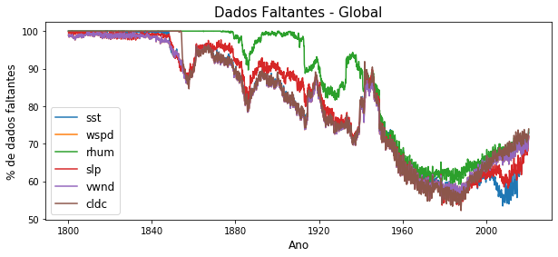


    <class 'numpy.ma.core.MaskedArray'>


__Legenda:__

- sst: Sea Surface Temperature (Temperatura na superfície do mar)
- wspd: Scalar Wind Speed (Velocidade de vento escalar)
- rhum: Relative Humidity (Umidade relativa)
- slp: Sea Level Pressure (Pressão no nível do mar)
- vwnd: V-wind component (Componente V-wind)
- cldc: Cloudiness (Nebulosidade das nuvens)


Como os continentes representam aproximadamente $29,1\%$ da suferfície terrestre e nossos dados só preenchem os oceanos, os continentes são preenchidos como dados inexistentes. Então naturalmente nossa cota inferior de dados faltantes é essa porcentagem.

Note que os dados lidos vem no formato de "numpy masked array" que tem um atributo "mask" que é indicadora de dado faltante, isso nos ajudará a lidar com esses dados.

Como vemos no plot acima temos várias décadas com níveis de dados faltantes acima de $90\%$ mas vamos analisar focadamente e atlântico norte, que é nossa região de estudos.


```python
sst_at = sst[:,34:40,51:82] #10°-20°N, 80°-20°W
wspd_at = wspd[:,34:40,51:82]
rhum_at = rhum[:,34:40,51:82]
slp_at = slp[:,34:40,51:82]
vwnd_at = vwnd[:,34:40,51:82]
cldc_at = cldc[:,34:40,51:82]

# sst_pac = sst[:,14:45,0:41] #0°-60°N, 100°W-180°W
# wspd_pac = wspd[:,14:45,0:41]
# rhum_pac = rhum[:,14:45,0:41]

missing_at = get_missing([sst_at,wspd_at,rhum_at,slp_at,vwnd_at,cldc_at],['sst_at','wspd_at','rhum_at','slp_at','vwnd_at','cldc_at'])
# missing_pac = get_missing([sst_pac,wspd_pac,rhum_pac],['sst_pac','wspd_pac','rhum_pac'])

# fig,(ax,ax1) = plt.subplots(2,1,figsize=(10,8))
fig,ax = plt.subplots(1,1,figsize=(10,4))
ax.set_title("Dados Faltantes - Atlântico Norte MDR*",fontsize=15)
ax.set_xlabel("Ano",fontsize=12)
ax.set_ylabel("% de dados faltantes",fontsize=12)
for key,value in missing_at.items():
    ax.plot(period,missing_at[key],label=key[0:-3])
plt.axvline(x=period[1860],label = "Jan/1955",color = 'black', lw=3,ls='--')

ax.legend(loc='best',fontsize=12);
fig.savefig('../figs/missing_mdr.png')
```


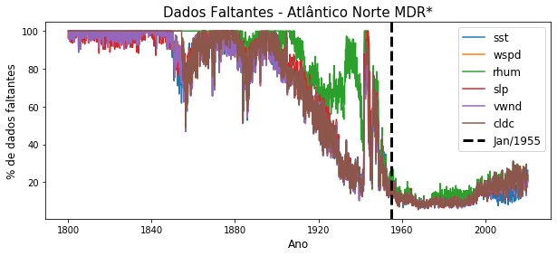


\*MDR é a abreviação de _Main Development Region_ ou região central de desenvolvimento dos furacões no Atlântico Norte e se refere à faixa 10°-20°N, 80°-20°W.

Vemos que a partir de 1950-1960, os dados começam a ficar mais completos na região de estudos. Então, para entender a relação as variáveis, iremos trabalhar a partir desta data.

Entretanto, nada nos impede de usar os dados mais antigos, já que as medições não variam muito quando estão perto, se quisermos trabalhar com tendências de longo prazo podemos cortar os dados a partir de 1920, trabalhar com a média das regiões estudadas, mesmo que com $~70\%$ de dados faltantes. Isso pois temos a array indicadora, que pode ajudar em modelos, e também essa porcentagem é um pouco mais baixa devido às faixas continentais considaradas no corte de coordenadas.

Abaixo temos um exemplo de como os dados de temperatura estão distribuídos em Janeiro de 1955 

### Visualização


```python
#Transforms longitude ranges from [0,360] para [-180,180] --> useful for plot

sst[:],lonsn = shiftgrid(180,sst[:],lons,start=False)
wspd[:],lonsn = shiftgrid(180,wspd[:],lons,start=False)
# shum[:],lonsn = shiftgrid(180,shum[:],lons,start=False)
rhum[:],lonsn = shiftgrid(180,rhum[:],lons,start=False)
lons = lonsn
```


```python
#Reference: https://annefou.github.io/metos_python/04-plotting/
time_index = 1860

fig = plt.figure(figsize=[12,15])
ax = fig.add_subplot(1, 1, 1)
ax.set_title("sst: {}".format(period[time_index].date()),fontsize=16)
map = Basemap(projection='cyl',llcrnrlat=-90,urcrnrlat=90,\
            llcrnrlon=-180,urcrnrlon=180,resolution='c', ax=ax)
map.drawcoastlines()
map.fillcontinents(color='#ffe2ab')

map.drawparallels(np.arange(-90.,120.,30.),labels=[1,0,0,0])
map.drawmeridians(np.arange(-180.,180.,60.),labels=[0,0,0,1])


llons, llats = np.meshgrid(lons, lats)
x,y = map(llons,llats)


cmap = c.ListedColormap(['#35978f','#ffffcc','#ffeda0','#fed976','#feb24c','#fd8d3c',
                        '#fc4e2a','#e31a1c','#bd0026','#800026'])
bounds=list(np.arange(-5,37,1))
# bounds=list(np.arange(10,100,5))
norm = c.BoundaryNorm(bounds, ncolors=cmap.N)

cs = map.contourf(x,y,sst[time_index], cmap=cmap, norm=norm, levels=bounds)
fig.colorbar(cs, cmap=cmap, norm=norm, boundaries=bounds, ticks=bounds, ax=ax, orientation='horizontal');

plt.savefig('../figs/sst_1955.png')
```


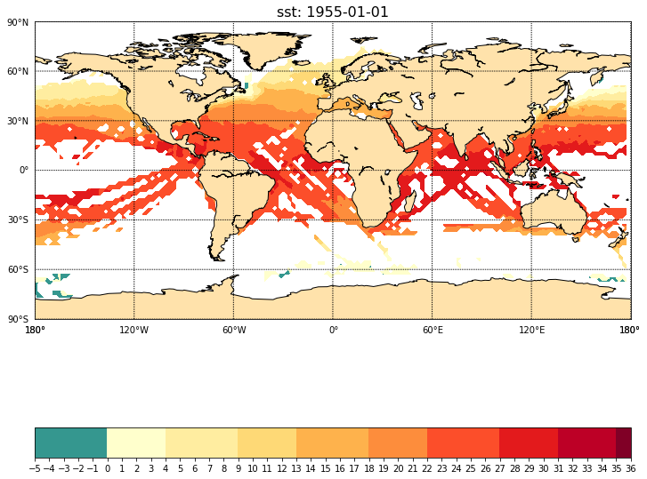


### Agregação dos Dados MDR

Criaremos a seguir uma dataframe com as médias espaciais da região MDR, para análise futura com o PDI. Usamos essa média baseados na premissa razoável de que nesse corte espacial da MDR do atlântico os valores não variam muito dentro de um mês. Fazemos essa médias para análises de mais longo prazo como podem ver no notebook do [PDI](https://github.com/reneroliveira/Hurricane_Project/blob/master/PowerDissipationIndex.ipynb).


```python
print(period[1860]) # -- Jan/1955
def get_mean(data):
    size = data.shape[0]
    new = np.array([])
    for i in range(size):
        new = np.append(new,np.mean(data[i,:,:]))
    return new

#Começaremos do índice 1788, representando Janeiro de 1949, para corresponder com os dados de PDI.
data_at = pd.DataFrame(get_mean(sst_at[1788:,:,:]),columns =["sst"])
period_df = pd.DataFrame(period[1788:],columns = ["Date"])
period_df['Year']=period_df.Date.map(lambda x: x.year)
period_df['Month']=period_df.Date.map(lambda x: x.month)
data_at['rhum'] = pd.DataFrame(get_mean(rhum_at[1788:,:,:]),columns =["rhum"])
data_at['slp'] = pd.DataFrame(get_mean(slp_at[1788:,:,:]),columns =["slp"])
data_at['wspd'] = pd.DataFrame(get_mean(wspd_at[1788:,:,:]),columns =["wspd"])
data_at['vwnd'] = pd.DataFrame(get_mean(vwnd_at[1788:,:,:]),columns =["vwnd"])
data_at['cldc'] = pd.DataFrame(get_mean(cldc_at[1788:,:,:]),columns =["cldc"])

atlantic_mdr = pd.concat([period_df,data_at],axis=1)


#Código que calcula desvios da temperatura do mar em relação à média histórica
#Apenas para visualização
cum_sum = {}
for i in range(1,13):
    cum_sum[i]=0
k=0 #year count
for i in range(0,atlantic_mdr.shape[0]-12):
    month = atlantic_mdr.iloc[i,:].Month
    if month%12==1:
        k+=1
    cum_sum[month]+=atlantic_mdr.iloc[i,3]
    atlantic_mdr.loc[atlantic_mdr.index[i],'sst_anomaly'] = atlantic_mdr.iloc[i,3]-cum_sum[month]/k
atlantic_mdr.drop('sst_anomaly',axis=1).to_csv('../Datasets/atlantic_mdr.csv',index=False)
atlantic_mdr.iloc[12:24,:]
```

    1955-01-01 00:00:00


<div>
<style scoped>
    .dataframe tbody tr th:only-of-type {
        vertical-align: middle;
    }

    .dataframe tbody tr th {
        vertical-align: top;
    }

    .dataframe thead th {
        text-align: right;
    }
</style>
<table border="1" class="dataframe">
  <thead>
    <tr style="text-align: right;">
      <th></th>
      <th>Date</th>
      <th>Year</th>
      <th>Month</th>
      <th>sst</th>
      <th>rhum</th>
      <th>slp</th>
      <th>wspd</th>
      <th>vwnd</th>
      <th>cldc</th>
      <th>sst_anomaly</th>
    </tr>
  </thead>
  <tbody>
    <tr>
      <th>12</th>
      <td>1950-01-01</td>
      <td>1950</td>
      <td>1</td>
      <td>24.782794</td>
      <td>75.675756</td>
      <td>1012.699219</td>
      <td>7.800527</td>
      <td>-2.709708</td>
      <td>4.139401</td>
      <td>-0.138282</td>
    </tr>
    <tr>
      <th>13</th>
      <td>1950-02-01</td>
      <td>1950</td>
      <td>2</td>
      <td>24.251776</td>
      <td>78.633936</td>
      <td>1012.883875</td>
      <td>6.583213</td>
      <td>-2.401613</td>
      <td>3.965875</td>
      <td>-0.129778</td>
    </tr>
    <tr>
      <th>14</th>
      <td>1950-03-01</td>
      <td>1950</td>
      <td>3</td>
      <td>24.395219</td>
      <td>78.334148</td>
      <td>1013.134516</td>
      <td>6.621354</td>
      <td>-2.062759</td>
      <td>4.087092</td>
      <td>-0.020090</td>
    </tr>
    <tr>
      <th>15</th>
      <td>1950-04-01</td>
      <td>1950</td>
      <td>4</td>
      <td>24.900423</td>
      <td>77.248673</td>
      <td>1011.096354</td>
      <td>5.958877</td>
      <td>-0.454326</td>
      <td>3.146995</td>
      <td>-0.010952</td>
    </tr>
    <tr>
      <th>16</th>
      <td>1950-05-01</td>
      <td>1950</td>
      <td>5</td>
      <td>25.355377</td>
      <td>79.638362</td>
      <td>1010.577563</td>
      <td>6.486837</td>
      <td>0.516981</td>
      <td>4.291411</td>
      <td>-0.061999</td>
    </tr>
    <tr>
      <th>17</th>
      <td>1950-06-01</td>
      <td>1950</td>
      <td>6</td>
      <td>26.110960</td>
      <td>81.022388</td>
      <td>1009.393293</td>
      <td>6.946026</td>
      <td>2.076482</td>
      <td>4.650387</td>
      <td>0.087756</td>
    </tr>
    <tr>
      <th>18</th>
      <td>1950-07-01</td>
      <td>1950</td>
      <td>7</td>
      <td>26.516357</td>
      <td>80.354432</td>
      <td>1007.978285</td>
      <td>6.342278</td>
      <td>2.375750</td>
      <td>5.184904</td>
      <td>-0.070533</td>
    </tr>
    <tr>
      <th>19</th>
      <td>1950-08-01</td>
      <td>1950</td>
      <td>8</td>
      <td>27.312561</td>
      <td>81.914887</td>
      <td>1007.856950</td>
      <td>5.279884</td>
      <td>1.956808</td>
      <td>5.109233</td>
      <td>-0.081636</td>
    </tr>
    <tr>
      <th>20</th>
      <td>1950-09-01</td>
      <td>1950</td>
      <td>9</td>
      <td>27.811223</td>
      <td>80.212305</td>
      <td>1007.869104</td>
      <td>4.947030</td>
      <td>0.525868</td>
      <td>5.305648</td>
      <td>-0.057075</td>
    </tr>
    <tr>
      <th>21</th>
      <td>1950-10-01</td>
      <td>1950</td>
      <td>10</td>
      <td>27.702060</td>
      <td>80.523185</td>
      <td>1010.697798</td>
      <td>4.656318</td>
      <td>-1.037250</td>
      <td>4.423469</td>
      <td>-0.026328</td>
    </tr>
    <tr>
      <th>22</th>
      <td>1950-11-01</td>
      <td>1950</td>
      <td>11</td>
      <td>27.303333</td>
      <td>81.614127</td>
      <td>1009.745018</td>
      <td>5.103683</td>
      <td>-2.024746</td>
      <td>3.765682</td>
      <td>0.058410</td>
    </tr>
    <tr>
      <th>23</th>
      <td>1950-12-01</td>
      <td>1950</td>
      <td>12</td>
      <td>26.351468</td>
      <td>77.828336</td>
      <td>1012.071718</td>
      <td>5.696333</td>
      <td>-4.750430</td>
      <td>4.100716</td>
      <td>0.117639</td>
    </tr>
  </tbody>
</table>
</div>


```python
fig,ax = plt.subplots(1,1,figsize=(12,5))

ax.plot(np.arange(1949,2021,1),atlantic_mdr.groupby(['Year']).agg({'sst_anomaly':np.mean})['sst_anomaly'])
ax.set_title("Desvios na temperatura do mar em relação à média histórica",fontsize=14)
ax.set_xlabel("Ano",fontsize=12)
ax.set_ylabel("Desvio da temperatura",fontsize=12);

```


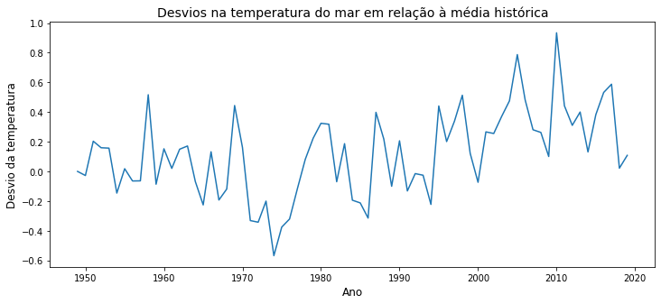


Podemos ver que após 1970-1980 inicia-se uma tendência crescente de aumento de temperatura do mar em relação à média histórica.


```python
corr = atlantic_mdr.corr()
corr.style.background_gradient(cmap='coolwarm')
```


<style  type="text/css" >
    #T_f64d8f40_eb28_11ea_88a4_cdafc426433brow0_col0 {
            background-color:  #b40426;
            color:  #f1f1f1;
        }    #T_f64d8f40_eb28_11ea_88a4_cdafc426433brow0_col1 {
            background-color:  #9dbdff;
            color:  #000000;
        }    #T_f64d8f40_eb28_11ea_88a4_cdafc426433brow0_col2 {
            background-color:  #d6dce4;
            color:  #000000;
        }    #T_f64d8f40_eb28_11ea_88a4_cdafc426433brow0_col3 {
            background-color:  #b9d0f9;
            color:  #000000;
        }    #T_f64d8f40_eb28_11ea_88a4_cdafc426433brow0_col4 {
            background-color:  #d6dce4;
            color:  #000000;
        }    #T_f64d8f40_eb28_11ea_88a4_cdafc426433brow0_col5 {
            background-color:  #f4987a;
            color:  #000000;
        }    #T_f64d8f40_eb28_11ea_88a4_cdafc426433brow0_col6 {
            background-color:  #c9d7f0;
            color:  #000000;
        }    #T_f64d8f40_eb28_11ea_88a4_cdafc426433brow0_col7 {
            background-color:  #dfdbd9;
            color:  #000000;
        }    #T_f64d8f40_eb28_11ea_88a4_cdafc426433brow0_col8 {
            background-color:  #bcd2f7;
            color:  #000000;
        }    #T_f64d8f40_eb28_11ea_88a4_cdafc426433brow1_col0 {
            background-color:  #536edd;
            color:  #000000;
        }    #T_f64d8f40_eb28_11ea_88a4_cdafc426433brow1_col1 {
            background-color:  #b40426;
            color:  #f1f1f1;
        }    #T_f64d8f40_eb28_11ea_88a4_cdafc426433brow1_col2 {
            background-color:  #e36b54;
            color:  #000000;
        }    #T_f64d8f40_eb28_11ea_88a4_cdafc426433brow1_col3 {
            background-color:  #f7ba9f;
            color:  #000000;
        }    #T_f64d8f40_eb28_11ea_88a4_cdafc426433brow1_col4 {
            background-color:  #7ea1fa;
            color:  #000000;
        }    #T_f64d8f40_eb28_11ea_88a4_cdafc426433brow1_col5 {
            background-color:  #4055c8;
            color:  #f1f1f1;
        }    #T_f64d8f40_eb28_11ea_88a4_cdafc426433brow1_col6 {
            background-color:  #e5d8d1;
            color:  #000000;
        }    #T_f64d8f40_eb28_11ea_88a4_cdafc426433brow1_col7 {
            background-color:  #f2cbb7;
            color:  #000000;
        }    #T_f64d8f40_eb28_11ea_88a4_cdafc426433brow1_col8 {
            background-color:  #3b4cc0;
            color:  #f1f1f1;
        }    #T_f64d8f40_eb28_11ea_88a4_cdafc426433brow2_col0 {
            background-color:  #82a6fb;
            color:  #000000;
        }    #T_f64d8f40_eb28_11ea_88a4_cdafc426433brow2_col1 {
            background-color:  #e7745b;
            color:  #000000;
        }    #T_f64d8f40_eb28_11ea_88a4_cdafc426433brow2_col2 {
            background-color:  #b40426;
            color:  #f1f1f1;
        }    #T_f64d8f40_eb28_11ea_88a4_cdafc426433brow2_col3 {
            background-color:  #ee8669;
            color:  #000000;
        }    #T_f64d8f40_eb28_11ea_88a4_cdafc426433brow2_col4 {
            background-color:  #5977e3;
            color:  #000000;
        }    #T_f64d8f40_eb28_11ea_88a4_cdafc426433brow2_col5 {
            background-color:  #3b4cc0;
            color:  #f1f1f1;
        }    #T_f64d8f40_eb28_11ea_88a4_cdafc426433brow2_col6 {
            background-color:  #f7b194;
            color:  #000000;
        }    #T_f64d8f40_eb28_11ea_88a4_cdafc426433brow2_col7 {
            background-color:  #f7a688;
            color:  #000000;
        }    #T_f64d8f40_eb28_11ea_88a4_cdafc426433brow2_col8 {
            background-color:  #a7c5fe;
            color:  #000000;
        }    #T_f64d8f40_eb28_11ea_88a4_cdafc426433brow3_col0 {
            background-color:  #3b4cc0;
            color:  #f1f1f1;
        }    #T_f64d8f40_eb28_11ea_88a4_cdafc426433brow3_col1 {
            background-color:  #eed0c0;
            color:  #000000;
        }    #T_f64d8f40_eb28_11ea_88a4_cdafc426433brow3_col2 {
            background-color:  #f18f71;
            color:  #000000;
        }    #T_f64d8f40_eb28_11ea_88a4_cdafc426433brow3_col3 {
            background-color:  #b40426;
            color:  #f1f1f1;
        }    #T_f64d8f40_eb28_11ea_88a4_cdafc426433brow3_col4 {
            background-color:  #4257c9;
            color:  #f1f1f1;
        }    #T_f64d8f40_eb28_11ea_88a4_cdafc426433brow3_col5 {
            background-color:  #4257c9;
            color:  #f1f1f1;
        }    #T_f64d8f40_eb28_11ea_88a4_cdafc426433brow3_col6 {
            background-color:  #d85646;
            color:  #000000;
        }    #T_f64d8f40_eb28_11ea_88a4_cdafc426433brow3_col7 {
            background-color:  #ead5c9;
            color:  #000000;
        }    #T_f64d8f40_eb28_11ea_88a4_cdafc426433brow3_col8 {
            background-color:  #445acc;
            color:  #f1f1f1;
        }    #T_f64d8f40_eb28_11ea_88a4_cdafc426433brow4_col0 {
            background-color:  #6485ec;
            color:  #000000;
        }    #T_f64d8f40_eb28_11ea_88a4_cdafc426433brow4_col1 {
            background-color:  #3b4cc0;
            color:  #f1f1f1;
        }    #T_f64d8f40_eb28_11ea_88a4_cdafc426433brow4_col2 {
            background-color:  #3b4cc0;
            color:  #f1f1f1;
        }    #T_f64d8f40_eb28_11ea_88a4_cdafc426433brow4_col3 {
            background-color:  #3b4cc0;
            color:  #f1f1f1;
        }    #T_f64d8f40_eb28_11ea_88a4_cdafc426433brow4_col4 {
            background-color:  #b40426;
            color:  #f1f1f1;
        }    #T_f64d8f40_eb28_11ea_88a4_cdafc426433brow4_col5 {
            background-color:  #e1dad6;
            color:  #000000;
        }    #T_f64d8f40_eb28_11ea_88a4_cdafc426433brow4_col6 {
            background-color:  #3b4cc0;
            color:  #f1f1f1;
        }    #T_f64d8f40_eb28_11ea_88a4_cdafc426433brow4_col7 {
            background-color:  #3b4cc0;
            color:  #f1f1f1;
        }    #T_f64d8f40_eb28_11ea_88a4_cdafc426433brow4_col8 {
            background-color:  #6788ee;
            color:  #000000;
        }    #T_f64d8f40_eb28_11ea_88a4_cdafc426433brow5_col0 {
            background-color:  #f7b497;
            color:  #000000;
        }    #T_f64d8f40_eb28_11ea_88a4_cdafc426433brow5_col1 {
            background-color:  #445acc;
            color:  #f1f1f1;
        }    #T_f64d8f40_eb28_11ea_88a4_cdafc426433brow5_col2 {
            background-color:  #6384eb;
            color:  #000000;
        }    #T_f64d8f40_eb28_11ea_88a4_cdafc426433brow5_col3 {
            background-color:  #82a6fb;
            color:  #000000;
        }    #T_f64d8f40_eb28_11ea_88a4_cdafc426433brow5_col4 {
            background-color:  #f4c5ad;
            color:  #000000;
        }    #T_f64d8f40_eb28_11ea_88a4_cdafc426433brow5_col5 {
            background-color:  #b40426;
            color:  #f1f1f1;
        }    #T_f64d8f40_eb28_11ea_88a4_cdafc426433brow5_col6 {
            background-color:  #a1c0ff;
            color:  #000000;
        }    #T_f64d8f40_eb28_11ea_88a4_cdafc426433brow5_col7 {
            background-color:  #b2ccfb;
            color:  #000000;
        }    #T_f64d8f40_eb28_11ea_88a4_cdafc426433brow5_col8 {
            background-color:  #4b64d5;
            color:  #f1f1f1;
        }    #T_f64d8f40_eb28_11ea_88a4_cdafc426433brow6_col0 {
            background-color:  #4b64d5;
            color:  #f1f1f1;
        }    #T_f64d8f40_eb28_11ea_88a4_cdafc426433brow6_col1 {
            background-color:  #c3d5f4;
            color:  #000000;
        }    #T_f64d8f40_eb28_11ea_88a4_cdafc426433brow6_col2 {
            background-color:  #f6bda2;
            color:  #000000;
        }    #T_f64d8f40_eb28_11ea_88a4_cdafc426433brow6_col3 {
            background-color:  #d95847;
            color:  #000000;
        }    #T_f64d8f40_eb28_11ea_88a4_cdafc426433brow6_col4 {
            background-color:  #3b4cc0;
            color:  #f1f1f1;
        }    #T_f64d8f40_eb28_11ea_88a4_cdafc426433brow6_col5 {
            background-color:  #5e7de7;
            color:  #000000;
        }    #T_f64d8f40_eb28_11ea_88a4_cdafc426433brow6_col6 {
            background-color:  #b40426;
            color:  #f1f1f1;
        }    #T_f64d8f40_eb28_11ea_88a4_cdafc426433brow6_col7 {
            background-color:  #dedcdb;
            color:  #000000;
        }    #T_f64d8f40_eb28_11ea_88a4_cdafc426433brow6_col8 {
            background-color:  #3e51c5;
            color:  #f1f1f1;
        }    #T_f64d8f40_eb28_11ea_88a4_cdafc426433brow7_col0 {
            background-color:  #a2c1ff;
            color:  #000000;
        }    #T_f64d8f40_eb28_11ea_88a4_cdafc426433brow7_col1 {
            background-color:  #edd2c3;
            color:  #000000;
        }    #T_f64d8f40_eb28_11ea_88a4_cdafc426433brow7_col2 {
            background-color:  #f6a283;
            color:  #000000;
        }    #T_f64d8f40_eb28_11ea_88a4_cdafc426433brow7_col3 {
            background-color:  #f2c9b4;
            color:  #000000;
        }    #T_f64d8f40_eb28_11ea_88a4_cdafc426433brow7_col4 {
            background-color:  #688aef;
            color:  #000000;
        }    #T_f64d8f40_eb28_11ea_88a4_cdafc426433brow7_col5 {
            background-color:  #9ebeff;
            color:  #000000;
        }    #T_f64d8f40_eb28_11ea_88a4_cdafc426433brow7_col6 {
            background-color:  #efcfbf;
            color:  #000000;
        }    #T_f64d8f40_eb28_11ea_88a4_cdafc426433brow7_col7 {
            background-color:  #b40426;
            color:  #f1f1f1;
        }    #T_f64d8f40_eb28_11ea_88a4_cdafc426433brow7_col8 {
            background-color:  #455cce;
            color:  #f1f1f1;
        }    #T_f64d8f40_eb28_11ea_88a4_cdafc426433brow8_col0 {
            background-color:  #cbd8ee;
            color:  #000000;
        }    #T_f64d8f40_eb28_11ea_88a4_cdafc426433brow8_col1 {
            background-color:  #9bbcff;
            color:  #000000;
        }    #T_f64d8f40_eb28_11ea_88a4_cdafc426433brow8_col2 {
            background-color:  #efcfbf;
            color:  #000000;
        }    #T_f64d8f40_eb28_11ea_88a4_cdafc426433brow8_col3 {
            background-color:  #cdd9ec;
            color:  #000000;
        }    #T_f64d8f40_eb28_11ea_88a4_cdafc426433brow8_col4 {
            background-color:  #e2dad5;
            color:  #000000;
        }    #T_f64d8f40_eb28_11ea_88a4_cdafc426433brow8_col5 {
            background-color:  #a6c4fe;
            color:  #000000;
        }    #T_f64d8f40_eb28_11ea_88a4_cdafc426433brow8_col6 {
            background-color:  #cedaeb;
            color:  #000000;
        }    #T_f64d8f40_eb28_11ea_88a4_cdafc426433brow8_col7 {
            background-color:  #b5cdfa;
            color:  #000000;
        }    #T_f64d8f40_eb28_11ea_88a4_cdafc426433brow8_col8 {
            background-color:  #b40426;
            color:  #f1f1f1;
        }</style><table id="T_f64d8f40_eb28_11ea_88a4_cdafc426433b" ><thead>    <tr>        <th class="blank level0" ></th>        <th class="col_heading level0 col0" >Year</th>        <th class="col_heading level0 col1" >Month</th>        <th class="col_heading level0 col2" >sst</th>        <th class="col_heading level0 col3" >rhum</th>        <th class="col_heading level0 col4" >slp</th>        <th class="col_heading level0 col5" >wspd</th>        <th class="col_heading level0 col6" >vwnd</th>        <th class="col_heading level0 col7" >cldc</th>        <th class="col_heading level0 col8" >sst_anomaly</th>    </tr></thead><tbody>
                <tr>
                        <th id="T_f64d8f40_eb28_11ea_88a4_cdafc426433blevel0_row0" class="row_heading level0 row0" >Year</th>
                        <td id="T_f64d8f40_eb28_11ea_88a4_cdafc426433brow0_col0" class="data row0 col0" >1.000000</td>
                        <td id="T_f64d8f40_eb28_11ea_88a4_cdafc426433brow0_col1" class="data row0 col1" >-0.010203</td>
                        <td id="T_f64d8f40_eb28_11ea_88a4_cdafc426433brow0_col2" class="data row0 col2" >0.145686</td>
                        <td id="T_f64d8f40_eb28_11ea_88a4_cdafc426433brow0_col3" class="data row0 col3" >-0.098235</td>
                        <td id="T_f64d8f40_eb28_11ea_88a4_cdafc426433brow0_col4" class="data row0 col4" >0.048908</td>
                        <td id="T_f64d8f40_eb28_11ea_88a4_cdafc426433brow0_col5" class="data row0 col5" >0.646453</td>
                        <td id="T_f64d8f40_eb28_11ea_88a4_cdafc426433brow0_col6" class="data row0 col6" >-0.035567</td>
                        <td id="T_f64d8f40_eb28_11ea_88a4_cdafc426433brow0_col7" class="data row0 col7" >0.241832</td>
                        <td id="T_f64d8f40_eb28_11ea_88a4_cdafc426433brow0_col8" class="data row0 col8" >0.379038</td>
            </tr>
            <tr>
                        <th id="T_f64d8f40_eb28_11ea_88a4_cdafc426433blevel0_row1" class="row_heading level0 row1" >Month</th>
                        <td id="T_f64d8f40_eb28_11ea_88a4_cdafc426433brow1_col0" class="data row1 col0" >-0.010203</td>
                        <td id="T_f64d8f40_eb28_11ea_88a4_cdafc426433brow1_col1" class="data row1 col1" >1.000000</td>
                        <td id="T_f64d8f40_eb28_11ea_88a4_cdafc426433brow1_col2" class="data row1 col2" >0.762722</td>
                        <td id="T_f64d8f40_eb28_11ea_88a4_cdafc426433brow1_col3" class="data row1 col3" >0.392842</td>
                        <td id="T_f64d8f40_eb28_11ea_88a4_cdafc426433brow1_col4" class="data row1 col4" >-0.434216</td>
                        <td id="T_f64d8f40_eb28_11ea_88a4_cdafc426433brow1_col5" class="data row1 col5" >-0.385048</td>
                        <td id="T_f64d8f40_eb28_11ea_88a4_cdafc426433brow1_col6" class="data row1 col6" >0.151316</td>
                        <td id="T_f64d8f40_eb28_11ea_88a4_cdafc426433brow1_col7" class="data row1 col7" >0.380311</td>
                        <td id="T_f64d8f40_eb28_11ea_88a4_cdafc426433brow1_col8" class="data row1 col8" >-0.017207</td>
            </tr>
            <tr>
                        <th id="T_f64d8f40_eb28_11ea_88a4_cdafc426433blevel0_row2" class="row_heading level0 row2" >sst</th>
                        <td id="T_f64d8f40_eb28_11ea_88a4_cdafc426433brow2_col0" class="data row2 col0" >0.145686</td>
                        <td id="T_f64d8f40_eb28_11ea_88a4_cdafc426433brow2_col1" class="data row2 col1" >0.762722</td>
                        <td id="T_f64d8f40_eb28_11ea_88a4_cdafc426433brow2_col2" class="data row2 col2" >1.000000</td>
                        <td id="T_f64d8f40_eb28_11ea_88a4_cdafc426433brow2_col3" class="data row2 col3" >0.635370</td>
                        <td id="T_f64d8f40_eb28_11ea_88a4_cdafc426433brow2_col4" class="data row2 col4" >-0.632031</td>
                        <td id="T_f64d8f40_eb28_11ea_88a4_cdafc426433brow2_col5" class="data row2 col5" >-0.416486</td>
                        <td id="T_f64d8f40_eb28_11ea_88a4_cdafc426433brow2_col6" class="data row2 col6" >0.432498</td>
                        <td id="T_f64d8f40_eb28_11ea_88a4_cdafc426433brow2_col7" class="data row2 col7" >0.559898</td>
                        <td id="T_f64d8f40_eb28_11ea_88a4_cdafc426433brow2_col8" class="data row2 col8" >0.312656</td>
            </tr>
            <tr>
                        <th id="T_f64d8f40_eb28_11ea_88a4_cdafc426433blevel0_row3" class="row_heading level0 row3" >rhum</th>
                        <td id="T_f64d8f40_eb28_11ea_88a4_cdafc426433brow3_col0" class="data row3 col0" >-0.098235</td>
                        <td id="T_f64d8f40_eb28_11ea_88a4_cdafc426433brow3_col1" class="data row3 col1" >0.392842</td>
                        <td id="T_f64d8f40_eb28_11ea_88a4_cdafc426433brow3_col2" class="data row3 col2" >0.635370</td>
                        <td id="T_f64d8f40_eb28_11ea_88a4_cdafc426433brow3_col3" class="data row3 col3" >1.000000</td>
                        <td id="T_f64d8f40_eb28_11ea_88a4_cdafc426433brow3_col4" class="data row3 col4" >-0.768182</td>
                        <td id="T_f64d8f40_eb28_11ea_88a4_cdafc426433brow3_col5" class="data row3 col5" >-0.380635</td>
                        <td id="T_f64d8f40_eb28_11ea_88a4_cdafc426433brow3_col6" class="data row3 col6" >0.803748</td>
                        <td id="T_f64d8f40_eb28_11ea_88a4_cdafc426433brow3_col7" class="data row3 col7" >0.305508</td>
                        <td id="T_f64d8f40_eb28_11ea_88a4_cdafc426433brow3_col8" class="data row3 col8" >0.014696</td>
            </tr>
            <tr>
                        <th id="T_f64d8f40_eb28_11ea_88a4_cdafc426433blevel0_row4" class="row_heading level0 row4" >slp</th>
                        <td id="T_f64d8f40_eb28_11ea_88a4_cdafc426433brow4_col0" class="data row4 col0" >0.048908</td>
                        <td id="T_f64d8f40_eb28_11ea_88a4_cdafc426433brow4_col1" class="data row4 col1" >-0.434216</td>
                        <td id="T_f64d8f40_eb28_11ea_88a4_cdafc426433brow4_col2" class="data row4 col2" >-0.632031</td>
                        <td id="T_f64d8f40_eb28_11ea_88a4_cdafc426433brow4_col3" class="data row4 col3" >-0.768182</td>
                        <td id="T_f64d8f40_eb28_11ea_88a4_cdafc426433brow4_col4" class="data row4 col4" >1.000000</td>
                        <td id="T_f64d8f40_eb28_11ea_88a4_cdafc426433brow4_col5" class="data row4 col5" >0.317397</td>
                        <td id="T_f64d8f40_eb28_11ea_88a4_cdafc426433brow4_col6" class="data row4 col6" >-0.812037</td>
                        <td id="T_f64d8f40_eb28_11ea_88a4_cdafc426433brow4_col7" class="data row4 col7" >-0.548567</td>
                        <td id="T_f64d8f40_eb28_11ea_88a4_cdafc426433brow4_col8" class="data row4 col8" >0.129542</td>
            </tr>
            <tr>
                        <th id="T_f64d8f40_eb28_11ea_88a4_cdafc426433blevel0_row5" class="row_heading level0 row5" >wspd</th>
                        <td id="T_f64d8f40_eb28_11ea_88a4_cdafc426433brow5_col0" class="data row5 col0" >0.646453</td>
                        <td id="T_f64d8f40_eb28_11ea_88a4_cdafc426433brow5_col1" class="data row5 col1" >-0.385048</td>
                        <td id="T_f64d8f40_eb28_11ea_88a4_cdafc426433brow5_col2" class="data row5 col2" >-0.416486</td>
                        <td id="T_f64d8f40_eb28_11ea_88a4_cdafc426433brow5_col3" class="data row5 col3" >-0.380635</td>
                        <td id="T_f64d8f40_eb28_11ea_88a4_cdafc426433brow5_col4" class="data row5 col4" >0.317397</td>
                        <td id="T_f64d8f40_eb28_11ea_88a4_cdafc426433brow5_col5" class="data row5 col5" >1.000000</td>
                        <td id="T_f64d8f40_eb28_11ea_88a4_cdafc426433brow5_col6" class="data row5 col6" >-0.253309</td>
                        <td id="T_f64d8f40_eb28_11ea_88a4_cdafc426433brow5_col7" class="data row5 col7" >0.007404</td>
                        <td id="T_f64d8f40_eb28_11ea_88a4_cdafc426433brow5_col8" class="data row5 col8" >0.040588</td>
            </tr>
            <tr>
                        <th id="T_f64d8f40_eb28_11ea_88a4_cdafc426433blevel0_row6" class="row_heading level0 row6" >vwnd</th>
                        <td id="T_f64d8f40_eb28_11ea_88a4_cdafc426433brow6_col0" class="data row6 col0" >-0.035567</td>
                        <td id="T_f64d8f40_eb28_11ea_88a4_cdafc426433brow6_col1" class="data row6 col1" >0.151316</td>
                        <td id="T_f64d8f40_eb28_11ea_88a4_cdafc426433brow6_col2" class="data row6 col2" >0.432498</td>
                        <td id="T_f64d8f40_eb28_11ea_88a4_cdafc426433brow6_col3" class="data row6 col3" >0.803748</td>
                        <td id="T_f64d8f40_eb28_11ea_88a4_cdafc426433brow6_col4" class="data row6 col4" >-0.812037</td>
                        <td id="T_f64d8f40_eb28_11ea_88a4_cdafc426433brow6_col5" class="data row6 col5" >-0.253309</td>
                        <td id="T_f64d8f40_eb28_11ea_88a4_cdafc426433brow6_col6" class="data row6 col6" >1.000000</td>
                        <td id="T_f64d8f40_eb28_11ea_88a4_cdafc426433brow6_col7" class="data row6 col7" >0.236100</td>
                        <td id="T_f64d8f40_eb28_11ea_88a4_cdafc426433brow6_col8" class="data row6 col8" >-0.002599</td>
            </tr>
            <tr>
                        <th id="T_f64d8f40_eb28_11ea_88a4_cdafc426433blevel0_row7" class="row_heading level0 row7" >cldc</th>
                        <td id="T_f64d8f40_eb28_11ea_88a4_cdafc426433brow7_col0" class="data row7 col0" >0.241832</td>
                        <td id="T_f64d8f40_eb28_11ea_88a4_cdafc426433brow7_col1" class="data row7 col1" >0.380311</td>
                        <td id="T_f64d8f40_eb28_11ea_88a4_cdafc426433brow7_col2" class="data row7 col2" >0.559898</td>
                        <td id="T_f64d8f40_eb28_11ea_88a4_cdafc426433brow7_col3" class="data row7 col3" >0.305508</td>
                        <td id="T_f64d8f40_eb28_11ea_88a4_cdafc426433brow7_col4" class="data row7 col4" >-0.548567</td>
                        <td id="T_f64d8f40_eb28_11ea_88a4_cdafc426433brow7_col5" class="data row7 col5" >0.007404</td>
                        <td id="T_f64d8f40_eb28_11ea_88a4_cdafc426433brow7_col6" class="data row7 col6" >0.236100</td>
                        <td id="T_f64d8f40_eb28_11ea_88a4_cdafc426433brow7_col7" class="data row7 col7" >1.000000</td>
                        <td id="T_f64d8f40_eb28_11ea_88a4_cdafc426433brow7_col8" class="data row7 col8" >0.019122</td>
            </tr>
            <tr>
                        <th id="T_f64d8f40_eb28_11ea_88a4_cdafc426433blevel0_row8" class="row_heading level0 row8" >sst_anomaly</th>
                        <td id="T_f64d8f40_eb28_11ea_88a4_cdafc426433brow8_col0" class="data row8 col0" >0.379038</td>
                        <td id="T_f64d8f40_eb28_11ea_88a4_cdafc426433brow8_col1" class="data row8 col1" >-0.017207</td>
                        <td id="T_f64d8f40_eb28_11ea_88a4_cdafc426433brow8_col2" class="data row8 col2" >0.312656</td>
                        <td id="T_f64d8f40_eb28_11ea_88a4_cdafc426433brow8_col3" class="data row8 col3" >0.014696</td>
                        <td id="T_f64d8f40_eb28_11ea_88a4_cdafc426433brow8_col4" class="data row8 col4" >0.129542</td>
                        <td id="T_f64d8f40_eb28_11ea_88a4_cdafc426433brow8_col5" class="data row8 col5" >0.040588</td>
                        <td id="T_f64d8f40_eb28_11ea_88a4_cdafc426433brow8_col6" class="data row8 col6" >-0.002599</td>
                        <td id="T_f64d8f40_eb28_11ea_88a4_cdafc426433brow8_col7" class="data row8 col7" >0.019122</td>
                        <td id="T_f64d8f40_eb28_11ea_88a4_cdafc426433brow8_col8" class="data row8 col8" >1.000000</td>
            </tr>
    </tbody></table>


Alguma correlações fortes interessantes:
    
- Temperatura do mar (sst) com ano (Year)
- Temperatura do mar (sst) e umidade (rhum)
- Velocidade de vento (wspd) e ano (Year)
- Pressão (slp) e Umidade (rhum)

Análises mais aprofundadas dessas variáveis veremos no notebook de análise do PDI. 


```python
month_sst = atlantic_mdr.groupby('Month')['sst'].mean()
month_rhum = atlantic_mdr.groupby('Month')['rhum'].mean()
# month_slp = atlantic_mdr.groupby('Month')['slp'].mean()
# month_cldc = atlantic_mdr.groupby('Month')['cldc'].mean()

m = np.arange(1,13)
fig,ax = plt.subplots(1,1,figsize=(9,5))
ax.plot(month_sst,lw=3.5,color='blue',label = 'sst')
ax.set_xticks(m);
ax.set_xlabel("Mês",fontsize=14)
ax.set_ylabel("Média Histórica - SST",fontsize=14)

ax2 = ax.twinx()
ax2.plot(month_rhum,lw=3.5,color='orange',label = 'rhum')
ax2.set_ylabel("Média Histórica - Umidade",fontsize=14)
ax.legend(loc='best',fontsize=14);
ax2.legend(loc='upper left',fontsize=14);
plt.savefig("../figs/mensal_sst_rhum.jpg")
```


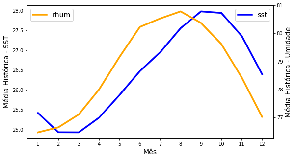


Veja acima que os picos de temperatura e umidade, coincidem razoavelmente com a temporada de furacões.


```python
month_slp = atlantic_mdr.groupby('Month')['slp'].mean()
month_cldc = atlantic_mdr.groupby('Month')['cldc'].mean()

m = np.arange(1,13)
fig,ax = plt.subplots(1,1,figsize=(9,5))
ax.plot(month_slp,lw=3.5,color='blue',label = 'slp')
ax.set_xticks(m);
ax.set_xlabel("Mês",fontsize=14)
ax.set_ylabel("Média Histórica - Pressão",fontsize=14)

ax2 = ax.twinx()
ax2.plot(month_cldc,lw=3.5,color='orange',label = 'cldc')
ax2.set_ylabel("Média Histórica - Nebulosidade",fontsize=14)
ax.legend(loc='best',fontsize=14);
ax2.legend(loc='lower left',fontsize=14);
plt.savefig("../figs/mensal_slp_cldc.jpg")
```


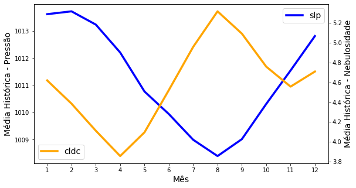


O pico de nebulosidade das nuvens também coincide de forma razoável com a temporada de furacões. Assim como os valores mais baixos de pressão. Essas características estão relacionadas com a formação do evento de tempestade forte ou furacão.

## Dataset HURDAT2 (Hurricane) - Análise e Limpeza

Passemos agora a analisar os dados de tempestades e furacões.


```python
# O foco principal do trabalho se dará nos dados do atlântico
data_atl = pd.read_csv('../Datasets/atlantic.csv',parse_dates=['Date'])
data_atl.dtypes
```


    ID                          object
    Name                        object
    Date                datetime64[ns]
    Time                         int64
    Event                       object
    Status                      object
    Latitude                    object
    Longitude                   object
    Maximum Wind                 int64
    Minimum Pressure             int64
    Low Wind NE                  int64
    Low Wind SE                  int64
    Low Wind SW                  int64
    Low Wind NW                  int64
    Moderate Wind NE             int64
    Moderate Wind SE             int64
    Moderate Wind SW             int64
    Moderate Wind NW             int64
    High Wind NE                 int64
    High Wind SE                 int64
    High Wind SW                 int64
    High Wind NW                 int64
    dtype: object


```python
# formatando dados de data
data_atl['Year'] = pd.DatetimeIndex(data_atl['Date']).year
data_atl['Month'] = pd.DatetimeIndex(data_atl['Date']).month
data_atl['Day'] = pd.DatetimeIndex(data_atl['Date']).day
print(data_atl.columns)
data_atl.head()
```

    Index(['ID', 'Name', 'Date', 'Time', 'Event', 'Status', 'Latitude',
           'Longitude', 'Maximum Wind', 'Minimum Pressure', 'Low Wind NE',
           'Low Wind SE', 'Low Wind SW', 'Low Wind NW', 'Moderate Wind NE',
           'Moderate Wind SE', 'Moderate Wind SW', 'Moderate Wind NW',
           'High Wind NE', 'High Wind SE', 'High Wind SW', 'High Wind NW', 'Year',
           'Month', 'Day'],
          dtype='object')


<div>
<style scoped>
    .dataframe tbody tr th:only-of-type {
        vertical-align: middle;
    }

    .dataframe tbody tr th {
        vertical-align: top;
    }

    .dataframe thead th {
        text-align: right;
    }
</style>
<table border="1" class="dataframe">
  <thead>
    <tr style="text-align: right;">
      <th></th>
      <th>ID</th>
      <th>Name</th>
      <th>Date</th>
      <th>Time</th>
      <th>Event</th>
      <th>Status</th>
      <th>Latitude</th>
      <th>Longitude</th>
      <th>Maximum Wind</th>
      <th>Minimum Pressure</th>
      <th>...</th>
      <th>Moderate Wind SE</th>
      <th>Moderate Wind SW</th>
      <th>Moderate Wind NW</th>
      <th>High Wind NE</th>
      <th>High Wind SE</th>
      <th>High Wind SW</th>
      <th>High Wind NW</th>
      <th>Year</th>
      <th>Month</th>
      <th>Day</th>
    </tr>
  </thead>
  <tbody>
    <tr>
      <th>0</th>
      <td>AL011851</td>
      <td>UNNAMED</td>
      <td>1851-06-25</td>
      <td>0</td>
      <td></td>
      <td>HU</td>
      <td>28.0N</td>
      <td>94.8W</td>
      <td>80</td>
      <td>-999</td>
      <td>...</td>
      <td>-999</td>
      <td>-999</td>
      <td>-999</td>
      <td>-999</td>
      <td>-999</td>
      <td>-999</td>
      <td>-999</td>
      <td>1851</td>
      <td>6</td>
      <td>25</td>
    </tr>
    <tr>
      <th>1</th>
      <td>AL011851</td>
      <td>UNNAMED</td>
      <td>1851-06-25</td>
      <td>600</td>
      <td></td>
      <td>HU</td>
      <td>28.0N</td>
      <td>95.4W</td>
      <td>80</td>
      <td>-999</td>
      <td>...</td>
      <td>-999</td>
      <td>-999</td>
      <td>-999</td>
      <td>-999</td>
      <td>-999</td>
      <td>-999</td>
      <td>-999</td>
      <td>1851</td>
      <td>6</td>
      <td>25</td>
    </tr>
    <tr>
      <th>2</th>
      <td>AL011851</td>
      <td>UNNAMED</td>
      <td>1851-06-25</td>
      <td>1200</td>
      <td></td>
      <td>HU</td>
      <td>28.0N</td>
      <td>96.0W</td>
      <td>80</td>
      <td>-999</td>
      <td>...</td>
      <td>-999</td>
      <td>-999</td>
      <td>-999</td>
      <td>-999</td>
      <td>-999</td>
      <td>-999</td>
      <td>-999</td>
      <td>1851</td>
      <td>6</td>
      <td>25</td>
    </tr>
    <tr>
      <th>3</th>
      <td>AL011851</td>
      <td>UNNAMED</td>
      <td>1851-06-25</td>
      <td>1800</td>
      <td></td>
      <td>HU</td>
      <td>28.1N</td>
      <td>96.5W</td>
      <td>80</td>
      <td>-999</td>
      <td>...</td>
      <td>-999</td>
      <td>-999</td>
      <td>-999</td>
      <td>-999</td>
      <td>-999</td>
      <td>-999</td>
      <td>-999</td>
      <td>1851</td>
      <td>6</td>
      <td>25</td>
    </tr>
    <tr>
      <th>4</th>
      <td>AL011851</td>
      <td>UNNAMED</td>
      <td>1851-06-25</td>
      <td>2100</td>
      <td>L</td>
      <td>HU</td>
      <td>28.2N</td>
      <td>96.8W</td>
      <td>80</td>
      <td>-999</td>
      <td>...</td>
      <td>-999</td>
      <td>-999</td>
      <td>-999</td>
      <td>-999</td>
      <td>-999</td>
      <td>-999</td>
      <td>-999</td>
      <td>1851</td>
      <td>6</td>
      <td>25</td>
    </tr>
  </tbody>
</table>
<p>5 rows × 25 columns</p>
</div>


```python
# Registro de Furacões é maior em determinada época do ano
print(data_atl.groupby(['Month'])['ID'].count())
```

    Month
    1       132
    2        13
    3        14
    4        81
    5       655
    6      2349
    7      3262
    8     10857
    9     18926
    10     9802
    11     2548
    12      466
    Name: ID, dtype: int64


```python
fig, ax = plt.subplots(1,1)#, figsize=(16,10))
fig.suptitle('Número de furações registrados por mês do ano', fontsize=28, y=1.06)

ax.bar(data_atl.groupby(['Month'])['Month'].mean(), data_atl.groupby(['Month'])['ID'].count(), ls = '--')
ax.tick_params(labelsize=24)
ax.set_title(f'Número de registros (1851-2015)', fontsize=24)
ax.set_xlabel(r'$Mês$', fontsize=16)
ax.set_ylabel(r'$Quantidade$', fontsize=16)
# ax.legend(loc='best', fontsize=12);

fig.set_figheight(5)
fig.set_figwidth(20)
fig.tight_layout(pad=2.0)

plt.savefig("../figs/furacoes_mes.jpg")
```


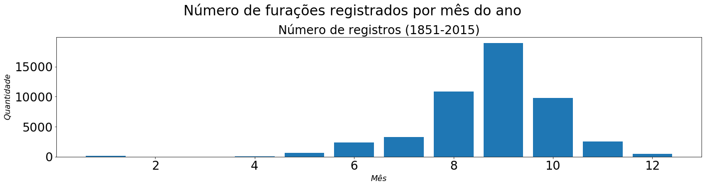


Período de furacões se concentra entre os meses de julho e novembro.
Isso deve estar relacionado com o período anterior (verão do hemisfério norte, onde acontece o maior número de casos)
O aquecimento das águas está intimamente ligado com a formação das massas de ar que ocasionam os furacões
Isso nos dá uma pista da forma de correlação temporal que devemos buscar para predizer os eventos


```python
## Formatação dos dados para plot pressao x vento
data_atl_ext = data_atl.copy()
data_atl_mwmp = data_atl.copy()
data_atl_mw = data_atl.copy()

ind_nan_ext = []
ind_nan_mwmp = []
ind_nan_mw = []
for l in range(len(data_atl)):
    if (data_atl_mw['Maximum Wind'][l] < 0):
        ind_nan_mw.append(l)
        ind_nan_mwmp.append(l)
        ind_nan_ext.append(l)
    elif (data_atl_mwmp['Minimum Pressure'][l] < 0):
        ind_nan_mwmp.append(l)
        ind_nan_ext.append(l)
    elif (min(data_atl_ext['Low Wind NE'][l], data_atl_ext['Low Wind SE'][l],
              data_atl_ext['Low Wind SW'][l], data_atl_ext['Low Wind NW'][l], 
              data_atl_ext['Moderate Wind NE'][l], data_atl_ext['Moderate Wind SE'][l],
              data_atl_ext['Moderate Wind SW'][l], data_atl_ext['Moderate Wind NW'][l], 
              data_atl_ext['High Wind NE'][l], data_atl_ext['High Wind SE'][l],
              data_atl_ext['High Wind SW'][l], data_atl_ext['High Wind NW'][l]) < 0):
        ind_nan_ext.append(l)
data_atl_ext = data_atl_ext.drop(ind_nan_ext, 0)
data_atl_mwmp = data_atl_mwmp.drop(ind_nan_mwmp, 0)
data_atl_mw = data_atl_mw.drop(ind_nan_mw, 0)

print(len(data_atl_ext))
print(len(data_atl_mwmp))
print(len(data_atl_mw))
```


    ---------------------------------------------------------------------------

    NameError                                 Traceback (most recent call last)

    <ipython-input-3-754270ff204f> in <module>
          1 ## Formatação dos dados para plot pressao x vento
    ----> 2 data_atl_ext = data_atl.copy()
          3 data_atl_mwmp = data_atl.copy()
          4 data_atl_mw = data_atl.copy()
          5 


    NameError: name 'data_atl' is not defined


```python
fig, ax = plt.subplots(1,1)#, figsize=(16,10))
#fig.suptitle('Velocidade Máxima vs Pressão Mínima (1851-2015)', fontsize=28, y=1.06)

ax.scatter(data_atl_mwmp['Minimum Pressure'], data_atl_mwmp['Maximum Wind'], alpha = 0.2, ls = '--') #, label=r'$Furacões$ $=$ $0$')
ax.tick_params(labelsize=24)
ax.set_title(f'Velocidade Máxima vs Pressão Mínima (1851-2015)', fontsize=24)
ax.set_xlabel(r'$Pressão Mínima$', fontsize=16)
ax.set_ylabel(r'$Velocidade Máxima$', fontsize=16)
# ax.legend(loc='best', fontsize=12);

fig.set_figheight(5)
fig.set_figwidth(20)
fig.tight_layout(pad=2.0)
plt.savefig('../figs/pressaoMin_Velo_max.jpg')
```


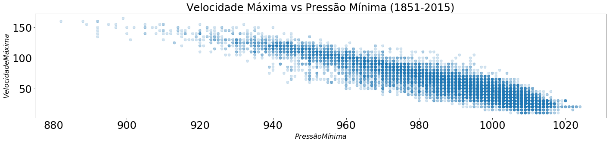


Abaixo formatamos as Latitudes e Longitudes para remover os terminadores W, E, N e S. Como indicador de hemisfério, usamos sinal negativo para sul e oeste e positovo para norte e leste. Precisaremos que esses dados sejam numericos para aplicações futuras e não textuais.


```python
data_atl[['Latitude','Longitude']].dtypes
```


    Latitude     object
    Longitude    object
    dtype: object


```python
data_atl.Latitude = data_atl.Latitude.apply(lambda x: -float(x.rstrip("S")) if x.endswith("S") else float(x.rstrip("N")))
data_atl.Longitude = data_atl.Longitude.apply(lambda x: -float(x.rstrip("W")) if x.endswith("W") else float(x.rstrip("E")))
data_atl[['Latitude','Longitude']].describe()
```


<div>
<style scoped>
    .dataframe tbody tr th:only-of-type {
        vertical-align: middle;
    }

    .dataframe tbody tr th {
        vertical-align: top;
    }

    .dataframe thead th {
        text-align: right;
    }
</style>
<table border="1" class="dataframe">
  <thead>
    <tr style="text-align: right;">
      <th></th>
      <th>Latitude</th>
      <th>Longitude</th>
    </tr>
  </thead>
  <tbody>
    <tr>
      <th>count</th>
      <td>49105.000000</td>
      <td>49105.000000</td>
    </tr>
    <tr>
      <th>mean</th>
      <td>27.044904</td>
      <td>-65.682533</td>
    </tr>
    <tr>
      <th>std</th>
      <td>10.077880</td>
      <td>19.687240</td>
    </tr>
    <tr>
      <th>min</th>
      <td>7.200000</td>
      <td>-359.100000</td>
    </tr>
    <tr>
      <th>25%</th>
      <td>19.100000</td>
      <td>-81.000000</td>
    </tr>
    <tr>
      <th>50%</th>
      <td>26.400000</td>
      <td>-68.000000</td>
    </tr>
    <tr>
      <th>75%</th>
      <td>33.100000</td>
      <td>-52.500000</td>
    </tr>
    <tr>
      <th>max</th>
      <td>81.000000</td>
      <td>63.000000</td>
    </tr>
  </tbody>
</table>
</div>


```python

X_train = data_atl.groupby(['Year'])['Year'].mean()
y_train = data_atl.groupby(['Year'])['ID'].count()
X_train2 = sm.add_constant(X_train) #np.array(X_train).reshape(X_train.shape[0],1)
OLS_obj = OLS(y_train, X_train2)
OLSModel = OLS_obj.fit()

r2_train = OLSModel.rsquared

print(f'R^2_train = {r2_train}')
#print(f'R^2_test  = {r2_test}')
print(f'Parâmetro_const  = {OLSModel.params[0]}')
print(f'Parâmetro_Year  = {OLSModel.params[1]}')

w0 = OLSModel.params[0] + 1850*OLSModel.params[1]
w1 = OLSModel.params[0] + 2015*OLSModel.params[1]

fig, ax = plt.subplots(1,1)#, figsize=(16,10))


ax.plot(data_atl.groupby(['Year'])['ID'].count(), ls = '--') 
ax.plot([1850, 2015], [w0, w1], ls = '-.') 
ax.tick_params(labelsize=24)
ax.set_title(f'Número de Furacões Anuais (1851-2015)', fontsize=24)
ax.set_xlabel(r'$Ano$', fontsize=16)
ax.set_ylabel(r'$Quantidade$', fontsize=16)
# ax.legend(loc='best', fontsize=12);

fig.set_figheight(5)
fig.set_figwidth(20)
fig.tight_layout(pad=2.0)
plt.savefig('../figs/numero_furacoes1851-2015.jpg')

```

    R^2_train = 0.40918060978409
    Parâmetro_const  = -3940.349139351199
    Parâmetro_Year  = 2.192423797184304


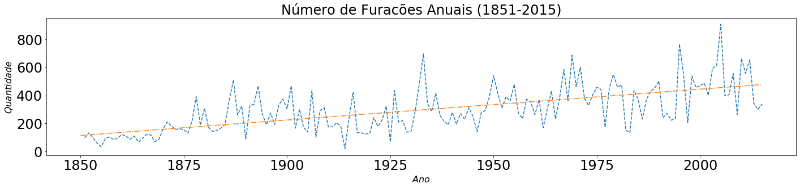


Vemos acima que o número de registro de furações tem crescido desde 1850, mas isso se deve à maior capacidade de detecção com o passar dos anos.


```python

X_train = data_atl_mw.groupby(['Year'])['Year'].mean()
y_train = data_atl_mw.groupby(['Year'])['Maximum Wind'].mean()
X_train2 = sm.add_constant(X_train)
OLS_obj = OLS(y_train, X_train2)
OLSModel = OLS_obj.fit()

r2_train = OLSModel.rsquared

print(f'R^2_train = {r2_train}')

print(f'Parâmetro_const  = {OLSModel.params[0]}')
print(f'Parâmetro_Year  = {OLSModel.params[1]}')

w0 = OLSModel.params[0] + 1850*OLSModel.params[1]
w1 = OLSModel.params[0] + 2015*OLSModel.params[1]

fig, ax = plt.subplots(1,1)#, figsize=(16,10))


ax.plot(data_atl_mw.groupby(['Year'])['Year'].mean(), data_atl_mw.groupby(['Year'])['Maximum Wind'].mean(), ls = '--')
ax.plot([1850, 2015], [w0, w1], ls = '-.') 
ax.tick_params(labelsize=24)
ax.set_title(f'Velocidade Máxima vs Ano (1851-2015)', fontsize=24)
ax.set_xlabel(r'$Ano$', fontsize=16)
ax.set_ylabel(r'$Velocidade Máxima$', fontsize=16)


fig.set_figheight(5)
fig.set_figwidth(20)
fig.tight_layout(pad=2.0)
plt.savefig('../figs/maxwind_1851-2015.jpg')

```

    R^2_train = 0.49772308255924613
    Parâmetro_const  = 345.3529584491673
    Parâmetro_Year  = -0.15025433346159078


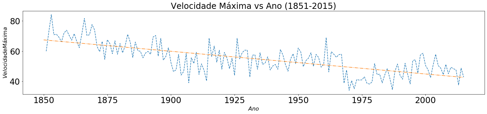


Vemos também que a velocidade máxima de vento sustentada pelos furacões reduziu, mas isso também se deve à maior capacidade de registro de eventos de pequeno porte, que acabam pesando a média para baixo. Assim, para não enviesar nossos dados, filtraremos os registros de pequeno porte; Consideramos apenas tempestades cuja duração em dias é maior que 2, e cuja classificação na escala [Saffir-Simpson](https://en.wikipedia.org/wiki/Saffir%E2%80%93Simpson_scale) seja no mínimo Tempestade Tropical.

Para essa classificação, a velocidade máxima sustentada de vento deve ultrapassar 63km/h o que equivale a 34 knots (milhas náuticas).


```python
#Filtro de Duração
data_atl_fdur = data_atl_mw.copy()
duration = data_atl_mw.groupby(['ID'])['Date'].max()-data_atl_mw.groupby(['ID'])['Date'].min()
duration.name = 'Duration'
#print(duration)
data_atl_fdur = pd.merge(data_atl_fdur, duration, how='inner', left_on='ID', right_index=True)
data_atl_fdur['Duration'] = pd.to_numeric(data_atl_fdur['Duration'].dt.days, downcast='integer')
data_atl_fdur = data_atl_fdur[data_atl_fdur['Duration'] > 2]
print(len(data_atl_fdur))
```

    46350


```python
#Filtro de Max_Windspeed
data_atl_fwind = data_atl_fdur.copy()
data_atl_fwind = data_atl_fwind[data_atl_fwind['Maximum Wind'] > 34]
print(len(data_atl_fwind))
```

    35696


Vejamos os novos plots com os dados filtrados:


```python
# Com o novo filtro, o viés do aumento no número de furacões ao longo dos anos reduziu, mas ainda há um aumento
# Isso mostra que essa tendência pode ser algo não viesada, e que gera preocupação pelo futuro
X_train = data_atl_fwind.groupby(['Year'])['Year'].mean()
y_train = data_atl_fwind.groupby(['Year'])['ID'].count()
X_train2 = sm.add_constant(X_train) 
OLS_obj = OLS(y_train, X_train2)
OLSModel = OLS_obj.fit()

r2_train = OLSModel.rsquared

print(f'R^2_train = {r2_train}')
#print(f'R^2_test  = {r2_test}')
print(f'Parâmetro_const  = {OLSModel.params[0]}')
print(f'Parâmetro_Year  = {OLSModel.params[1]}')

w0 = OLSModel.params[0] + 1850*OLSModel.params[1]
w1 = OLSModel.params[0] + 2015*OLSModel.params[1]

fig, ax = plt.subplots(1,1)

ax.plot(data_atl_fwind.groupby(['Year'])['ID'].count(), ls = '--') 
ax.plot([1850, 2015], [w0, w1], ls = '-.') 
ax.tick_params(labelsize=24)
ax.set_title(f'Número de Furacões Anuais (1851-2015)', fontsize=24)
ax.set_xlabel(r'$Ano$', fontsize=16)
ax.set_ylabel(r'$Quantidade$', fontsize=16)


fig.set_figheight(5)
fig.set_figwidth(20)
fig.tight_layout(pad=2.0)
plt.savefig('../figs/filtered_numero_furacoes1851-2015.jpg')
```

    R^2_train = 0.15573477903937427
    Parâmetro_const  = -1661.4327723310091
    Parâmetro_Year  = 0.9714289530628057


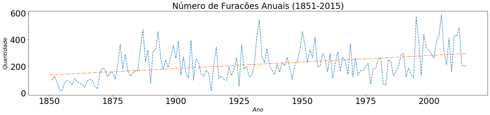


```python
X_train = data_atl_fwind.groupby(['Year'])['Year'].mean()
y_train = data_atl_fwind.groupby(['Year'])['Maximum Wind'].mean()
X_train2 = sm.add_constant(X_train) #np.array(X_train).reshape(X_train.shape[0],1)
OLS_obj = OLS(y_train, X_train2)
OLSModel = OLS_obj.fit()

r2_train = OLSModel.rsquared

print(f'R^2_train = {r2_train}')
#print(f'R^2_test  = {r2_test}')
print(f'Parâmetro_const  = {OLSModel.params[0]}')
print(f'Parâmetro_Year  = {OLSModel.params[1]}')

w0 = OLSModel.params[0] + 1850*OLSModel.params[1]
w1 = OLSModel.params[0] + 2015*OLSModel.params[1]

fig, ax = plt.subplots(1,1)#, figsize=(16,10))


ax.plot(data_atl_fwind.groupby(['Year'])['Year'].mean(), data_atl_fwind.groupby(['Year'])['Maximum Wind'].mean(), ls = '--') 
ax.plot([1850, 2015], [w0, w1], ls = '-.') #, label=r'$Furacões$ $=$ $0$')
ax.tick_params(labelsize=24)
ax.set_title(f'Velocidade Máxima vs Ano (1851-2015)', fontsize=24)
ax.set_xlabel(r'$Ano$', fontsize=16)
ax.set_ylabel(r'$Velocidade Máxima$', fontsize=16)

fig.set_figheight(5)
fig.set_figwidth(20)
fig.tight_layout(pad=2.0)
plt.savefig('../figs/filtered_maxwind_1851-2015.jpg')
```

    R^2_train = 0.11158706746149893
    Parâmetro_const  = 167.44362825887208
    Parâmetro_Year  = -0.05470982174808241


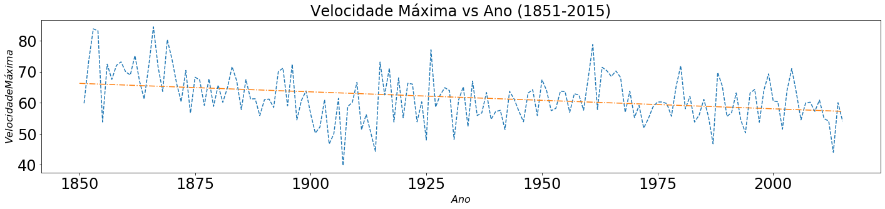


Com o novo filtro, o viés da redução da velocidade máxima sustentada de vento reduziu, quase para o nível constante
Isso pode significar que os filtros estão relativamente bem adequados para retirada do viés inicial dos dados.

Geraremos então um novo DataFrame com algums filtros importantes:

- Velocidade Máxima Sustentada > 34 milhas náuticas
- Duração > 2 dias
- Furacões a partir de 1950 (quando a capacidade de medição começa a evoluir

O código abaixo aplica esses filtros.


```python
data_atl_mw2 = data_atl.copy()

data_atl_mw2_filtrado3 = data_atl_mw2.copy()
Lat_min = data_atl_mw2_filtrado3.groupby(['ID'])['Latitude'].first()
Lat_min.name = 'Lat_min'

data_atl_mw2_filtrado3 = pd.merge(data_atl_mw2_filtrado3, Lat_min, how='inner', left_on='ID', right_index=True)

data_atl_mw2_filtrado3 = data_atl_mw2_filtrado3[abs(data_atl_mw2_filtrado3['Lat_min'] - 12.5) > 0]


Lon_min = data_atl_mw2_filtrado3.groupby(['ID'])['Longitude'].min()
Lon_min.name = 'Lon_min'

data_atl_mw2_filtrado3 = pd.merge(data_atl_mw2_filtrado3, Lon_min, how='inner', left_on='ID', right_index=True)
#print(data_atl_mw2_filtrado3)
data_atl_mw2_filtrado3 = data_atl_mw2_filtrado3[data_atl_mw2_filtrado3['Lon_min'] > -180]

Wind_max = data_atl_mw2_filtrado3.groupby(['ID'])['Maximum Wind'].max()
Wind_max.name = 'Wind_max'
#print(Wind_max)
data_atl_mw2_filtrado3 = pd.merge(data_atl_mw2_filtrado3, Wind_max, how='inner', on='ID')#left_on='ID', right_index=True)
#print(data_atl_mw2_filtrado3)
data_atl_mw2_filtrado3 = data_atl_mw2_filtrado3[data_atl_mw2_filtrado3['Wind_max'] > 34]

data_atl_mw2_filtrado3 = data_atl_mw2_filtrado3[data_atl_mw2_filtrado3['Year'] > 1950]

duration = data_atl_mw2_filtrado3.groupby(['ID'])['Date'].max()-data_atl_mw2_filtrado3.groupby(['ID'])['Date'].min()
duration.name = 'Duration'
#print(duration)
data_atl_mw2_filtrado3 = pd.merge(data_atl_mw2_filtrado3, duration, how='inner', left_on='ID', right_index=True)
data_atl_mw2_filtrado3['Duration'] = pd.to_numeric(data_atl_mw2_filtrado3['Duration'].dt.days, downcast='integer')
data_atl_mw2_filtrado3 = data_atl_mw2_filtrado3[data_atl_mw2_filtrado3['Duration'] > 2]

data_atl_mw2_filtrado3 = data_atl_mw2_filtrado3.drop(['Lat_min', 'Lon_min', 'Wind_max'], 1)
#data_atl_mw2_filtrado3.head()

print(len(data_atl_mw2_filtrado3))
print(len(data_atl.groupby(['ID'])['ID'].count()))
print(len(data_atl_mw2_filtrado3.groupby(['ID'])['ID'].count()))

print(len(data_atl))
print(len(data_atl_mw2))
data_atl_mw2_filtrado3.head()
```

    22386
    1814
    685
    49105
    49105


<div>
<style scoped>
    .dataframe tbody tr th:only-of-type {
        vertical-align: middle;
    }

    .dataframe tbody tr th {
        vertical-align: top;
    }

    .dataframe thead th {
        text-align: right;
    }
</style>
<table border="1" class="dataframe">
  <thead>
    <tr style="text-align: right;">
      <th></th>
      <th>ID</th>
      <th>Name</th>
      <th>Date</th>
      <th>Time</th>
      <th>Event</th>
      <th>Status</th>
      <th>Latitude</th>
      <th>Longitude</th>
      <th>Maximum Wind</th>
      <th>Minimum Pressure</th>
      <th>...</th>
      <th>Moderate Wind SW</th>
      <th>Moderate Wind NW</th>
      <th>High Wind NE</th>
      <th>High Wind SE</th>
      <th>High Wind SW</th>
      <th>High Wind NW</th>
      <th>Year</th>
      <th>Month</th>
      <th>Day</th>
      <th>Duration</th>
    </tr>
  </thead>
  <tbody>
    <tr>
      <th>21948</th>
      <td>AL011951</td>
      <td>UNNAMED</td>
      <td>1951-01-02</td>
      <td>1200</td>
      <td></td>
      <td>EX</td>
      <td>30.5</td>
      <td>-58.0</td>
      <td>50</td>
      <td>-999</td>
      <td>...</td>
      <td>-999</td>
      <td>-999</td>
      <td>-999</td>
      <td>-999</td>
      <td>-999</td>
      <td>-999</td>
      <td>1951</td>
      <td>1</td>
      <td>2</td>
      <td>10</td>
    </tr>
    <tr>
      <th>21949</th>
      <td>AL011951</td>
      <td>UNNAMED</td>
      <td>1951-01-02</td>
      <td>1800</td>
      <td></td>
      <td>EX</td>
      <td>29.9</td>
      <td>-56.8</td>
      <td>45</td>
      <td>-999</td>
      <td>...</td>
      <td>-999</td>
      <td>-999</td>
      <td>-999</td>
      <td>-999</td>
      <td>-999</td>
      <td>-999</td>
      <td>1951</td>
      <td>1</td>
      <td>2</td>
      <td>10</td>
    </tr>
    <tr>
      <th>21950</th>
      <td>AL011951</td>
      <td>UNNAMED</td>
      <td>1951-01-03</td>
      <td>0</td>
      <td></td>
      <td>EX</td>
      <td>29.0</td>
      <td>-55.7</td>
      <td>45</td>
      <td>-999</td>
      <td>...</td>
      <td>-999</td>
      <td>-999</td>
      <td>-999</td>
      <td>-999</td>
      <td>-999</td>
      <td>-999</td>
      <td>1951</td>
      <td>1</td>
      <td>3</td>
      <td>10</td>
    </tr>
    <tr>
      <th>21951</th>
      <td>AL011951</td>
      <td>UNNAMED</td>
      <td>1951-01-03</td>
      <td>600</td>
      <td></td>
      <td>EX</td>
      <td>27.5</td>
      <td>-54.8</td>
      <td>45</td>
      <td>-999</td>
      <td>...</td>
      <td>-999</td>
      <td>-999</td>
      <td>-999</td>
      <td>-999</td>
      <td>-999</td>
      <td>-999</td>
      <td>1951</td>
      <td>1</td>
      <td>3</td>
      <td>10</td>
    </tr>
    <tr>
      <th>21952</th>
      <td>AL011951</td>
      <td>UNNAMED</td>
      <td>1951-01-03</td>
      <td>1200</td>
      <td></td>
      <td>EX</td>
      <td>26.5</td>
      <td>-54.5</td>
      <td>45</td>
      <td>-999</td>
      <td>...</td>
      <td>-999</td>
      <td>-999</td>
      <td>-999</td>
      <td>-999</td>
      <td>-999</td>
      <td>-999</td>
      <td>1951</td>
      <td>1</td>
      <td>3</td>
      <td>10</td>
    </tr>
  </tbody>
</table>
<p>5 rows × 26 columns</p>
</div>


Uma limpeza final será feita nas entradas de texto:


```python
df = data_atl_mw2_filtrado3.copy()
np.unique(df.Name)[0:5],np.unique(df.Event),np.unique(df.Status)
```


    (array(['                AMY', '                ANA',
            '                BOB', '                DOG',
            '                DON'], dtype=object),
     array(['  ', ' C', ' G', ' I', ' L', ' P', ' R', ' S', ' T', ' W'],
           dtype=object),
     array([' DB', ' EX', ' HU', ' LO', ' SD', ' SS', ' TD', ' TS', ' WV'],
           dtype=object))


Veja que as entradas estão espaçadas, abaixo corrigimos isso:


```python
df['Name'] = df['Name'].apply(lambda x: x.strip())
df['Event'] = df['Event'].apply(lambda x: x.strip())
df['Status'] = df['Status'].apply(lambda x: x.strip())

np.unique(df.Name)[0:5],np.unique(df.Event),np.unique(df.Status)
```


    (array(['ABBY', 'ABLE', 'AGNES', 'ALBERTO', 'ALEX'], dtype=object),
     array(['', 'C', 'G', 'I', 'L', 'P', 'R', 'S', 'T', 'W'], dtype=object),
     array(['DB', 'EX', 'HU', 'LO', 'SD', 'SS', 'TD', 'TS', 'WV'], dtype=object))


```python
#Salvando em csv
data_atl_mw2_filtrado3 = df.copy()
data_atl_mw2_filtrado3.to_csv('../Datasets/data_atl_mw2_filtrado3.csv', encoding='utf-8', index=False)
```

## União dos dados via k-NN ponderado

Abaixo vamos gerar um novo dataframe que pegará o filtrado3.csv gerado acima e buscará os dados climáticos nos datasets da ICOADS diretamente dos arquivos .nc. Faremos essa busca via coordenadas e para lidar com dados faltantes implementaremos um k-NN ponderado pelo inverso das distâncias entre as coordenadas originais e o vizinho considerado no algoritmo.

### Leitura dos dados e limpezas adicionais


```python
df = pd.read_csv('../Datasets/data_atl_mw2_filtrado3.csv',parse_dates=['Date'])

df.dtypes
```


    ID                          object
    Name                        object
    Date                datetime64[ns]
    Time                         int64
    Event                       object
    Status                      object
    Latitude                   float64
    Longitude                  float64
    Maximum Wind                 int64
    Minimum Pressure             int64
    Low Wind NE                  int64
    Low Wind SE                  int64
    Low Wind SW                  int64
    Low Wind NW                  int64
    Moderate Wind NE             int64
    Moderate Wind SE             int64
    Moderate Wind SW             int64
    Moderate Wind NW             int64
    High Wind NE                 int64
    High Wind SE                 int64
    High Wind SW                 int64
    High Wind NW                 int64
    Year                         int64
    Month                        int64
    Day                          int64
    Duration                     int64
    dtype: object


```python
pd.DataFrame(zip(df.columns,
                 [np.sum(df[x] == -999)/len(df) for x in df.columns])
             ,columns = ['Variable','Missing Ratio'])
```


<div>
<style scoped>
    .dataframe tbody tr th:only-of-type {
        vertical-align: middle;
    }

    .dataframe tbody tr th {
        vertical-align: top;
    }

    .dataframe thead th {
        text-align: right;
    }
</style>
<table border="1" class="dataframe">
  <thead>
    <tr style="text-align: right;">
      <th></th>
      <th>Variable</th>
      <th>Missing Ratio</th>
    </tr>
  </thead>
  <tbody>
    <tr>
      <th>0</th>
      <td>ID</td>
      <td>0.000000</td>
    </tr>
    <tr>
      <th>1</th>
      <td>Name</td>
      <td>0.000000</td>
    </tr>
    <tr>
      <th>2</th>
      <td>Date</td>
      <td>0.000000</td>
    </tr>
    <tr>
      <th>3</th>
      <td>Time</td>
      <td>0.000000</td>
    </tr>
    <tr>
      <th>4</th>
      <td>Event</td>
      <td>0.000000</td>
    </tr>
    <tr>
      <th>5</th>
      <td>Status</td>
      <td>0.000000</td>
    </tr>
    <tr>
      <th>6</th>
      <td>Latitude</td>
      <td>0.000000</td>
    </tr>
    <tr>
      <th>7</th>
      <td>Longitude</td>
      <td>0.000000</td>
    </tr>
    <tr>
      <th>8</th>
      <td>Maximum Wind</td>
      <td>0.000000</td>
    </tr>
    <tr>
      <th>9</th>
      <td>Minimum Pressure</td>
      <td>0.256723</td>
    </tr>
    <tr>
      <th>10</th>
      <td>Low Wind NE</td>
      <td>0.750201</td>
    </tr>
    <tr>
      <th>11</th>
      <td>Low Wind SE</td>
      <td>0.750201</td>
    </tr>
    <tr>
      <th>12</th>
      <td>Low Wind SW</td>
      <td>0.750201</td>
    </tr>
    <tr>
      <th>13</th>
      <td>Low Wind NW</td>
      <td>0.750201</td>
    </tr>
    <tr>
      <th>14</th>
      <td>Moderate Wind NE</td>
      <td>0.750201</td>
    </tr>
    <tr>
      <th>15</th>
      <td>Moderate Wind SE</td>
      <td>0.750201</td>
    </tr>
    <tr>
      <th>16</th>
      <td>Moderate Wind SW</td>
      <td>0.750201</td>
    </tr>
    <tr>
      <th>17</th>
      <td>Moderate Wind NW</td>
      <td>0.750201</td>
    </tr>
    <tr>
      <th>18</th>
      <td>High Wind NE</td>
      <td>0.750201</td>
    </tr>
    <tr>
      <th>19</th>
      <td>High Wind SE</td>
      <td>0.750201</td>
    </tr>
    <tr>
      <th>20</th>
      <td>High Wind SW</td>
      <td>0.750201</td>
    </tr>
    <tr>
      <th>21</th>
      <td>High Wind NW</td>
      <td>0.750201</td>
    </tr>
    <tr>
      <th>22</th>
      <td>Year</td>
      <td>0.000000</td>
    </tr>
    <tr>
      <th>23</th>
      <td>Month</td>
      <td>0.000000</td>
    </tr>
    <tr>
      <th>24</th>
      <td>Day</td>
      <td>0.000000</td>
    </tr>
    <tr>
      <th>25</th>
      <td>Duration</td>
      <td>0.000000</td>
    </tr>
  </tbody>
</table>
</div>


Removeremos as colunas abaixo, pois não utilizaremos nas análises e são muitos esparsas


```python
df = df.drop(['Low Wind NE',
       'Low Wind SE', 'Low Wind SW', 'Low Wind NW', 'Moderate Wind NE',
       'Moderate Wind SE', 'Moderate Wind SW', 'Moderate Wind NW',
       'High Wind NE', 'High Wind SE', 'High Wind SW', 'High Wind NW'],axis = 1)
```

Na célula abaixo, lemos os dados climáticos e os salvamos en variáveis para uso futuro.


```python
sst_mean = nc.Dataset('sst.mean.nc','r')
rhum_mean = nc.Dataset('rhum.mean.nc','r')
wspd_mean = nc.Dataset('wspd.mean.nc','r')
slp_mean = nc.Dataset('slp.mean.nc','r')
# vwnd_mean = nc.Dataset('Datasets/vwnd.mean.nc','r')
# Resolvemos não considerar o vwnd por ser ruído
cldc_mean = nc.Dataset("cldc.mean.nc",'r')

lats = sst_mean.variables['lat'][:]
lons = sst_mean.variables['lon'][:]
time = sst_mean.variables['time'][:]

lons = [x-180 for x in lons]
lats = [x for x in lats]

sst = sst_mean.variables['sst'][:,:,:]
rhum = rhum_mean.variables['rhum'][:,:,:]
wspd = wspd_mean.variables['wspd'][:,:,:]
slp = slp_mean.variables['slp'][:,:,:]
cldc = cldc_mean.variables['cldc'][:,:,:]

sst_mean.close()
wspd_mean.close()
rhum_mean.close()
slp_mean.close()
cldc_mean.close()
```

### Formula da distância

Dados duas coordenadas $(\varphi_1,\lambda_1)$ e ($\varphi_2,\lambda_2)$ em radianos, a [Fórmula Haversine](https://wikimedia.org/api/rest_v1/media/math/render/svg/a65dbbde43ff45bacd2505fcf32b44fc7dcd8cc0) é capaz de calcular a distância real entre esses dois pontos no mapa:


Onde $r$ é o raio da Terra.

Usando $r$ aproximadamente igual a $6371$ km o valor de $d$ será a distância em km dos dois pontos dados em coordenadas geográficas.

Abaixo, seguimos uma implementação equivalente obtida no [Stack Overflow](https://stackoverflow.com/questions/19412462/getting-distance-between-two-points-based-on-latitude-longitude).


```python

def distance(lat1,lon1,lat2,lon2):
    # approximate radius of earth in km
    R = 6371.0

    lat1 = radians(lat1)
    lon1 = radians(lon1)
    lat2 = radians(lat2)
    lon2 = radians(lon2)

    dlon = lon2 - lon1
    dlat = lat2 - lat1

    a = sin(dlat / 2)**2 + cos(lat1) * cos(lat2) * sin(dlon / 2)**2
    c = 2 * atan2(sqrt(a), sqrt(1 - a))
    if R*c==0:
        return 0.000000001 #Handling Zero Division problems
    else:
        return R * c
```

### k-NN ponderado por inverso da distância

Abaixo segue a implementação de algumas funções auxiliares para realizar esse preenchimento de dados almejado. o que queremos é dos dados que filtramos do HURDAT, para cada linha, usando as coordenadas geográficas, gerar novas colunas contendo os dados do ICOADS para aquela data espefícica e aquela coordenada específica.

Por conta de dados faltantes no ICOADS, nem sempre existirá registros para todas as coordenadas. Assim, buscamos os $k$ vizinhos mais próximos a calculamos a média entre eles, porém a média é ponderada pelo inverso da distância entre o vizinho e a coordenada original (usando a Fórmula Haversive). Sendo assim, pontos mais distantes terão menor peso na média, enquanto pontos mais próximos serão considerados mais importantes.

Por simplicidade, usamos $k=15$.

Funcionamento das funções:

 - get_coords: recebe uma coordenada e a lista de coordenadas disponíveis no ICOADS. Retorna uma coordenada que existe na lista passada. Precisamos dessa função pois os dados de coordenadas do ICOADS são intervalados 2 a 2.
 - get_neighboors: recebe uma data, latitude, longitude, uma array de dados do ICOADS e a quantidade de vizinhos a buscar. Retorna uma lista de $k$ vizinhos e uma lista de distâncias em kilometros.
 - get_data: usa as funções acima para gerar a média ponderada pelo inverso da distância
 - get_data_df: aplica as funções acima para gerar uma nova coluna nos dados HURDAT2 da forma como almejado inicialmente.


```python
def get_coord(coord,l):
    if int(coord) in l:
        return int(coord)
    elif int(coord)+1 in l:
        return int(coord)+1
    elif int(coord)-1 in l:
        return int(coord)-1
    elif int(coord)+2 in l:
        return int(coord)+2
    elif int(coord)-2 in l:
        return int(coord)-2
    
def get_neighboors(t,lat,lon,marray,k):
    nb = []
    dist = []

    lat_data = get_coord(lat,lats) #nearest lat in our lats list
    lon_data = get_coord(lon,lons)
    lat_i = lats.index(lat_data)
    lon_i = lons.index(lon_data)
    if marray[t,lat_i,lon_i]:
        nb.append(marray[t,lat_i,lon_i])
        dist.append(distance(lat,lon,lat_data,lon_data))
    j=1
    while len(nb)<k:
        
        lower_i = (lat_i-j)#%90
        upper_i = (lat_i+j)#%90
        right_i = (lon_i+j)#%180
        left_i = (lon_i-j)#%180
#         if right_i>=len()
        left_values = marray[t,lower_i:upper_i,left_i]
        upper_values = marray[t,upper_i,left_i:right_i]
        right_values = marray[t,upper_i:lower_i:-1,right_i]
        lower_values = marray[t,lower_i,right_i:left_i:-1]
        
        [nb.append(x) for x in left_values if x]
        [dist.append(distance(lat,lon,lats[i],lons[left_i])) for i in range(len(left_values)) if left_values[i]]
        if len(nb)>=k:
            break
        [nb.append(x) for x in upper_values if x]
        [dist.append(distance(lat,lon,lats[upper_i],lons[i])) for i in range(len(upper_values)) if upper_values[i]]
        if len(nb)>=k:
            break
        [nb.append(x) for x in right_values if x]
        [dist.append(distance(lat,lon,lats[i],lons[right_i])) for i in range(len(right_values)) if right_values[i]]
        if len(nb)>=k:
            break
        [nb.append(x) for x in lower_values if x]
        [dist.append(distance(lat,lon,lats[lower_i],lons[i])) for i in range(len(lower_values)) if lower_values[i]]
        if len(nb)>=k:
            break
        j+=1
    if prob!=[]:
        print(prob)
    return nb,dist
        
        
```


```python
period = pd.date_range(start = "1800-01-01",end = "2020-07-01", freq = "MS").to_pydatetime().tolist()
def get_data(datetime,lat,lon,dataset,k):#k is the number of neighboors
    year = datetime.year
    month = datetime.month
    time_index = period.index(dt.datetime(year, month, 1, 0, 0))
    nb,dist = get_neighboors(time_index,lat,lon,dataset,k)
    inv_dist = [1/x for x in dist]
    return sum(nb[i]*inv_dist[i] for i in range(len(nb)))/sum(inv_dist)
```


```python
def get_data_df(df,dataset,label,k=15):
    output = pd.DataFrame(np.zeros([len(df),1]),columns = [label])
    for i in range(len(df)):
        output.loc[i,label] = get_data(df.Date[i],df.Latitude[i],df.Longitude[i],dataset,k)
    return output
```

Abaixo executamos tudo que foi implementado acima para gerar o novo dataframe. Salvamos em um novo csv que usaremos nas próximas análises.


```python
%%time
# Esta célula demora um pouco a ser executada; Todos essas dados já estão salvos em data_atl_merged2.csv
df.loc[:,'sst']=get_data_df(df,sst,'sst')
print("OK -- sst")
df.loc[:,'rhum']=get_data_df(df,rhum,'rhum')
print("OK -- rhum")
df.loc[:,'wspd']=get_data_df(df,rhum,'wspd')
print("OK -- wspd")
df.loc[:,'slp']=get_data_df(df,slp,'slp')
print("OK -- slp")
df.loc[:,'cldc']=get_data_df(df,cldc,'cldc')
print("OK -- cldc\n")
df.columns
```

    OK -- sst
    OK -- rhum
    OK -- wspd
    OK -- slp
    OK -- cldc
    
    CPU times: user 2min 34s, sys: 868 ms, total: 2min 35s
    Wall time: 2min 33s


    Index(['ID', 'Name', 'Date', 'Time', 'Event', 'Status', 'Latitude',
           'Longitude', 'Maximum Wind', 'Minimum Pressure', 'Date_c', 'Year',
           'Month', 'Day', 'Latitude_c', 'Longitude_c', 'Duration', 'sst', 'rhum',
           'wspd', 'slp', 'cldc'],
          dtype='object')


```python
df.to_csv('../Datasets/data_atl_merged2.csv',index=0)
df = pd.read_csv('../Datasets/data_atl_merged2.csv',parse_dates=['Date'])
df.dtypes
```


    ID                          object
    Name                        object
    Date                datetime64[ns]
    Time                         int64
    Event                       object
    Status                      object
    Latitude                   float64
    Longitude                  float64
    Maximum Wind                 int64
    Minimum Pressure             int64
    Date_c                      object
    Year                         int64
    Month                        int64
    Day                          int64
    Latitude_c                 float64
    Longitude_c                float64
    Duration                     int64
    sst                        float64
    rhum                       float64
    wspd                       float64
    slp                        float64
    cldc                       float64
    dtype: object


## Outras Visualizações


```python
import warnings
warnings.filterwarnings('ignore')
dfplot = df[['ID','Year', 'Maximum Wind']]
def category(mw):
    if mw>=137:
        return "Categoria 5"
    elif mw>=113:
        return "Categoria 4"
    elif mw>=96:
        return "Categoria 3"
    elif mw>=83:
        return "Categoria 2"
    elif mw>=64:
        return "Categoria 1"
    elif mw>=34:
        return "Tropical Storm"
    else:
        return "Tropical Depression"
plt.title("Nº Tempestades por Categoria Máxima",fontsize=15)
cat_id = dfplot.groupby('ID')['Maximum Wind'].max().apply(category)
dfplot.loc[:,'Categoria']=dfplot.ID.apply(lambda x:cat_id[x])
dfplot.groupby('Categoria')['ID'].count().plot.bar();
# plt.savefig('figs/hur_by_category.jpg')
```


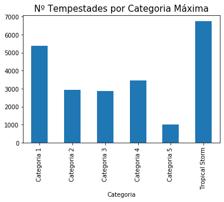


```python
#Major Hurricanes by Year
plt.title("Nº Furacões Graves por ano (Cat>=3)",fontsize = 15)

major_df = dfplot[dfplot.Categoria.apply(lambda x: 0 if x[-1]=='m' else int(x[-1]))>=3]
major_df.groupby('Year')['ID'].count().plot()
plt.xlabel("Ano");
# plt.savefig("figs/major_hurricanes_year.jpg")

```


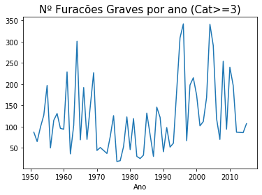


Nos plots abaixo usaremos a biblioteca troPYcal. Internamente ela tem o dataset HURDAT2 atualizado e possui funções de visualização prontas, simples de serem usadas.

Referência: https://tropycal.github.io/tropycal/examples/index.html


```python
hurdat_atl = tracks.TrackDataset(basin='north_atlantic',source='hurdat',include_btk=False)

storm = hurdat_atl.get_storm(('michael',2018))

#
storm.plot(return_ax=True)
plt.savefig('../figs/troPycal_michal18.jpg')
```

    --> Starting to read in HURDAT2 data
    --> Completed reading in HURDAT2 data (4.0 seconds)


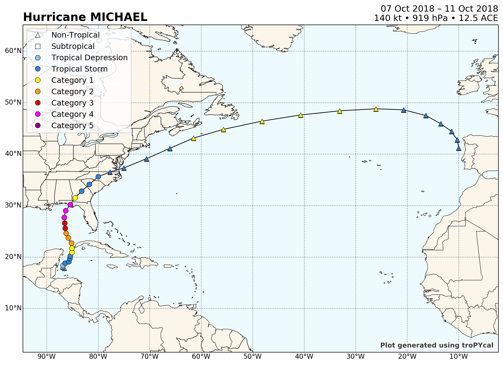


```python
storm.plot_tors(plotPPH=True)
plt.savefig('../figs/troPYcal_michaelPPH.jpg')
```

    --> Starting to read in tornado track data
    --> Completed reading in tornado data for 1950-2018 (10.42 seconds)


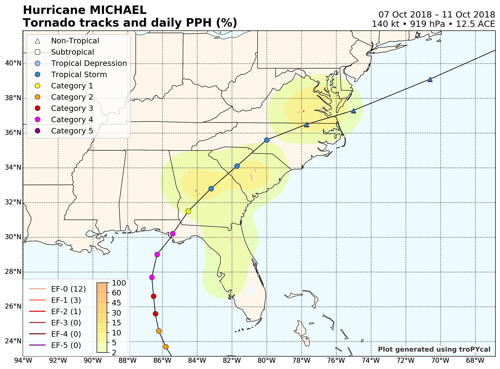


    <Figure size 432x288 with 0 Axes>


```python
storm.plot_nhc_forecast(forecast=2,return_ax=True)
plt.savefig('../figs/troPYcal_michael_fore2.jpg')
```


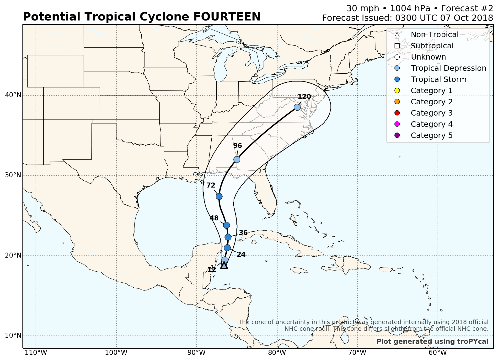


```python
storm.plot_nhc_forecast(forecast=12,return_ax=True)
plt.savefig('../figs/troPYcal_michael_fore12.jpg')
```


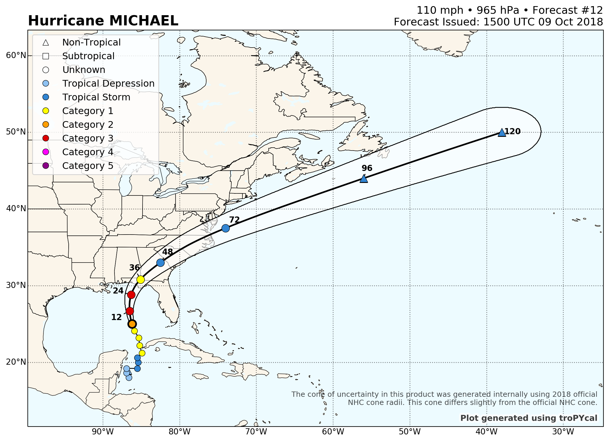


```python
ibtracs = tracks.TrackDataset(basin='all',source='ibtracs',ibtracs_mode='jtwc_neumann',catarina=True)

storm = ibtracs.get_storm(('catarina',2004))
storm.plot(return_ax=True)
plt.savefig('../figs/troPYcal_catarina.jpg')
```

    --> Starting to read in ibtracs data
    --> Completed reading in ibtracs data (114.01 seconds)


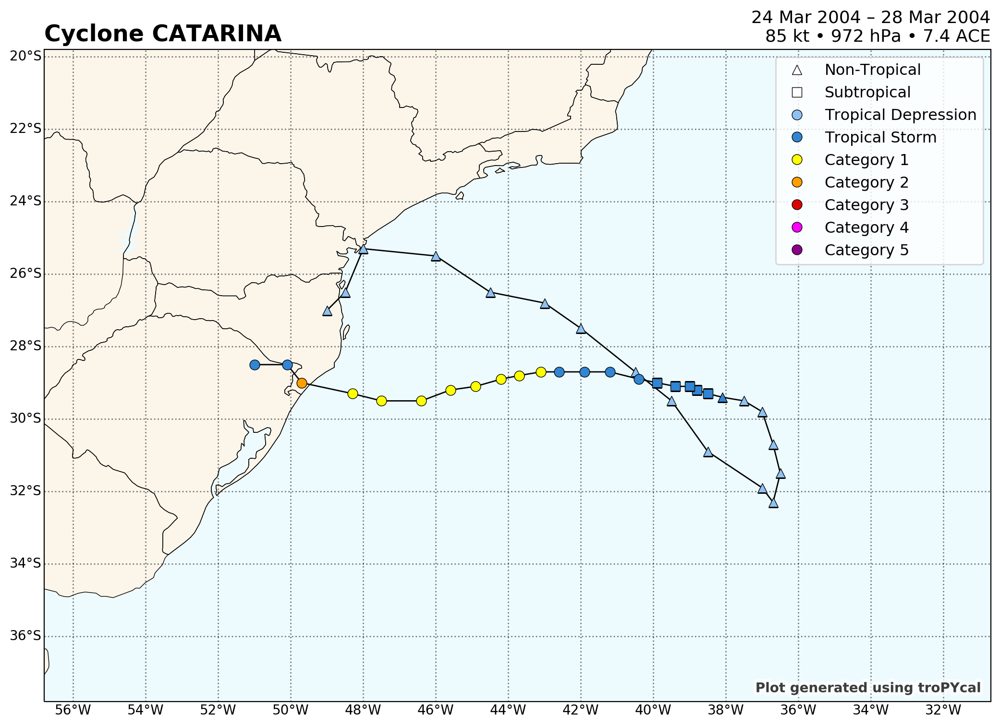


```python
tor_data = tornado.TornadoDataset()

tor_ax,domain,leg_tor = tor_data.plot_tors(dt.datetime(2011,4,27),plotPPH=True,return_ax=True)
tor_ax

plt.savefig('../figs/troPYcal_dailyPPH.jpg')

```

    --> Starting to read in tornado track data
    --> Completed reading in tornado data for 1950-2018 (9.15 seconds)


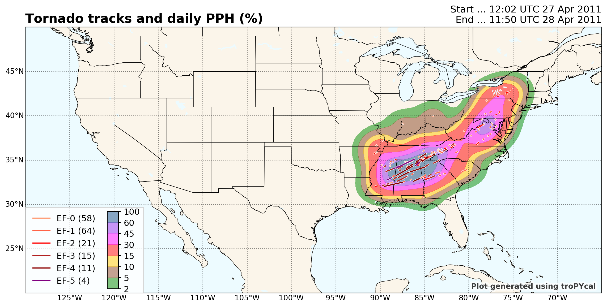


```python
hurdat_atl = tracks.TrackDataset(basin='north_atlantic',source='hurdat',include_btk=False)
# #
hurdat_atl.assign_storm_tornadoes(dist_thresh=750)
# #
storm = hurdat_atl.get_storm(('ivan',2004))
# #
storm.plot_tors(plotPPH=True,return_ax=True)

plt.savefig('../figs/troPYcal_ivan04.jpg')
```

    --> Starting to read in HURDAT2 data
    --> Completed reading in HURDAT2 data (8.13 seconds)
    --> Starting to read in tornado track data
    --> Completed reading in tornado data for 1950-2018 (9.86 seconds)
    --> Starting to assign tornadoes to storms
    --> Completed assigning tornadoes to storm (403.30 seconds)


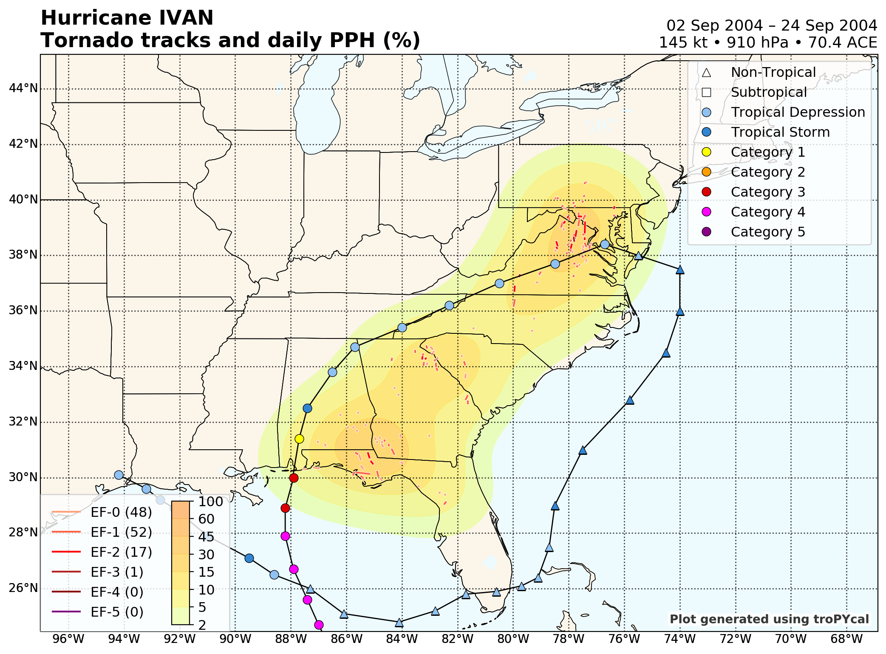


```python
hurdat_atl = tracks.TrackDataset(basin='north_atlantic',source='hurdat',include_btk=False)

#Retrieve Hurricane Michael from 2018
storm = hurdat_atl.get_storm(('michael',2018))
    
#Retrieve the 2017 Atlantic hurricane season
season = hurdat_atl.get_season(2017)

#Printing the Storm object lists relevant data:
print(storm)
    
print(hurdat_atl.search_name('Michael'))
#

```

    --> Starting to read in HURDAT2 data
    --> Completed reading in HURDAT2 data (4.39 seconds)
    <tropycal.tracks.Storm>
    Storm Summary:
        Maximum Wind:      140 knots
        Minimum Pressure:  919 hPa
        Start Date:        0600 UTC 07 October 2018
        End Date:          1800 UTC 11 October 2018
    
    Variables:
        date        (datetime) [2018-10-06 18:00:00 .... 2018-10-15 18:00:00]
        extra_obs   (int64) [0 .... 0]
        special     (str) [ .... ]
        type        (str) [LO .... EX]
        lat         (float64) [17.8 .... 41.2]
        lon         (float64) [-86.6 .... -10.0]
        vmax        (int64) [25 .... 35]
        mslp        (int64) [1006 .... 1001]
        wmo_basin   (str) [north_atlantic .... north_atlantic]
    
    More Information:
        id:              AL142018
        operational_id:  AL142018
        name:            MICHAEL
        year:            2018
        season:          2018
        basin:           north_atlantic
        source_info:     NHC Hurricane Database
        source:          hurdat
        ace:             12.5
        realtime:        False
    [2000, 2012, 2018]


```python
hurdat_atl.ace_climo(plot_year=2018,compare_years=2017)
plt.savefig('../figs/troPYcal_ACE.jpg')
```


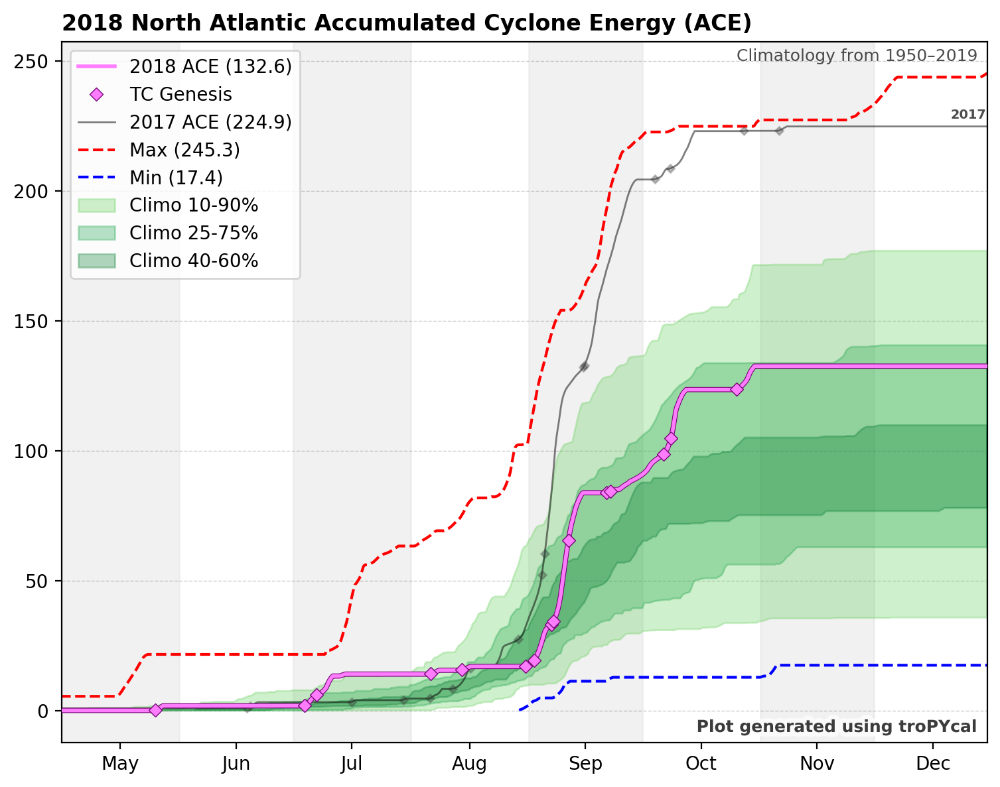


    <Figure size 432x288 with 0 Axes>


```python
hurdat_atl.ace_climo(rolling_sum=30,plot_year=2018,compare_years=2017)
plt.savefig('../figs/troPYcal_ACE_rolling.jpg')
```


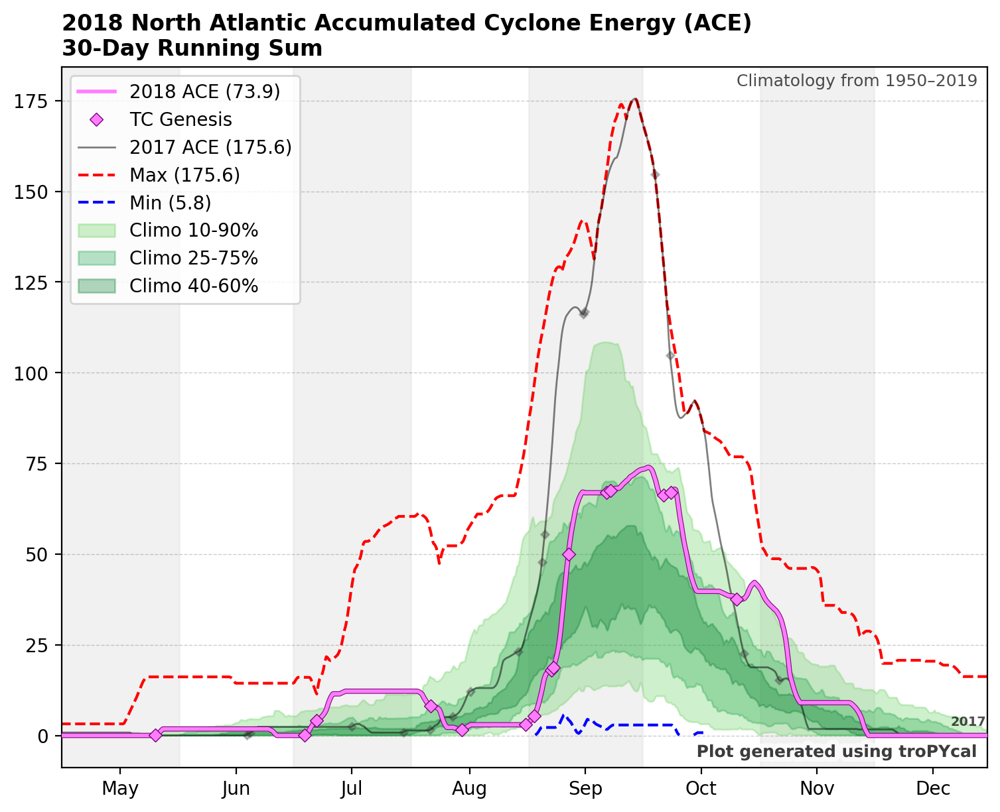


    <Figure size 432x288 with 0 Axes>


```python
hurdat_atl.wind_pres_relationship(storm=('sandy',2012))
plt.savefig('../figs/troPYcal_wind_press.jpg')
```


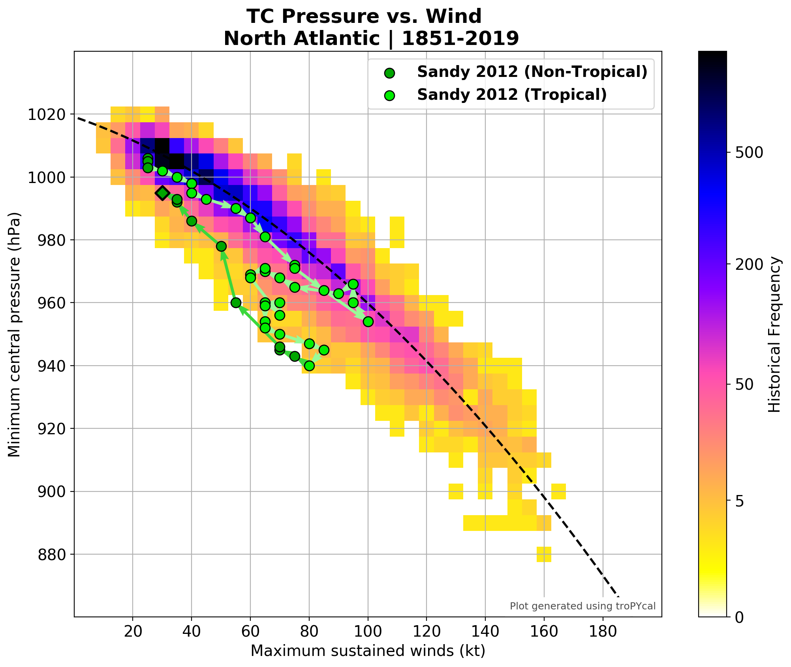


    <Figure size 432x288 with 0 Axes>


```python

# ibtracs = tracks.TrackDataset(basin='all',source='ibtracs',ibtracs_mode='jtwc_neumann',catarina=True)

ibtracs.gridded_stats(request="maximum wind",return_ax=True)
#
plt.savefig('../figs/troPYcal_maxwind.jpg')
```

    --> Getting filtered storm tracks
    --> Grouping by lat/lon/storm
    --> Generating plot


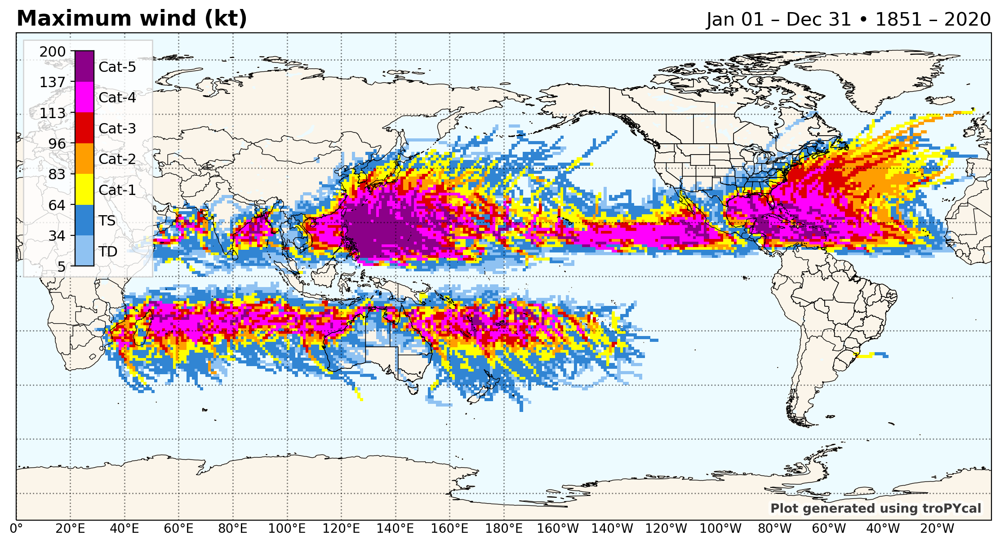


```python
ibtracs.gridded_stats(request="number of storms",thresh={'dv_min':30},prop={'cmap':'plasma_r'})
plt.savefig('../figs/troPYcal_num_storms.jpg')
```

    --> Getting filtered storm tracks
    --> Grouping by lat/lon/storm
    --> Generating plot


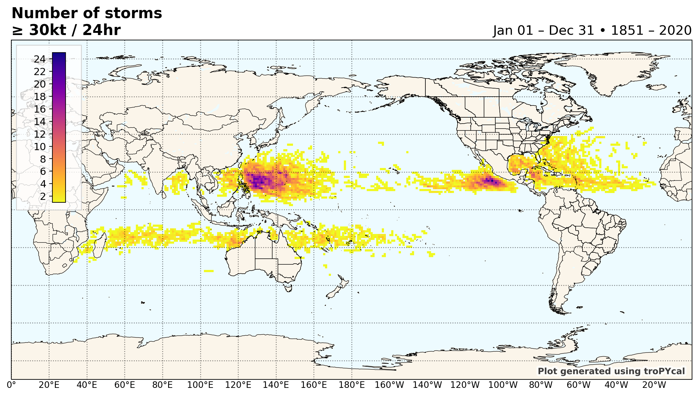

