# EDA

## Instalação e Importação de pacotes


```python
'''
!apt-get install libgeos-3.5.0
!apt-get install libgeos-dev
!pip install https://github.com/matplotlib/basemap/archive/master.zip
!pip install pyproj==1.9.6
'''
```


    '\n!apt-get install libgeos-3.5.0\n!apt-get install libgeos-dev\n!pip install https://github.com/matplotlib/basemap/archive/master.zip\n!pip install pyproj==1.9.6\n'


```python
'''
!pip install netcdf4
'''
```


    '\n!pip install netcdf4\n'


```python
'''
Dependencies for Tropycal Package: https://pypi.org/project/tropycal/
matplotlib >= 2.2.2
numpy >= 1.14.3
scipy >= 1.1.0
pandas >= 0.23.0
geopy >= 1.18.1
xarray >= 0.10.7
networkx >= 2.0.0
requests >= 2.22.0
To fully leverage tropycal's plotting capabilities, it is strongly recommended to have cartopy >= 0.17.0 installed.


!pip install numpy
!pip install pandas
!pip install matplotlib
!pip install scipy
#!pip uninstall geopy
!pip install geopy
!pip install xarray
!pip install networkx
!pip install requests
!pip install proj
!pip install proj-data
!pip install geos
#!pip uninstall cartopy
!apt-get -qq install python-cartopy python3-cartopy
!pip install cartopy
!pip install tropycal
#!pip freeze
'''
```


    "\nDependencies for Tropycal Package: https://pypi.org/project/tropycal/\nmatplotlib >= 2.2.2\nnumpy >= 1.14.3\nscipy >= 1.1.0\npandas >= 0.23.0\ngeopy >= 1.18.1\nxarray >= 0.10.7\nnetworkx >= 2.0.0\nrequests >= 2.22.0\nTo fully leverage tropycal's plotting capabilities, it is strongly recommended to have cartopy >= 0.17.0 installed.\n\n\n!pip install numpy\n!pip install pandas\n!pip install matplotlib\n!pip install scipy\n#!pip uninstall geopy\n!pip install geopy\n!pip install xarray\n!pip install networkx\n!pip install requests\n!pip install proj\n!pip install proj-data\n!pip install geos\n#!pip uninstall cartopy\n!apt-get -qq install python-cartopy python3-cartopy\n!pip install cartopy\n!pip install tropycal\n#!pip freeze\n"


```python
%matplotlib inline
import numpy as np
import matplotlib
import matplotlib.pyplot as plt
import matplotlib.colors as c
#from mpl_toolkits.basemap import Basemap,shiftgrid
import pandas as pd
import netCDF4 as nc
from itertools import chain
from netCDF4 import Dataset
from netCDF4 import date2index
from datetime import datetime
import scipy
import geopy
import xarray
import networkx
import requests
import cartopy
import tropycal

import tropycal.tracks as tracks
import tropycal.tornado as tornado
import datetime as dt
```


```python
import statsmodels.api as sm
from statsmodels.api import OLS

'''
from sklearn.decomposition import PCA
from sklearn.linear_model import LogisticRegression
from sklearn.linear_model import LogisticRegressionCV
from sklearn.discriminant_analysis import LinearDiscriminantAnalysis
from sklearn.discriminant_analysis import QuadraticDiscriminantAnalysis
from sklearn.preprocessing import PolynomialFeatures
from sklearn.neighbors import KNeighborsClassifier
from sklearn.model_selection import cross_val_score
from sklearn.metrics import accuracy_score
from sklearn.model_selection import KFold

import math
from scipy.special import gamma

import seaborn as sns
sns.set()

alpha = 0.5

from sklearn import preprocessing
'''
```


    '\nfrom sklearn.decomposition import PCA\nfrom sklearn.linear_model import LogisticRegression\nfrom sklearn.linear_model import LogisticRegressionCV\nfrom sklearn.discriminant_analysis import LinearDiscriminantAnalysis\nfrom sklearn.discriminant_analysis import QuadraticDiscriminantAnalysis\nfrom sklearn.preprocessing import PolynomialFeatures\nfrom sklearn.neighbors import KNeighborsClassifier\nfrom sklearn.model_selection import cross_val_score\nfrom sklearn.metrics import accuracy_score\nfrom sklearn.model_selection import KFold\n\nimport math\nfrom scipy.special import gamma\n\nimport seaborn as sns\nsns.set()\n\nalpha = 0.5\n\nfrom sklearn import preprocessing\n'


```python
'''
#import csv
from pandas.plotting import scatter_matrix

from sklearn.ensemble import RandomForestRegressor

from sklearn.neural_network import MLPRegressor
from sklearn.model_selection import train_test_split
'''
```


    '\n#import csv\nfrom pandas.plotting import scatter_matrix\n\nfrom sklearn.ensemble import RandomForestRegressor\n\nfrom sklearn.neural_network import MLPRegressor\nfrom sklearn.model_selection import train_test_split\n'


## Extração, Transformação, Carregamento e Limpeza dos Dados


```python
# Referência para os dados: https://www.kaggle.com/noaa/hurricane-database
# O foco principal do trabalho se dará nos dados do atlântico
data_atl = pd.read_csv('data/atlantic.csv')
data_pac = pd.read_csv('data/pacific.csv')
```


```python
# formatando dados de data
data_atl['Date_c'] = pd.to_datetime(data_atl['Date'].astype(str), format='%Y%m%d')
data_atl['Year'] = pd.DatetimeIndex(data_atl['Date_c']).year
data_atl['Month'] = pd.DatetimeIndex(data_atl['Date_c']).month
data_atl['Day'] = pd.DatetimeIndex(data_atl['Date_c']).day
print(data_atl.columns)
data_atl.head()
```

    Index(['ID', 'Name', 'Date', 'Time', 'Event', 'Status', 'Latitude',
           'Longitude', 'Maximum Wind', 'Minimum Pressure', 'Low Wind NE',
           'Low Wind SE', 'Low Wind SW', 'Low Wind NW', 'Moderate Wind NE',
           'Moderate Wind SE', 'Moderate Wind SW', 'Moderate Wind NW',
           'High Wind NE', 'High Wind SE', 'High Wind SW', 'High Wind NW',
           'Date_c', 'Year', 'Month', 'Day'],
          dtype='object')


<div>
<style scoped>
    .dataframe tbody tr th:only-of-type {
        vertical-align: middle;
    }

    .dataframe tbody tr th {
        vertical-align: top;
    }

    .dataframe thead th {
        text-align: right;
    }
</style>
<table border="1" class="dataframe">
  <thead>
    <tr style="text-align: right;">
      <th></th>
      <th>ID</th>
      <th>Name</th>
      <th>Date</th>
      <th>Time</th>
      <th>Event</th>
      <th>Status</th>
      <th>Latitude</th>
      <th>Longitude</th>
      <th>Maximum Wind</th>
      <th>Minimum Pressure</th>
      <th>...</th>
      <th>Moderate Wind SW</th>
      <th>Moderate Wind NW</th>
      <th>High Wind NE</th>
      <th>High Wind SE</th>
      <th>High Wind SW</th>
      <th>High Wind NW</th>
      <th>Date_c</th>
      <th>Year</th>
      <th>Month</th>
      <th>Day</th>
    </tr>
  </thead>
  <tbody>
    <tr>
      <th>0</th>
      <td>AL011851</td>
      <td>UNNAMED</td>
      <td>18510625</td>
      <td>0</td>
      <td></td>
      <td>HU</td>
      <td>28.0N</td>
      <td>94.8W</td>
      <td>80</td>
      <td>-999</td>
      <td>...</td>
      <td>-999</td>
      <td>-999</td>
      <td>-999</td>
      <td>-999</td>
      <td>-999</td>
      <td>-999</td>
      <td>1851-06-25</td>
      <td>1851</td>
      <td>6</td>
      <td>25</td>
    </tr>
    <tr>
      <th>1</th>
      <td>AL011851</td>
      <td>UNNAMED</td>
      <td>18510625</td>
      <td>600</td>
      <td></td>
      <td>HU</td>
      <td>28.0N</td>
      <td>95.4W</td>
      <td>80</td>
      <td>-999</td>
      <td>...</td>
      <td>-999</td>
      <td>-999</td>
      <td>-999</td>
      <td>-999</td>
      <td>-999</td>
      <td>-999</td>
      <td>1851-06-25</td>
      <td>1851</td>
      <td>6</td>
      <td>25</td>
    </tr>
    <tr>
      <th>2</th>
      <td>AL011851</td>
      <td>UNNAMED</td>
      <td>18510625</td>
      <td>1200</td>
      <td></td>
      <td>HU</td>
      <td>28.0N</td>
      <td>96.0W</td>
      <td>80</td>
      <td>-999</td>
      <td>...</td>
      <td>-999</td>
      <td>-999</td>
      <td>-999</td>
      <td>-999</td>
      <td>-999</td>
      <td>-999</td>
      <td>1851-06-25</td>
      <td>1851</td>
      <td>6</td>
      <td>25</td>
    </tr>
    <tr>
      <th>3</th>
      <td>AL011851</td>
      <td>UNNAMED</td>
      <td>18510625</td>
      <td>1800</td>
      <td></td>
      <td>HU</td>
      <td>28.1N</td>
      <td>96.5W</td>
      <td>80</td>
      <td>-999</td>
      <td>...</td>
      <td>-999</td>
      <td>-999</td>
      <td>-999</td>
      <td>-999</td>
      <td>-999</td>
      <td>-999</td>
      <td>1851-06-25</td>
      <td>1851</td>
      <td>6</td>
      <td>25</td>
    </tr>
    <tr>
      <th>4</th>
      <td>AL011851</td>
      <td>UNNAMED</td>
      <td>18510625</td>
      <td>2100</td>
      <td>L</td>
      <td>HU</td>
      <td>28.2N</td>
      <td>96.8W</td>
      <td>80</td>
      <td>-999</td>
      <td>...</td>
      <td>-999</td>
      <td>-999</td>
      <td>-999</td>
      <td>-999</td>
      <td>-999</td>
      <td>-999</td>
      <td>1851-06-25</td>
      <td>1851</td>
      <td>6</td>
      <td>25</td>
    </tr>
  </tbody>
</table>
<p>5 rows × 26 columns</p>
</div>


```python
# Registro de Furacões é maior em determinada época do ano
print(data_atl.groupby(['Month'])['ID'].count())
```

    Month
    1       132
    2        13
    3        14
    4        81
    5       655
    6      2349
    7      3262
    8     10857
    9     18926
    10     9802
    11     2548
    12      466
    Name: ID, dtype: int64


```python
# Período de furacões se concentra entre os meses de julho e novembro.
# Isso deve estar relacionado com o período anterior (verão do hemisfério norte, onde acontece o maior número de casos)
# O aquecimento das águas está intimamente ligado com a formação das massas de ar que ocasionam os furacões
# Isso nos dá uma pista da forma de correlação temporal que devemos buscar para predizer os eventos

fig, ax = plt.subplots(1,1)#, figsize=(16,10))
fig.suptitle('Número de furações registrados por mês do ano', fontsize=28, y=1.06)

ax.plot(data_atl.groupby(['Month'])['Month'].mean(), data_atl.groupby(['Month'])['ID'].count(), ls = '--', label=r'$Furacões$ $=$ $0$')
ax.tick_params(labelsize=24)
ax.set_title(f'Número de registros (1851-2015)', fontsize=24)
ax.set_xlabel(r'$Mês$', fontsize=16)
ax.set_ylabel(r'$Quantidade$', fontsize=16)
ax.legend(loc='best', fontsize=12);

fig.set_figheight(5)
fig.set_figwidth(20)
fig.tight_layout(pad=2.0)
```


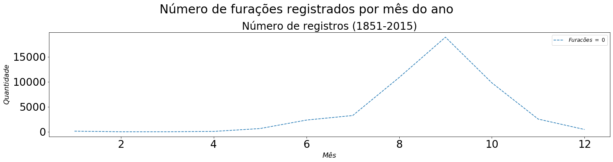


```python
data_atl_ext = data_atl.copy()
data_atl_mwmp = data_atl.copy()
data_atl_mw = data_atl.copy()

ind_nan_ext = []
ind_nan_mwmp = []
ind_nan_mw = []
for l in range(len(data_atl)):
    if (data_atl_mw['Maximum Wind'][l] < 0):
        ind_nan_mw.append(l)
        ind_nan_mwmp.append(l)
        ind_nan_ext.append(l)
    elif (data_atl_mwmp['Minimum Pressure'][l] < 0):
        ind_nan_mwmp.append(l)
        ind_nan_ext.append(l)
    elif (min(data_atl_ext['Low Wind NE'][l], data_atl_ext['Low Wind SE'][l], data_atl_ext['Low Wind SW'][l], data_atl_ext['Low Wind NW'][l], data_atl_ext['Moderate Wind NE'][l], data_atl_ext['Moderate Wind SE'][l], data_atl_ext['Moderate Wind SW'][l], data_atl_ext['Moderate Wind NW'][l], data_atl_ext['High Wind NE'][l], data_atl_ext['High Wind SE'][l], data_atl_ext['High Wind SW'][l], data_atl_ext['High Wind NW'][l]) < 0):
        ind_nan_ext.append(l)
data_atl_ext = data_atl_ext.drop(ind_nan_ext, 0)
data_atl_mwmp = data_atl_mwmp.drop(ind_nan_mwmp, 0)
data_atl_mw = data_atl_mw.drop(ind_nan_mw, 0)

print(len(data_atl_ext))
print(len(data_atl_mwmp))
print(len(data_atl_mw))
```

    5921
    18436
    48767


```python
fig, ax = plt.subplots(1,1)#, figsize=(16,10))
#fig.suptitle('Velocidade Máxima vs Pressão Mínima (1851-2015)', fontsize=28, y=1.06)

ax.scatter(data_atl_mwmp['Minimum Pressure'], data_atl_mwmp['Maximum Wind'], alpha = 0.2, ls = '--') #, label=r'$Furacões$ $=$ $0$')
ax.tick_params(labelsize=24)
ax.set_title(f'Velocidade Máxima vs Pressão Mínima (1851-2015)', fontsize=24)
ax.set_xlabel(r'$Pressão Mínima$', fontsize=16)
ax.set_ylabel(r'$Velocidade Máxima$', fontsize=16)
ax.legend(loc='best', fontsize=12);

fig.set_figheight(5)
fig.set_figwidth(20)
fig.tight_layout(pad=2.0)
```

    No handles with labels found to put in legend.


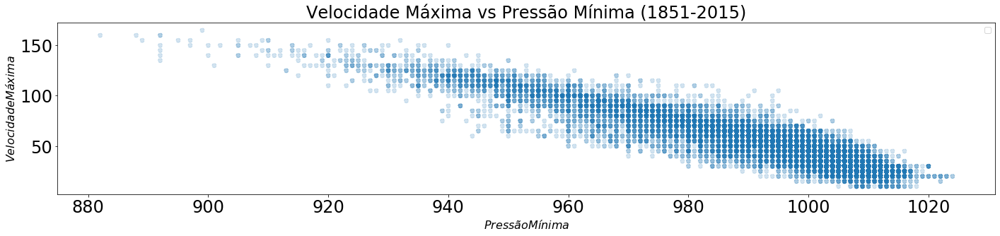


```python
def format_lat(latitude):
    new_lat = []
    for lat in latitude:
        if lat[-1]=="N":
            new_lat.append(float(lat[0:-1]))
        else:
            new_lat.append(-float(lat[0:-1]))
    return new_lat

def format_lon(longitude):
    new_lon = []
    for lon in longitude:
        if lon[-1]=="E":
            new_lon.append(float(lon[0:-1]))
        else:
            new_lon.append(-float(lon[0:-1]))
    return new_lon

#format_lat(data_atl['Latitude'])
data_atl['Latitude_c'] = format_lat(data_atl['Latitude'])
data_atl['Longitude_c'] = format_lat(data_atl['Longitude'])

# Todas as Latitudes são menores que 0, e as Longitudes maiores que 0
#print(data_atl[data_atl['Latitude_c'] < 0])
#print(data_atl[data_atl['Longitude_c'] > 0])
```


```python
#Número de registro de furações tem crescido, mas isso se deve à maior capacidade de detecção com o passar dos anos
X_train = data_atl.groupby(['Year'])['Year'].mean()
y_train = data_atl.groupby(['Year'])['ID'].count()
X_train2 = sm.add_constant(X_train) #np.array(X_train).reshape(X_train.shape[0],1)
OLS_obj = OLS(y_train, X_train2)
OLSModel = OLS_obj.fit()

r2_train = OLSModel.rsquared
#r2_test = 1 - ((OLSModel.predict(X_test2)-y_test)*(OLSModel.predict(X_test2)-y_test)).sum() / ((y_test.mean()-y_test)*(y_test.mean()-y_test)).sum()
print(f'R^2_train = {r2_train}')
#print(f'R^2_test  = {r2_test}')
print(f'Parâmetro_const  = {OLSModel.params[0]}')
print(f'Parâmetro_Year  = {OLSModel.params[1]}')

w0 = OLSModel.params[0] + 1850*OLSModel.params[1]
w1 = OLSModel.params[0] + 2015*OLSModel.params[1]

fig, ax = plt.subplots(1,1)#, figsize=(16,10))
#fig.suptitle('Velocidade Máxima vs Pressão Mínima (1851-2015)', fontsize=28, y=1.06)

ax.plot(data_atl.groupby(['Year'])['ID'].count(), ls = '--') #, label=r'$Furacões$ $=$ $0$')
ax.plot([1850, 2015], [w0, w1], ls = '-.') #, label=r'$Furacões$ $=$ $0$')
ax.tick_params(labelsize=24)
ax.set_title(f'Número de Furacões Anuais (1851-2015)', fontsize=24)
ax.set_xlabel(r'$Ano$', fontsize=16)
ax.set_ylabel(r'$Quantidade$', fontsize=16)
ax.legend(loc='best', fontsize=12);

fig.set_figheight(5)
fig.set_figwidth(20)
fig.tight_layout(pad=2.0)

#plt.plot(data_atl.groupby(['Year'])['ID'].count())
```

    No handles with labels found to put in legend.


    R^2_train = 0.40918060978408977
    Parâmetro_const  = -3940.3491393512004
    Parâmetro_Year  = 2.192423797184305


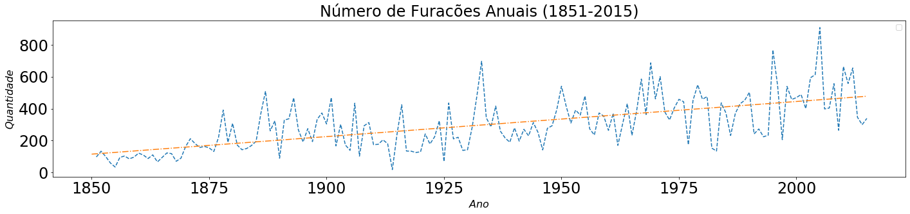


```python
#Velocidade máxima de vento sustentada pelos furacões reduziu, mas isso também se deve à maior capacidade de registro 
#de eventos de pequeno porte
X_train = data_atl_mw.groupby(['Year'])['Year'].mean()
y_train = data_atl_mw.groupby(['Year'])['Maximum Wind'].mean()
X_train2 = sm.add_constant(X_train) #np.array(X_train).reshape(X_train.shape[0],1)
OLS_obj = OLS(y_train, X_train2)
OLSModel = OLS_obj.fit()

r2_train = OLSModel.rsquared
#r2_test = 1 - ((OLSModel.predict(X_test2)-y_test)*(OLSModel.predict(X_test2)-y_test)).sum() / ((y_test.mean()-y_test)*(y_test.mean()-y_test)).sum()
print(f'R^2_train = {r2_train}')
#print(f'R^2_test  = {r2_test}')
print(f'Parâmetro_const  = {OLSModel.params[0]}')
print(f'Parâmetro_Year  = {OLSModel.params[1]}')

w0 = OLSModel.params[0] + 1850*OLSModel.params[1]
w1 = OLSModel.params[0] + 2015*OLSModel.params[1]

fig, ax = plt.subplots(1,1)#, figsize=(16,10))
#fig.suptitle('Velocidade Máxima vs Pressão Mínima (1851-2015)', fontsize=28, y=1.06)

ax.plot(data_atl_mw.groupby(['Year'])['Year'].mean(), data_atl_mw.groupby(['Year'])['Maximum Wind'].mean(), ls = '--') #, label=r'$Furacões$ $=$ $0$')
ax.plot([1850, 2015], [w0, w1], ls = '-.') #, label=r'$Furacões$ $=$ $0$')
ax.tick_params(labelsize=24)
ax.set_title(f'Velocidade Máxima vs Ano (1851-2015)', fontsize=24)
ax.set_xlabel(r'$Ano$', fontsize=16)
ax.set_ylabel(r'$Velocidade Máxima$', fontsize=16)
ax.legend(loc='best', fontsize=12);

fig.set_figheight(5)
fig.set_figwidth(20)
fig.tight_layout(pad=2.0)

#plt.plot(data_atl_mw.groupby(['Year'])['Year'].mean(), data_atl_mw.groupby(['Year'])['Maximum Wind'].mean())
```

    No handles with labels found to put in legend.


    R^2_train = 0.49772308255924613
    Parâmetro_const  = 345.35295844916755
    Parâmetro_Year  = -0.15025433346159117


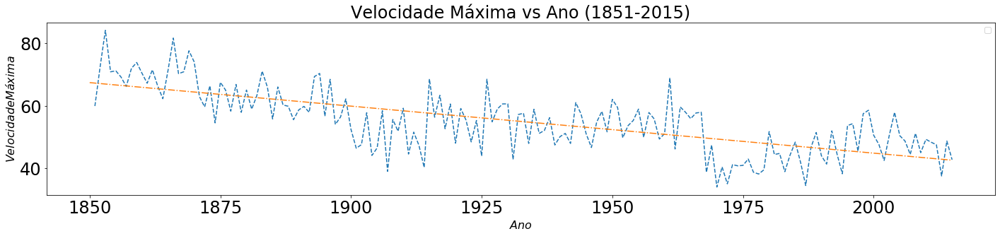


```python
#Para não enviesar nossos dados, filtraremos os registros de pequeno porte
data_atl_fdur = data_atl_mw.copy()
duration = data_atl_mw.groupby(['ID'])['Date_c'].max()-data_atl_mw.groupby(['ID'])['Date_c'].min()
duration.name = 'Duration'
#print(duration)
data_atl_fdur = pd.merge(data_atl_fdur, duration, how='inner', left_on='ID', right_index=True)
data_atl_fdur['Duration'] = pd.to_numeric(data_atl_fdur['Duration'].dt.days, downcast='integer')
data_atl_fdur = data_atl_fdur[data_atl_fdur['Duration'] > 2]
print(len(data_atl_fdur))

```

    46350


```python
#Para não enviesar nossos dados, filtraremos os registros de pequeno porte (somente a partir de Tropical Storm)
data_atl_fwind = data_atl_fdur.copy()
data_atl_fwind = data_atl_fwind[data_atl_fwind['Maximum Wind'] > 34]
print(len(data_atl_fwind))
```

    35696


```python
# Com o novo filtro, o viés do aumento no número de furacões ao longo dos anos reduziu, mas ainda há um aumento
# Isso mostra que essa tendência pode ser algo não viesada, e que gera preocupação pelo futuro
X_train = data_atl_fwind.groupby(['Year'])['Year'].mean()
y_train = data_atl_fwind.groupby(['Year'])['ID'].count()
X_train2 = sm.add_constant(X_train) #np.array(X_train).reshape(X_train.shape[0],1)
OLS_obj = OLS(y_train, X_train2)
OLSModel = OLS_obj.fit()

r2_train = OLSModel.rsquared
#r2_test = 1 - ((OLSModel.predict(X_test2)-y_test)*(OLSModel.predict(X_test2)-y_test)).sum() / ((y_test.mean()-y_test)*(y_test.mean()-y_test)).sum()
print(f'R^2_train = {r2_train}')
#print(f'R^2_test  = {r2_test}')
print(f'Parâmetro_const  = {OLSModel.params[0]}')
print(f'Parâmetro_Year  = {OLSModel.params[1]}')

w0 = OLSModel.params[0] + 1850*OLSModel.params[1]
w1 = OLSModel.params[0] + 2015*OLSModel.params[1]

fig, ax = plt.subplots(1,1)#, figsize=(16,10))
#fig.suptitle('Velocidade Máxima vs Pressão Mínima (1851-2015)', fontsize=28, y=1.06)

ax.plot(data_atl_fwind.groupby(['Year'])['ID'].count(), ls = '--') #, label=r'$Furacões$ $=$ $0$')
ax.plot([1850, 2015], [w0, w1], ls = '-.') #, label=r'$Furacões$ $=$ $0$')
ax.tick_params(labelsize=24)
ax.set_title(f'Número de Furacões Anuais (1851-2015)', fontsize=24)
ax.set_xlabel(r'$Ano$', fontsize=16)
ax.set_ylabel(r'$Quantidade$', fontsize=16)
ax.legend(loc='best', fontsize=12);

fig.set_figheight(5)
fig.set_figwidth(20)
fig.tight_layout(pad=2.0)
```

    No handles with labels found to put in legend.


    R^2_train = 0.15573477903937416
    Parâmetro_const  = -1661.4327723310093
    Parâmetro_Year  = 0.9714289530628062


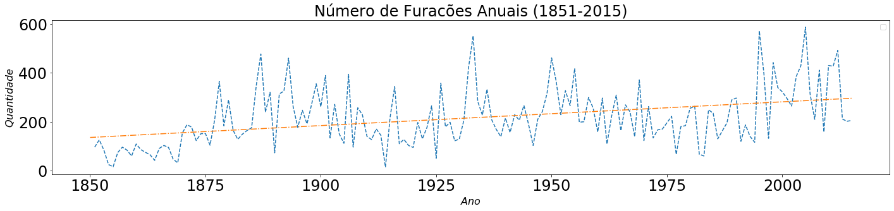


```python
# Com o novo filtro, o viés da redução da velocidade máxima sustentada de vento reduziu, quase para o nível constante
# Isso pode significar que os filtros estão relativamente bem adequados para retirada do viés inicial dos dados
X_train = data_atl_fwind.groupby(['Year'])['Year'].mean()
y_train = data_atl_fwind.groupby(['Year'])['Maximum Wind'].mean()
X_train2 = sm.add_constant(X_train) #np.array(X_train).reshape(X_train.shape[0],1)
OLS_obj = OLS(y_train, X_train2)
OLSModel = OLS_obj.fit()

r2_train = OLSModel.rsquared
#r2_test = 1 - ((OLSModel.predict(X_test2)-y_test)*(OLSModel.predict(X_test2)-y_test)).sum() / ((y_test.mean()-y_test)*(y_test.mean()-y_test)).sum()
print(f'R^2_train = {r2_train}')
#print(f'R^2_test  = {r2_test}')
print(f'Parâmetro_const  = {OLSModel.params[0]}')
print(f'Parâmetro_Year  = {OLSModel.params[1]}')

w0 = OLSModel.params[0] + 1850*OLSModel.params[1]
w1 = OLSModel.params[0] + 2015*OLSModel.params[1]

fig, ax = plt.subplots(1,1)#, figsize=(16,10))
#fig.suptitle('Velocidade Máxima vs Pressão Mínima (1851-2015)', fontsize=28, y=1.06)

ax.plot(data_atl_fwind.groupby(['Year'])['Year'].mean(), data_atl_fwind.groupby(['Year'])['Maximum Wind'].mean(), ls = '--') #, label=r'$Furacões$ $=$ $0$')
ax.plot([1850, 2015], [w0, w1], ls = '-.') #, label=r'$Furacões$ $=$ $0$')
ax.tick_params(labelsize=24)
ax.set_title(f'Velocidade Máxima vs Ano (1851-2015)', fontsize=24)
ax.set_xlabel(r'$Ano$', fontsize=16)
ax.set_ylabel(r'$Velocidade Máxima$', fontsize=16)
ax.legend(loc='best', fontsize=12);

fig.set_figheight(5)
fig.set_figwidth(20)
fig.tight_layout(pad=2.0)

#plt.plot(data_atl_mw.groupby(['Year'])['Year'].mean(), data_atl_mw.groupby(['Year'])['Maximum Wind'].mean())
```

    No handles with labels found to put in legend.


    R^2_train = 0.11158706746149893
    Parâmetro_const  = 167.44362825887168
    Parâmetro_Year  = -0.054709821748082546


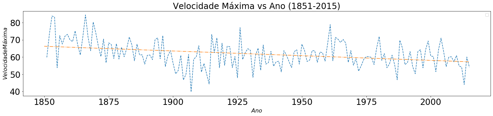


```python
data_atl_mw2 = data_atl_mw.copy()
data_atl_mw2['Latitude_c'] = format_lat(data_atl_mw['Latitude'])
data_atl_mw2['Longitude_c'] = format_lat(data_atl_mw['Longitude'])
data_atl_mw2.head()
```


<div>
<style scoped>
    .dataframe tbody tr th:only-of-type {
        vertical-align: middle;
    }

    .dataframe tbody tr th {
        vertical-align: top;
    }

    .dataframe thead th {
        text-align: right;
    }
</style>
<table border="1" class="dataframe">
  <thead>
    <tr style="text-align: right;">
      <th></th>
      <th>ID</th>
      <th>Name</th>
      <th>Date</th>
      <th>Time</th>
      <th>Event</th>
      <th>Status</th>
      <th>Latitude</th>
      <th>Longitude</th>
      <th>Maximum Wind</th>
      <th>Minimum Pressure</th>
      <th>...</th>
      <th>High Wind NE</th>
      <th>High Wind SE</th>
      <th>High Wind SW</th>
      <th>High Wind NW</th>
      <th>Date_c</th>
      <th>Year</th>
      <th>Month</th>
      <th>Day</th>
      <th>Latitude_c</th>
      <th>Longitude_c</th>
    </tr>
  </thead>
  <tbody>
    <tr>
      <th>0</th>
      <td>AL011851</td>
      <td>UNNAMED</td>
      <td>18510625</td>
      <td>0</td>
      <td></td>
      <td>HU</td>
      <td>28.0N</td>
      <td>94.8W</td>
      <td>80</td>
      <td>-999</td>
      <td>...</td>
      <td>-999</td>
      <td>-999</td>
      <td>-999</td>
      <td>-999</td>
      <td>1851-06-25</td>
      <td>1851</td>
      <td>6</td>
      <td>25</td>
      <td>28.0</td>
      <td>-94.8</td>
    </tr>
    <tr>
      <th>1</th>
      <td>AL011851</td>
      <td>UNNAMED</td>
      <td>18510625</td>
      <td>600</td>
      <td></td>
      <td>HU</td>
      <td>28.0N</td>
      <td>95.4W</td>
      <td>80</td>
      <td>-999</td>
      <td>...</td>
      <td>-999</td>
      <td>-999</td>
      <td>-999</td>
      <td>-999</td>
      <td>1851-06-25</td>
      <td>1851</td>
      <td>6</td>
      <td>25</td>
      <td>28.0</td>
      <td>-95.4</td>
    </tr>
    <tr>
      <th>2</th>
      <td>AL011851</td>
      <td>UNNAMED</td>
      <td>18510625</td>
      <td>1200</td>
      <td></td>
      <td>HU</td>
      <td>28.0N</td>
      <td>96.0W</td>
      <td>80</td>
      <td>-999</td>
      <td>...</td>
      <td>-999</td>
      <td>-999</td>
      <td>-999</td>
      <td>-999</td>
      <td>1851-06-25</td>
      <td>1851</td>
      <td>6</td>
      <td>25</td>
      <td>28.0</td>
      <td>-96.0</td>
    </tr>
    <tr>
      <th>3</th>
      <td>AL011851</td>
      <td>UNNAMED</td>
      <td>18510625</td>
      <td>1800</td>
      <td></td>
      <td>HU</td>
      <td>28.1N</td>
      <td>96.5W</td>
      <td>80</td>
      <td>-999</td>
      <td>...</td>
      <td>-999</td>
      <td>-999</td>
      <td>-999</td>
      <td>-999</td>
      <td>1851-06-25</td>
      <td>1851</td>
      <td>6</td>
      <td>25</td>
      <td>28.1</td>
      <td>-96.5</td>
    </tr>
    <tr>
      <th>4</th>
      <td>AL011851</td>
      <td>UNNAMED</td>
      <td>18510625</td>
      <td>2100</td>
      <td>L</td>
      <td>HU</td>
      <td>28.2N</td>
      <td>96.8W</td>
      <td>80</td>
      <td>-999</td>
      <td>...</td>
      <td>-999</td>
      <td>-999</td>
      <td>-999</td>
      <td>-999</td>
      <td>1851-06-25</td>
      <td>1851</td>
      <td>6</td>
      <td>25</td>
      <td>28.2</td>
      <td>-96.8</td>
    </tr>
  </tbody>
</table>
<p>5 rows × 28 columns</p>
</div>


```python
#print(data_atl_mw2.groupby(['ID'], as_index=False)['ID', 'Latitude_c'].first())
data_atl_mw2_filtrado3 = data_atl_mw2.copy()
Lat_min = data_atl_mw2_filtrado3.groupby(['ID'])['Latitude_c'].first()
Lat_min.name = 'Lat_min'
#print(Lat_min)
data_atl_mw2_filtrado3 = pd.merge(data_atl_mw2_filtrado3, Lat_min, how='inner', left_on='ID', right_index=True)
#print(data_atl_mw2_filtrado3)
data_atl_mw2_filtrado3 = data_atl_mw2_filtrado3[abs(data_atl_mw2_filtrado3['Lat_min'] - 12.5) > 0]
#data_atl_mw2_filtrado3.head()

Lon_min = data_atl_mw2_filtrado3.groupby(['ID'])['Longitude_c'].min()
Lon_min.name = 'Lon_min'
#print(Lon_min)
data_atl_mw2_filtrado3 = pd.merge(data_atl_mw2_filtrado3, Lon_min, how='inner', left_on='ID', right_index=True)
#print(data_atl_mw2_filtrado3)
data_atl_mw2_filtrado3 = data_atl_mw2_filtrado3[data_atl_mw2_filtrado3['Lon_min'] > -180]

Wind_max = data_atl_mw2_filtrado3.groupby(['ID'])['Maximum Wind'].max()
Wind_max.name = 'Wind_max'
#print(Wind_max)
data_atl_mw2_filtrado3 = pd.merge(data_atl_mw2_filtrado3, Wind_max, how='inner', on='ID')#left_on='ID', right_index=True)
#print(data_atl_mw2_filtrado3)
data_atl_mw2_filtrado3 = data_atl_mw2_filtrado3[data_atl_mw2_filtrado3['Wind_max'] > 34]

data_atl_mw2_filtrado3 = data_atl_mw2_filtrado3[data_atl_mw2_filtrado3['Year'] > 1950]

duration = data_atl_mw2_filtrado3.groupby(['ID'])['Date_c'].max()-data_atl_mw2_filtrado3.groupby(['ID'])['Date_c'].min()
duration.name = 'Duration'
#print(duration)
data_atl_mw2_filtrado3 = pd.merge(data_atl_mw2_filtrado3, duration, how='inner', left_on='ID', right_index=True)
data_atl_mw2_filtrado3['Duration'] = pd.to_numeric(data_atl_mw2_filtrado3['Duration'].dt.days, downcast='integer')
data_atl_mw2_filtrado3 = data_atl_mw2_filtrado3[data_atl_mw2_filtrado3['Duration'] > 2]

data_atl_mw2_filtrado3 = data_atl_mw2_filtrado3.drop(['Lat_min', 'Lon_min', 'Wind_max'], 1)
#data_atl_mw2_filtrado3.head()

print(len(data_atl_mw2_filtrado3))
print(len(data_atl.groupby(['ID'])['ID'].count()))
print(len(data_atl_mw2_filtrado3.groupby(['ID'])['ID'].count()))

print(len(data_atl))
print(len(data_atl_mw2))
data_atl_mw2_filtrado3.head()

```

    22386
    1814
    685
    49105
    48767


<div>
<style scoped>
    .dataframe tbody tr th:only-of-type {
        vertical-align: middle;
    }

    .dataframe tbody tr th {
        vertical-align: top;
    }

    .dataframe thead th {
        text-align: right;
    }
</style>
<table border="1" class="dataframe">
  <thead>
    <tr style="text-align: right;">
      <th></th>
      <th>ID</th>
      <th>Name</th>
      <th>Date</th>
      <th>Time</th>
      <th>Event</th>
      <th>Status</th>
      <th>Latitude</th>
      <th>Longitude</th>
      <th>Maximum Wind</th>
      <th>Minimum Pressure</th>
      <th>...</th>
      <th>High Wind SE</th>
      <th>High Wind SW</th>
      <th>High Wind NW</th>
      <th>Date_c</th>
      <th>Year</th>
      <th>Month</th>
      <th>Day</th>
      <th>Latitude_c</th>
      <th>Longitude_c</th>
      <th>Duration</th>
    </tr>
  </thead>
  <tbody>
    <tr>
      <th>21948</th>
      <td>AL011951</td>
      <td>UNNAMED</td>
      <td>19510102</td>
      <td>1200</td>
      <td></td>
      <td>EX</td>
      <td>30.5N</td>
      <td>58.0W</td>
      <td>50</td>
      <td>-999</td>
      <td>...</td>
      <td>-999</td>
      <td>-999</td>
      <td>-999</td>
      <td>1951-01-02</td>
      <td>1951</td>
      <td>1</td>
      <td>2</td>
      <td>30.5</td>
      <td>-58.0</td>
      <td>10</td>
    </tr>
    <tr>
      <th>21949</th>
      <td>AL011951</td>
      <td>UNNAMED</td>
      <td>19510102</td>
      <td>1800</td>
      <td></td>
      <td>EX</td>
      <td>29.9N</td>
      <td>56.8W</td>
      <td>45</td>
      <td>-999</td>
      <td>...</td>
      <td>-999</td>
      <td>-999</td>
      <td>-999</td>
      <td>1951-01-02</td>
      <td>1951</td>
      <td>1</td>
      <td>2</td>
      <td>29.9</td>
      <td>-56.8</td>
      <td>10</td>
    </tr>
    <tr>
      <th>21950</th>
      <td>AL011951</td>
      <td>UNNAMED</td>
      <td>19510103</td>
      <td>0</td>
      <td></td>
      <td>EX</td>
      <td>29.0N</td>
      <td>55.7W</td>
      <td>45</td>
      <td>-999</td>
      <td>...</td>
      <td>-999</td>
      <td>-999</td>
      <td>-999</td>
      <td>1951-01-03</td>
      <td>1951</td>
      <td>1</td>
      <td>3</td>
      <td>29.0</td>
      <td>-55.7</td>
      <td>10</td>
    </tr>
    <tr>
      <th>21951</th>
      <td>AL011951</td>
      <td>UNNAMED</td>
      <td>19510103</td>
      <td>600</td>
      <td></td>
      <td>EX</td>
      <td>27.5N</td>
      <td>54.8W</td>
      <td>45</td>
      <td>-999</td>
      <td>...</td>
      <td>-999</td>
      <td>-999</td>
      <td>-999</td>
      <td>1951-01-03</td>
      <td>1951</td>
      <td>1</td>
      <td>3</td>
      <td>27.5</td>
      <td>-54.8</td>
      <td>10</td>
    </tr>
    <tr>
      <th>21952</th>
      <td>AL011951</td>
      <td>UNNAMED</td>
      <td>19510103</td>
      <td>1200</td>
      <td></td>
      <td>EX</td>
      <td>26.5N</td>
      <td>54.5W</td>
      <td>45</td>
      <td>-999</td>
      <td>...</td>
      <td>-999</td>
      <td>-999</td>
      <td>-999</td>
      <td>1951-01-03</td>
      <td>1951</td>
      <td>1</td>
      <td>3</td>
      <td>26.5</td>
      <td>-54.5</td>
      <td>10</td>
    </tr>
  </tbody>
</table>
<p>5 rows × 29 columns</p>
</div>


```python
data_atl_mw2_filtrado3.to_csv('data_atl_mw2_filtrado3.csv', encoding='utf-8', index=False)

```

## Outras Visualizações

Referência: https://tropycal.github.io/tropycal/examples/index.html


```python
hurdat_atl = tracks.TrackDataset(basin='north_atlantic',source='hurdat',include_btk=False)

storm = hurdat_atl.get_storm(('michael',2018))

#
storm.plot(return_ax=True)
#
storm.plot_tors(plotPPH=True)
#
storm.plot_nhc_forecast(forecast=2,return_ax=True)
#
storm.plot_nhc_forecast(forecast=12,return_ax=True)
#
ibtracs = tracks.TrackDataset(basin='all',source='ibtracs',ibtracs_mode='jtwc_neumann',catarina=True)
#
storm = ibtracs.get_storm(('catarina',2004))
storm.plot(return_ax=True)
```

    --> Starting to read in HURDAT2 data
    --> Completed reading in HURDAT2 data (12.27 seconds)


    C:\Users\User\anaconda3\lib\site-packages\cartopy\mpl\gridliner.py:307: UserWarning: The .xlabels_top attribute is deprecated. Please use .top_labels to toggle visibility instead.
      warnings.warn('The .xlabels_top attribute is deprecated. Please '
    C:\Users\User\anaconda3\lib\site-packages\cartopy\mpl\gridliner.py:343: UserWarning: The .ylabels_right attribute is deprecated. Please use .right_labels to toggle visibility instead.
      warnings.warn('The .ylabels_right attribute is deprecated. Please '
    C:\Users\User\anaconda3\lib\site-packages\tropycal\tracks\storm.py:1239: UserWarning: Reading in tornado data for this storm. If you seek to analyze tornado data for multiple storms, run "TrackDataset.assign_storm_tornadoes()" to avoid this warning in the future.
      warnings.warn(warn_message)


    --> Starting to read in tornado track data
    --> Completed reading in tornado data for 1950-2018 (22.54 seconds)


    C:\Users\User\anaconda3\lib\site-packages\cartopy\mpl\gridliner.py:307: UserWarning: The .xlabels_top attribute is deprecated. Please use .top_labels to toggle visibility instead.
      warnings.warn('The .xlabels_top attribute is deprecated. Please '
    C:\Users\User\anaconda3\lib\site-packages\cartopy\mpl\gridliner.py:343: UserWarning: The .ylabels_right attribute is deprecated. Please use .right_labels to toggle visibility instead.
      warnings.warn('The .ylabels_right attribute is deprecated. Please '
    C:\Users\User\anaconda3\lib\site-packages\cartopy\mpl\gridliner.py:307: UserWarning: The .xlabels_top attribute is deprecated. Please use .top_labels to toggle visibility instead.
      warnings.warn('The .xlabels_top attribute is deprecated. Please '
    C:\Users\User\anaconda3\lib\site-packages\cartopy\mpl\gridliner.py:343: UserWarning: The .ylabels_right attribute is deprecated. Please use .right_labels to toggle visibility instead.
      warnings.warn('The .ylabels_right attribute is deprecated. Please '


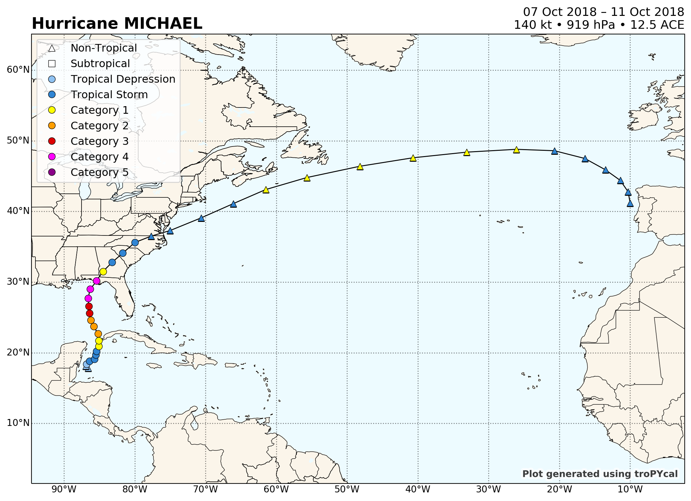


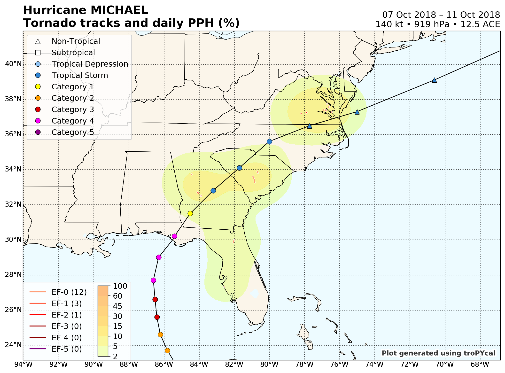


    C:\Users\User\anaconda3\lib\site-packages\cartopy\mpl\gridliner.py:307: UserWarning: The .xlabels_top attribute is deprecated. Please use .top_labels to toggle visibility instead.
      warnings.warn('The .xlabels_top attribute is deprecated. Please '
    C:\Users\User\anaconda3\lib\site-packages\cartopy\mpl\gridliner.py:343: UserWarning: The .ylabels_right attribute is deprecated. Please use .right_labels to toggle visibility instead.
      warnings.warn('The .ylabels_right attribute is deprecated. Please '
    C:\Users\User\anaconda3\lib\site-packages\cartopy\mpl\gridliner.py:307: UserWarning: The .xlabels_top attribute is deprecated. Please use .top_labels to toggle visibility instead.
      warnings.warn('The .xlabels_top attribute is deprecated. Please '
    C:\Users\User\anaconda3\lib\site-packages\cartopy\mpl\gridliner.py:343: UserWarning: The .ylabels_right attribute is deprecated. Please use .right_labels to toggle visibility instead.
      warnings.warn('The .ylabels_right attribute is deprecated. Please '


    --> Starting to read in ibtracs data
    --> Completed reading in ibtracs data (269.28 seconds)


    C:\Users\User\anaconda3\lib\site-packages\cartopy\mpl\gridliner.py:307: UserWarning: The .xlabels_top attribute is deprecated. Please use .top_labels to toggle visibility instead.
      warnings.warn('The .xlabels_top attribute is deprecated. Please '
    C:\Users\User\anaconda3\lib\site-packages\cartopy\mpl\gridliner.py:343: UserWarning: The .ylabels_right attribute is deprecated. Please use .right_labels to toggle visibility instead.
      warnings.warn('The .ylabels_right attribute is deprecated. Please '


    <cartopy.mpl.geoaxes.GeoAxesSubplot at 0x19569dc8>


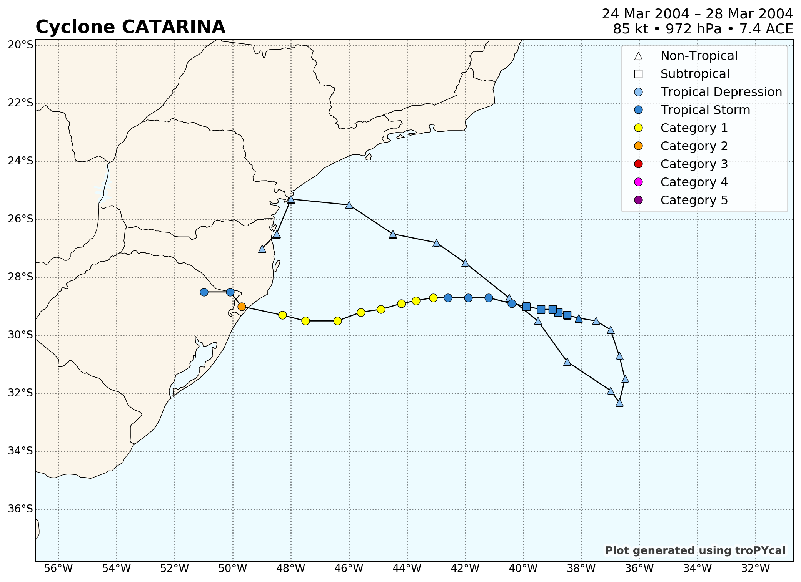


```python
tor_data = tornado.TornadoDataset()

tor_ax,domain,leg_tor = tor_data.plot_tors(dt.datetime(2011,4,27),plotPPH=True,return_ax=True)
tor_ax

hurdat_atl = tracks.TrackDataset(basin='north_atlantic',source='hurdat',include_btk=False)
#
hurdat_atl.assign_storm_tornadoes(dist_thresh=750)
#
storm = hurdat_atl.get_storm(('ivan',2004))
#
storm.plot_tors(plotPPH=True,return_ax=True)

```

    --> Starting to read in tornado track data
    --> Completed reading in tornado data for 1950-2018 (28.47 seconds)


    C:\Users\User\anaconda3\lib\site-packages\tropycal\tornado\tools.py:36: SettingWithCopyWarning: 
    A value is trying to be set on a copy of a slice from a DataFrame.
    Try using .loc[row_indexer,col_indexer] = value instead
    
    See the caveats in the documentation: https://pandas.pydata.org/pandas-docs/stable/user_guide/indexing.html#returning-a-view-versus-a-copy
      dfTors['SPC_time'] = dfTors['UTC_time'] - timedelta(hours=12)
    C:\Users\User\anaconda3\lib\site-packages\cartopy\mpl\gridliner.py:307: UserWarning: The .xlabels_top attribute is deprecated. Please use .top_labels to toggle visibility instead.
      warnings.warn('The .xlabels_top attribute is deprecated. Please '
    C:\Users\User\anaconda3\lib\site-packages\cartopy\mpl\gridliner.py:343: UserWarning: The .ylabels_right attribute is deprecated. Please use .right_labels to toggle visibility instead.
      warnings.warn('The .ylabels_right attribute is deprecated. Please '


    --> Starting to read in HURDAT2 data
    --> Completed reading in HURDAT2 data (8.9 seconds)
    --> Starting to read in tornado track data
    --> Completed reading in tornado data for 1950-2018 (17.77 seconds)
    --> Starting to assign tornadoes to storms
    --> Completed assigning tornadoes to storm (516.59 seconds)


    C:\Users\User\anaconda3\lib\site-packages\cartopy\mpl\gridliner.py:307: UserWarning: The .xlabels_top attribute is deprecated. Please use .top_labels to toggle visibility instead.
      warnings.warn('The .xlabels_top attribute is deprecated. Please '
    C:\Users\User\anaconda3\lib\site-packages\cartopy\mpl\gridliner.py:343: UserWarning: The .ylabels_right attribute is deprecated. Please use .right_labels to toggle visibility instead.
      warnings.warn('The .ylabels_right attribute is deprecated. Please '
    C:\Users\User\anaconda3\lib\site-packages\cartopy\mpl\gridliner.py:307: UserWarning: The .xlabels_top attribute is deprecated. Please use .top_labels to toggle visibility instead.
      warnings.warn('The .xlabels_top attribute is deprecated. Please '
    C:\Users\User\anaconda3\lib\site-packages\cartopy\mpl\gridliner.py:343: UserWarning: The .ylabels_right attribute is deprecated. Please use .right_labels to toggle visibility instead.
      warnings.warn('The .ylabels_right attribute is deprecated. Please '


    <cartopy.mpl.geoaxes.GeoAxesSubplot at 0x1815d948>


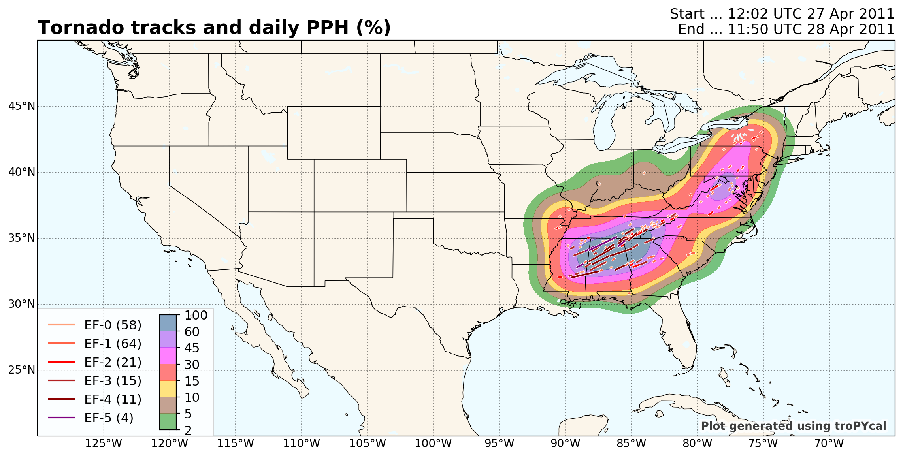


```python
hurdat_atl = tracks.TrackDataset(basin='north_atlantic',source='hurdat',include_btk=False)

#Retrieve Hurricane Michael from 2018
storm = hurdat_atl.get_storm(('michael',2018))
    
#Retrieve the 2017 Atlantic hurricane season
season = hurdat_atl.get_season(2017)

#Printing the Storm object lists relevant data:
print(storm)
    
print(hurdat_atl.search_name('Michael'))
#
hurdat_atl.plot_storm(('michael',2018),return_ax=True)
#
hurdat_atl.ace_climo(plot_year=2018,compare_years=2017)
#
hurdat_atl.ace_climo(rolling_sum=30,plot_year=2018,compare_years=2017)
#
hurdat_atl.wind_pres_relationship(storm=('sandy',2012))
#
ibtracs = tracks.TrackDataset(basin='all',source='ibtracs',ibtracs_mode='jtwc_neumann',catarina=True)
#
ibtracs.gridded_stats(request="maximum wind",return_ax=True)
#
ibtracs.gridded_stats(request="number of storms",thresh={'dv_min':30},prop={'cmap':'plasma_r'})

```

    --> Starting to read in HURDAT2 data
    --> Completed reading in HURDAT2 data (10.66 seconds)
    <tropycal.tracks.Storm>
    Storm Summary:
        Maximum Wind:      140 knots
        Minimum Pressure:  919 hPa
        Start Date:        0600 UTC 07 October 2018
        End Date:          1800 UTC 11 October 2018
    
    Variables:
        date        (datetime) [2018-10-06 18:00:00 .... 2018-10-15 18:00:00]
        extra_obs   (int32) [0 .... 0]
        special     (str) [ .... ]
        type        (str) [LO .... EX]
        lat         (float64) [17.8 .... 41.2]
        lon         (float64) [-86.6 .... -10.0]
        vmax        (int32) [25 .... 35]
        mslp        (int32) [1006 .... 1001]
        wmo_basin   (str) [north_atlantic .... north_atlantic]
    
    More Information:
        id:              AL142018
        operational_id:  AL142018
        name:            MICHAEL
        year:            2018
        season:          2018
        basin:           north_atlantic
        source_info:     NHC Hurricane Database
        source:          hurdat
        ace:             12.5
        realtime:        False
    [2000, 2012, 2018]


    C:\Users\User\anaconda3\lib\site-packages\cartopy\mpl\gridliner.py:307: UserWarning: The .xlabels_top attribute is deprecated. Please use .top_labels to toggle visibility instead.
      warnings.warn('The .xlabels_top attribute is deprecated. Please '
    C:\Users\User\anaconda3\lib\site-packages\cartopy\mpl\gridliner.py:343: UserWarning: The .ylabels_right attribute is deprecated. Please use .right_labels to toggle visibility instead.
      warnings.warn('The .ylabels_right attribute is deprecated. Please '


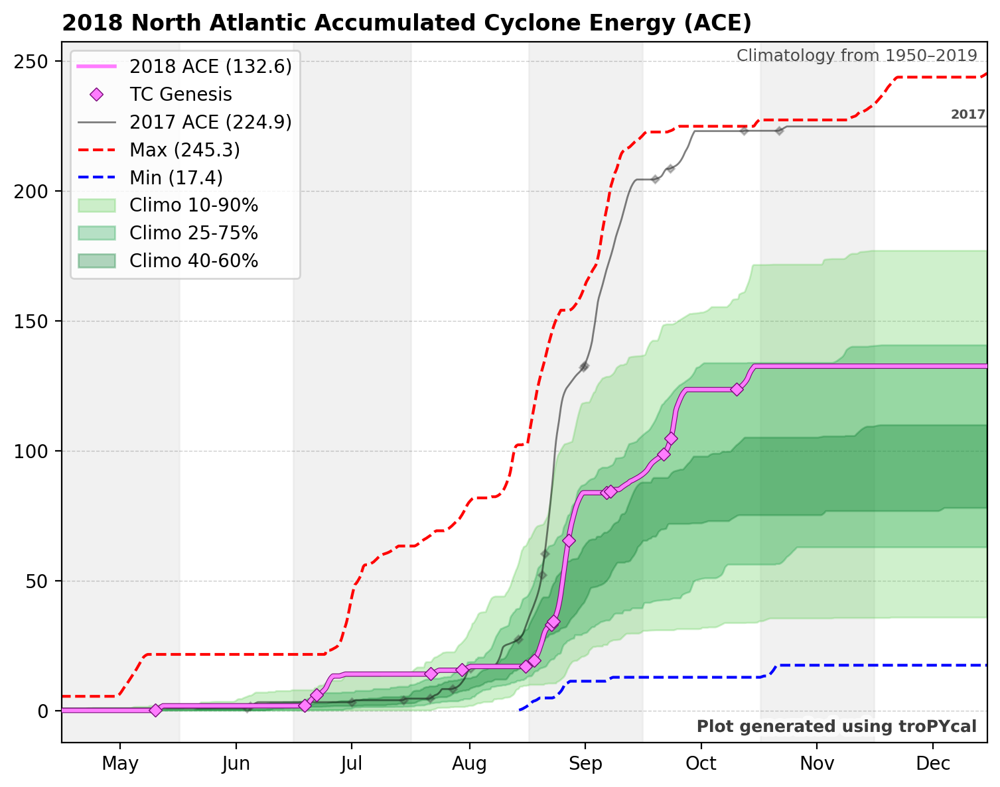


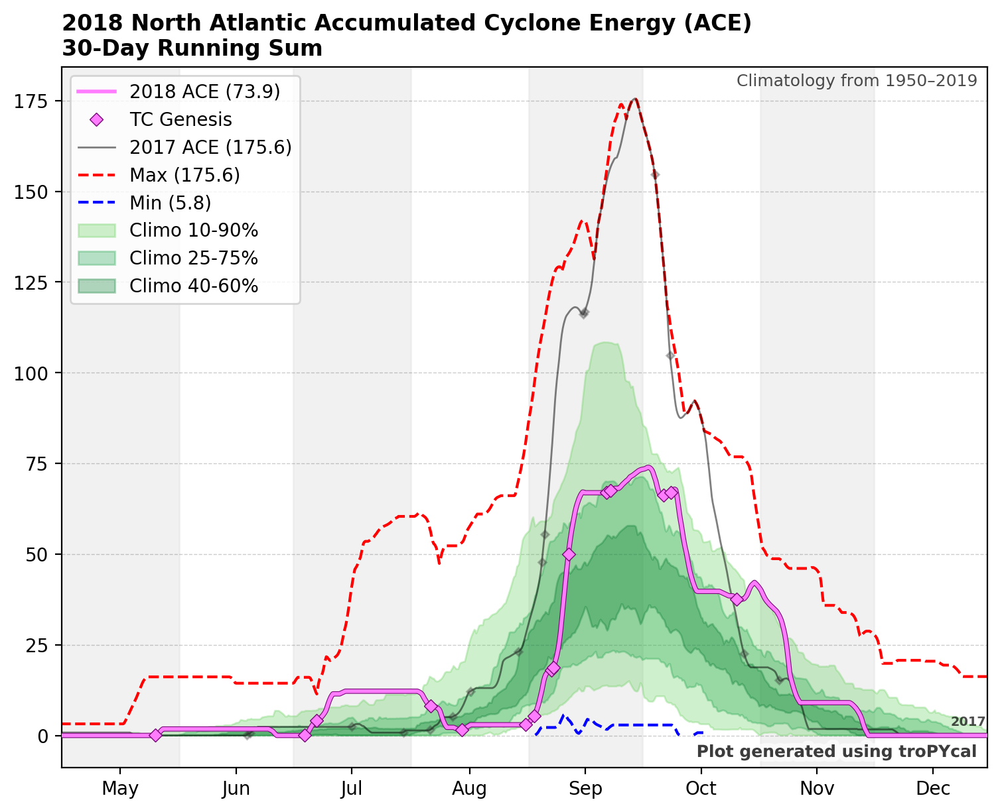


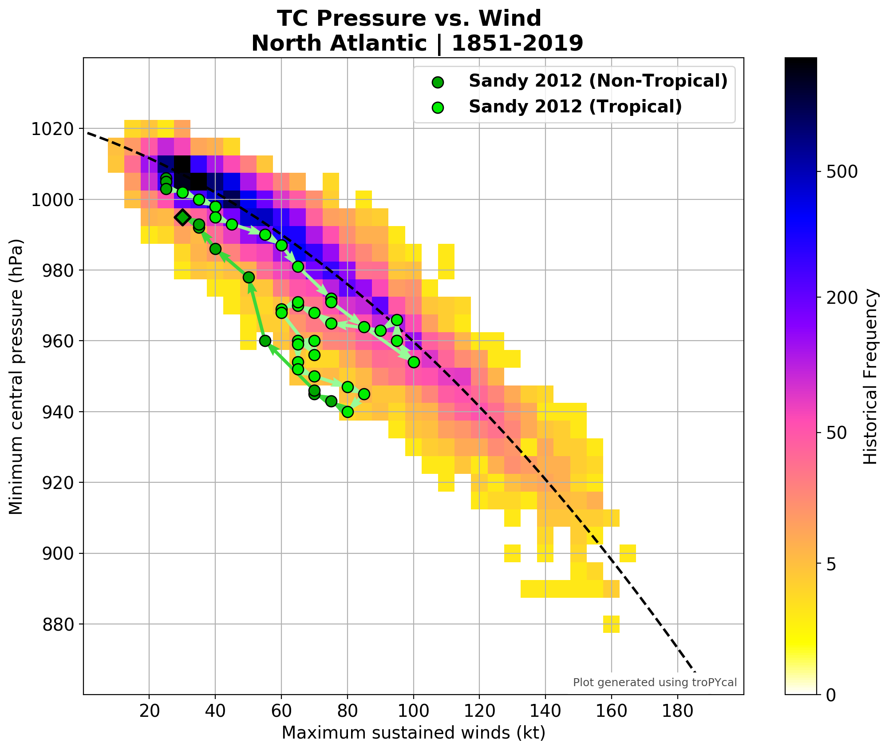


    --> Starting to read in ibtracs data
    --> Completed reading in ibtracs data (518.89 seconds)
    --> Getting filtered storm tracks
    --> Grouping by lat/lon/storm


    C:\Users\User\anaconda3\lib\site-packages\tropycal\tracks\tools.py:101: RuntimeWarning: All-NaN slice encountered
      return thresh, lambda x: np.nanmax(x)
    C:\Users\User\anaconda3\lib\site-packages\tropycal\tracks\tools.py:101: RuntimeWarning: All-NaN axis encountered
      return thresh, lambda x: np.nanmax(x)
    C:\Users\User\anaconda3\lib\site-packages\cartopy\mpl\gridliner.py:307: UserWarning: The .xlabels_top attribute is deprecated. Please use .top_labels to toggle visibility instead.
      warnings.warn('The .xlabels_top attribute is deprecated. Please '
    C:\Users\User\anaconda3\lib\site-packages\cartopy\mpl\gridliner.py:343: UserWarning: The .ylabels_right attribute is deprecated. Please use .right_labels to toggle visibility instead.
      warnings.warn('The .ylabels_right attribute is deprecated. Please '


    --> Generating plot
    --> Getting filtered storm tracks
    --> Grouping by lat/lon/storm
    --> Generating plot


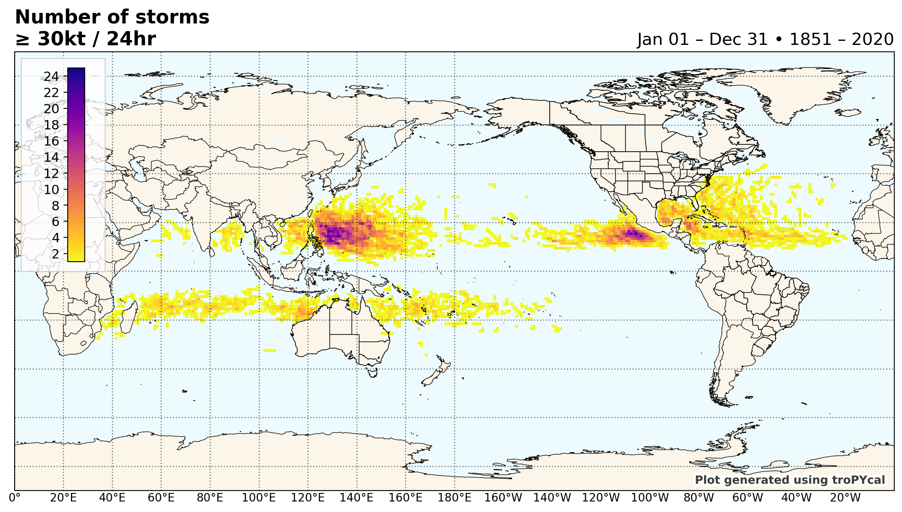


```python

```
