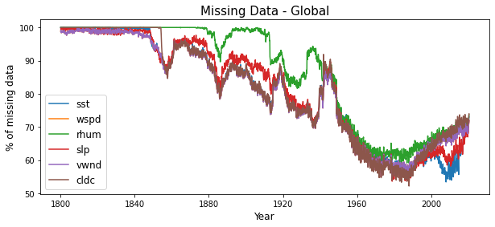
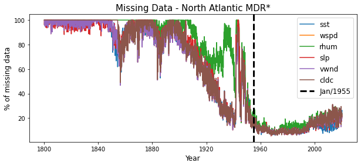
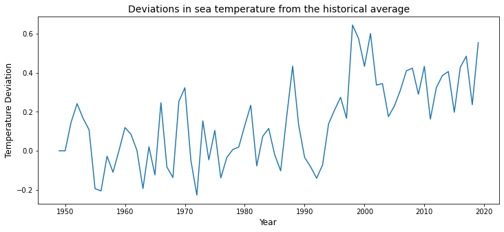
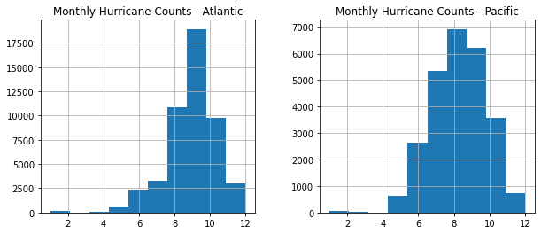
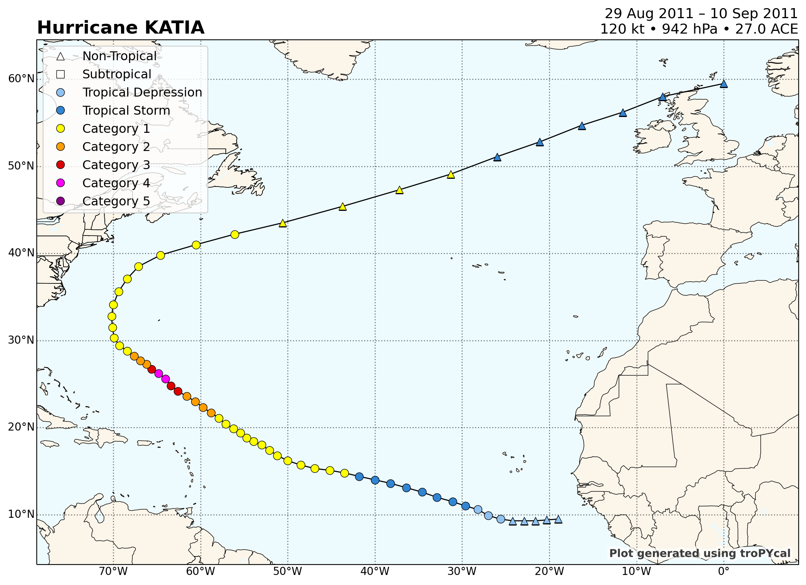

# Exploratory Data Analysis

__Group: Alysson Espíndola de Sá Silveira, Rener de Souza Oliveira, Yuri Luis Faria Silva__


```python
# !apt-get install libgeos-3.5.0
# !apt-get install libgeos-dev
# !pip install https://github.com/matplotlib/basemap/archive/master.zip
# !pip install pyproj==1.9.6
# !pip install netCDF4
# !pip install jinja2
# !pip install geopy
# !pip install xarray
# !pip install networkx
# !pip install requests
# !pip install cartopy
# !pip install tropycal
#Uncomment the above lines and execute this cell; then go to "Runtime"->"Restart Runtime".
```


```python
%matplotlib inline
import numpy as np
import matplotlib.pyplot as plt
import matplotlib.colors as c
from mpl_toolkits.basemap import Basemap,shiftgrid
import pandas as pd
import netCDF4 as nc
```

## 1 - Missing Data - netCDF4

This part of our data is in .nc file extension, which stands for netCDF4. It's widely used in climatology and has python support for reading it.


```python
sst_mean = nc.Dataset('Datasets/sst.mean.nc','r')
rhum_mean = nc.Dataset('Datasets/rhum.mean.nc','r')
wspd_mean = nc.Dataset('Datasets/wspd.mean.nc','r')
slp_mean = nc.Dataset('Datasets/slp.mean.nc','r')
vwnd_mean = nc.Dataset('Datasets/vwnd.mean.nc','r')
cldc_mean = nc.Dataset("Datasets/cldc.mean.nc",'r')

lats = sst_mean.variables['lat'][:]
lons = sst_mean.variables['lon'][:]
time = sst_mean.variables['time'][:]

sst = sst_mean.variables['sst'][:,:,:]
rhum = rhum_mean.variables['rhum'][:,:,:]
wspd = wspd_mean.variables['wspd'][:,:,:]
slp = slp_mean.variables['slp'][:,:,:]
vwnd = vwnd_mean.variables['vwnd'][:,:,:]
cldc = cldc_mean.variables['cldc'][:,:,:]

sst_mean.close()
wspd_mean.close()
rhum_mean.close()
slp_mean.close()
vwnd_mean.close()
cldc_mean.close()

period = pd.date_range(start = "1800-01-01",end = "2020-07-01", freq = "MS").to_pydatetime().tolist()

def get_missing(data:list,labels:list)->dict:
    missing={}
    lenght = data[0].shape[0]
    for j,item in enumerate(data):
        missing[labels[j]] = []
        for i in range(lenght):
            missing[labels[j]].append(100*np.sum(item[i].mask)/item[i].data.size)
    return missing

missing = get_missing([sst,wspd,rhum,slp,vwnd,cldc],['sst','wspd','rhum','slp','vwnd','cldc'])

fig,ax = plt.subplots(1,1,figsize=(10,4))

ax.set_title("Missing Data - Global",fontsize=15)
ax.set_xlabel("Year",fontsize=12)
ax.set_ylabel("% of missing data",fontsize=12)
for key,value in missing.items():
    ax.plot(period,missing[key],label=key)
ax.legend(loc='best',fontsize=12);
fig.savefig('missing.png')
plt.show()

print(type(sst))
```





    <class 'numpy.ma.core.MaskedArray'>


__Legend:__

- sst: Sea Surface Temperature
- wspd: Scalar Wind Speed
- rhum: Relative Humidity
- slp: Sea Level Pressure
- vwnd: V-wind component
- cldc: Cloudiness

Since continents represent approximately $29,1\%$ of earth surface and the data cover just oceans, The continents are filled with missing values. So, naturally, this percentage is the lower bound of missing data.


Note that the data types are "numpy.ma.core.MaskedArray" which has an attribute "mask", which is an indicator variable of missingness; That's gonna help us deal with it.

As we can see in the above plot, we have decades with missingness levels above 90%. Soon, we're gonna analyze focusing on Pacific and North Atlantic, which is our study area.


```python
sst_mean = nc.Dataset('Datasets/sst.mean.nc','r')
x = sst_mean['sst'][:]
plt.hist(x[:,70, 40][x[:,70, 40].data<20000]) #testes com masked array
```


    (array([ 3.,  3., 12., 20., 30., 36., 32., 23., 30.,  6.]),
     array([-0.30999756,  0.36400145,  1.0380005 ,  1.7119995 ,  2.3859985 ,
             3.0599976 ,  3.7339966 ,  4.4079957 ,  5.0819945 ,  5.755994  ,
             6.4299927 ], dtype=float32),
     <a list of 10 Patch objects>)


```python
x.shape
```


    (2647, 90, 180)


```python
sst_at = sst[:,34:40,51:82] #10°-20°N, 80°-20°W
wspd_at = wspd[:,34:40,51:82]
rhum_at = rhum[:,34:40,51:82]
slp_at = slp[:,34:40,51:82]
vwnd_at = vwnd[:,34:40,51:82]
cldc_at = cldc[:,34:40,51:82]

# sst_pac = sst[:,14:45,0:41] #0°-60°N, 100°W-180°W
# wspd_pac = wspd[:,14:45,0:41]
# rhum_pac = rhum[:,14:45,0:41]

missing_at = get_missing([sst_at,wspd_at,rhum_at,slp_at,vwnd_at,cldc_at],['sst_at','wspd_at','rhum_at','slp_at','vwnd_at','cldc_at'])
# missing_pac = get_missing([sst_pac,wspd_pac,rhum_pac],['sst_pac','wspd_pac','rhum_pac'])

# fig,(ax,ax1) = plt.subplots(2,1,figsize=(10,8))
fig,ax = plt.subplots(1,1,figsize=(10,4))
ax.set_title("Missing Data - North Atlantic MDR*",fontsize=15)
ax.set_xlabel("Year",fontsize=12)
ax.set_ylabel("% of missing data",fontsize=12)
for key,value in missing_at.items():
    ax.plot(period,missing_at[key],label=key[0:-3])
plt.axvline(x=period[1860],label = "Jan/1955",color = 'black', lw=3,ls='--')

ax.legend(loc='best',fontsize=12);
fig.savefig('missing_mdr.png')
```





\*MDR stands for _Main Development Region_ which refers to the rectangle 10°-20°N, 80°-20°W.

We can see that after the decade 1950-1960, we have more a more complete dataset in our study region. So, to understand the relation of the variables, we're gonna work starting this decade.

But, nothing keeps us from working with older data, since values don't vary a lot when it's close; If we wanted to work with long-term trends we could cut the data starting from 1920, and just apply the mean, even with $\approx70$% of missing data. that's because we have an indicator array, which can help with modeling. Also, this percentage is a little lower because of the continental area in the MDR cut considered. 

Below, we have an example of the distribution of SST data in January 1955.

## 2 - Visualization


```python
#Transforms longitude ranges from [0,360] para [-180,180] --> useful for plot

sst[:],lonsn = shiftgrid(180,sst[:],lons,start=False)
wspd[:],lonsn = shiftgrid(180,wspd[:],lons,start=False)
# shum[:],lonsn = shiftgrid(180,shum[:],lons,start=False)
rhum[:],lonsn = shiftgrid(180,rhum[:],lons,start=False)
lons = lonsn
```


```python
#Reference: https://annefou.github.io/metos_python/04-plotting/
time_index = 1860

fig = plt.figure(figsize=[12,15])
ax = fig.add_subplot(1, 1, 1)
ax.set_title("sst: {}".format(period[time_index].date()),fontsize=16)
map = Basemap(projection='cyl',llcrnrlat=-90,urcrnrlat=90,\
            llcrnrlon=-180,urcrnrlon=180,resolution='c', ax=ax)
map.drawcoastlines()
map.fillcontinents(color='#ffe2ab')

map.drawparallels(np.arange(-90.,120.,30.),labels=[1,0,0,0])
map.drawmeridians(np.arange(-180.,180.,60.),labels=[0,0,0,1])


llons, llats = np.meshgrid(lons, lats)
x,y = map(llons,llats)


cmap = c.ListedColormap(['#35978f','#ffffcc','#ffeda0','#fed976','#feb24c','#fd8d3c',
                        '#fc4e2a','#e31a1c','#bd0026','#800026'])
bounds=list(np.arange(-5,37,1))
# bounds=list(np.arange(10,100,5))
norm = c.BoundaryNorm(bounds, ncolors=cmap.N)

cs = map.contourf(x,y,sst[time_index], cmap=cmap, norm=norm, levels=bounds)
fig.colorbar(cs, cmap=cmap, norm=norm, boundaries=bounds, ticks=bounds, ax=ax, orientation='horizontal');
```


A good way to visualize this data is with animation, but the above plot gives us a very good glimpse of what kind of data we're working on.


```python
print(period[1788])
```

    1949-01-01 00:00:00


```python
print(period[1860]) # -- 1955 January
def get_mean(data):
    size = data.shape[0]
    new = np.array([])
    for i in range(size):
        new = np.append(new,np.mean(data[i,:,:]))
    return new

#We're gonna start from the time index 1788, representing January 1949, to match with our PDI dataset.
data_at = pd.DataFrame(get_mean(sst_at[1788:,:,:]),columns =["sst"])
period_df = pd.DataFrame(period[1788:],columns = ["Date"])
period_df['Year']=period_df.Date.map(lambda x: x.year)
period_df['Month']=period_df.Date.map(lambda x: x.month)
data_at['rhum'] = pd.DataFrame(get_mean(rhum_at[1788:,:,:]),columns =["rhum"])
data_at['slp'] = pd.DataFrame(get_mean(slp_at[1788:,:,:]),columns =["slp"])
data_at['wspd'] = pd.DataFrame(get_mean(wspd_at[1788:,:,:]),columns =["wspd"])
data_at['vwnd'] = pd.DataFrame(get_mean(vwnd_at[1788:,:,:]),columns =["vwnd"])
data_at['cldc'] = pd.DataFrame(get_mean(cldc_at[1788:,:,:]),columns =["cldc"])

atlantic_mdr = pd.concat([period_df,data_at],axis=1)

cum_sum = {}
for i in range(1,13):
    cum_sum[i]=0
k=0 #year count
for i in range(0,atlantic_mdr.shape[0]-12):
    month = atlantic_mdr.iloc[i,:].Month
    if month%12==1:
        k+=1
    cum_sum[month]+=atlantic_mdr.iloc[i,3]
    atlantic_mdr.loc[atlantic_mdr.index[i],'sst_anomaly'] = atlantic_mdr.iloc[i,3]-cum_sum[month]/k
atlantic_mdr.drop('sst_anomaly',axis=1).to_csv('Datasets/atlantic_mdr.csv',index=False)
atlantic_mdr.iloc[12:24,:]
```

    1955-01-01 00:00:00


<div>
<style scoped>
    .dataframe tbody tr th:only-of-type {
        vertical-align: middle;
    }

    .dataframe tbody tr th {
        vertical-align: top;
    }

    .dataframe thead th {
        text-align: right;
    }
</style>
<table border="1" class="dataframe">
  <thead>
    <tr style="text-align: right;">
      <th></th>
      <th>Date</th>
      <th>Year</th>
      <th>Month</th>
      <th>sst</th>
      <th>rhum</th>
      <th>slp</th>
      <th>wspd</th>
      <th>vwnd</th>
      <th>cldc</th>
      <th>sst_anomaly</th>
    </tr>
  </thead>
  <tbody>
    <tr>
      <th>12</th>
      <td>1950-01-01</td>
      <td>1950</td>
      <td>1</td>
      <td>26.618658</td>
      <td>80.166064</td>
      <td>1012.699219</td>
      <td>6.274566</td>
      <td>-2.709708</td>
      <td>4.139401</td>
      <td>0.401114</td>
    </tr>
    <tr>
      <th>13</th>
      <td>1950-02-01</td>
      <td>1950</td>
      <td>2</td>
      <td>25.996199</td>
      <td>78.348542</td>
      <td>1012.883875</td>
      <td>6.633078</td>
      <td>-2.401613</td>
      <td>3.965875</td>
      <td>0.150126</td>
    </tr>
    <tr>
      <th>14</th>
      <td>1950-03-01</td>
      <td>1950</td>
      <td>3</td>
      <td>26.414721</td>
      <td>80.421051</td>
      <td>1013.134516</td>
      <td>5.954330</td>
      <td>-2.062759</td>
      <td>4.087092</td>
      <td>0.269065</td>
    </tr>
    <tr>
      <th>15</th>
      <td>1950-04-01</td>
      <td>1950</td>
      <td>4</td>
      <td>27.401395</td>
      <td>81.788231</td>
      <td>1011.096354</td>
      <td>4.909927</td>
      <td>-0.454326</td>
      <td>3.146995</td>
      <td>0.092152</td>
    </tr>
    <tr>
      <th>16</th>
      <td>1950-05-01</td>
      <td>1950</td>
      <td>5</td>
      <td>28.472969</td>
      <td>80.007482</td>
      <td>1010.577563</td>
      <td>5.476332</td>
      <td>0.516981</td>
      <td>4.291411</td>
      <td>0.073090</td>
    </tr>
    <tr>
      <th>17</th>
      <td>1950-06-01</td>
      <td>1950</td>
      <td>6</td>
      <td>28.896216</td>
      <td>81.928657</td>
      <td>1009.393293</td>
      <td>4.850322</td>
      <td>2.076482</td>
      <td>4.650387</td>
      <td>-0.032209</td>
    </tr>
    <tr>
      <th>18</th>
      <td>1950-07-01</td>
      <td>1950</td>
      <td>7</td>
      <td>29.033083</td>
      <td>81.664352</td>
      <td>1007.978285</td>
      <td>5.042128</td>
      <td>2.375750</td>
      <td>5.184904</td>
      <td>0.050943</td>
    </tr>
    <tr>
      <th>19</th>
      <td>1950-08-01</td>
      <td>1950</td>
      <td>8</td>
      <td>28.283786</td>
      <td>82.927725</td>
      <td>1007.856950</td>
      <td>4.906136</td>
      <td>1.956808</td>
      <td>5.109233</td>
      <td>-0.403537</td>
    </tr>
    <tr>
      <th>20</th>
      <td>1950-09-01</td>
      <td>1950</td>
      <td>9</td>
      <td>28.832019</td>
      <td>82.908388</td>
      <td>1007.869104</td>
      <td>4.910579</td>
      <td>0.525868</td>
      <td>5.305648</td>
      <td>0.051078</td>
    </tr>
    <tr>
      <th>21</th>
      <td>1950-10-01</td>
      <td>1950</td>
      <td>10</td>
      <td>28.090939</td>
      <td>80.471020</td>
      <td>1010.697798</td>
      <td>5.345116</td>
      <td>-1.037250</td>
      <td>4.423469</td>
      <td>-0.236270</td>
    </tr>
    <tr>
      <th>22</th>
      <td>1950-11-01</td>
      <td>1950</td>
      <td>11</td>
      <td>27.558145</td>
      <td>80.553408</td>
      <td>1009.745018</td>
      <td>6.262806</td>
      <td>-2.024746</td>
      <td>3.765682</td>
      <td>-0.195893</td>
    </tr>
    <tr>
      <th>23</th>
      <td>1950-12-01</td>
      <td>1950</td>
      <td>12</td>
      <td>26.741317</td>
      <td>79.440282</td>
      <td>1012.071718</td>
      <td>7.539570</td>
      <td>-4.750430</td>
      <td>4.100716</td>
      <td>-0.222622</td>
    </tr>
  </tbody>
</table>
</div>


```python
fig,ax = plt.subplots(1,1,figsize=(12,5))

ax.plot(np.arange(1949,2021,1),atlantic_mdr.groupby(['Year']).agg({'sst_anomaly':np.mean})['sst_anomaly'])
ax.set_title("Deviations in sea temperature from the historical average",fontsize=14)
ax.set_xlabel("Year",fontsize=12)
ax.set_ylabel("Temperature Deviation",fontsize=12);

```





```python
corr = atlantic_mdr.corr()
corr.style.background_gradient(cmap='coolwarm')
```


<style  type="text/css" >
    #T_43e92b6a_e656_11ea_b667_5cc9d3626684row0_col0 {
            background-color:  #b40426;
            color:  #f1f1f1;
        }    #T_43e92b6a_e656_11ea_b667_5cc9d3626684row0_col1 {
            background-color:  #9dbdff;
            color:  #000000;
        }    #T_43e92b6a_e656_11ea_b667_5cc9d3626684row0_col2 {
            background-color:  #e8d6cc;
            color:  #000000;
        }    #T_43e92b6a_e656_11ea_b667_5cc9d3626684row0_col3 {
            background-color:  #b3cdfb;
            color:  #000000;
        }    #T_43e92b6a_e656_11ea_b667_5cc9d3626684row0_col4 {
            background-color:  #d8dce2;
            color:  #000000;
        }    #T_43e92b6a_e656_11ea_b667_5cc9d3626684row0_col5 {
            background-color:  #c9d7f0;
            color:  #000000;
        }    #T_43e92b6a_e656_11ea_b667_5cc9d3626684row0_col6 {
            background-color:  #dfdbd9;
            color:  #000000;
        }    #T_43e92b6a_e656_11ea_b667_5cc9d3626684row0_col7 {
            background-color:  #d9dce1;
            color:  #000000;
        }    #T_43e92b6a_e656_11ea_b667_5cc9d3626684row1_col0 {
            background-color:  #4358cb;
            color:  #f1f1f1;
        }    #T_43e92b6a_e656_11ea_b667_5cc9d3626684row1_col1 {
            background-color:  #b40426;
            color:  #f1f1f1;
        }    #T_43e92b6a_e656_11ea_b667_5cc9d3626684row1_col2 {
            background-color:  #f49a7b;
            color:  #000000;
        }    #T_43e92b6a_e656_11ea_b667_5cc9d3626684row1_col3 {
            background-color:  #f7b99e;
            color:  #000000;
        }    #T_43e92b6a_e656_11ea_b667_5cc9d3626684row1_col4 {
            background-color:  #81a4fb;
            color:  #000000;
        }    #T_43e92b6a_e656_11ea_b667_5cc9d3626684row1_col5 {
            background-color:  #e5d8d1;
            color:  #000000;
        }    #T_43e92b6a_e656_11ea_b667_5cc9d3626684row1_col6 {
            background-color:  #f2cbb7;
            color:  #000000;
        }    #T_43e92b6a_e656_11ea_b667_5cc9d3626684row1_col7 {
            background-color:  #455cce;
            color:  #f1f1f1;
        }    #T_43e92b6a_e656_11ea_b667_5cc9d3626684row2_col0 {
            background-color:  #7a9df8;
            color:  #000000;
        }    #T_43e92b6a_e656_11ea_b667_5cc9d3626684row2_col1 {
            background-color:  #f7b396;
            color:  #000000;
        }    #T_43e92b6a_e656_11ea_b667_5cc9d3626684row2_col2 {
            background-color:  #b40426;
            color:  #f1f1f1;
        }    #T_43e92b6a_e656_11ea_b667_5cc9d3626684row2_col3 {
            background-color:  #f6a385;
            color:  #000000;
        }    #T_43e92b6a_e656_11ea_b667_5cc9d3626684row2_col4 {
            background-color:  #3b4cc0;
            color:  #f1f1f1;
        }    #T_43e92b6a_e656_11ea_b667_5cc9d3626684row2_col5 {
            background-color:  #d75445;
            color:  #000000;
        }    #T_43e92b6a_e656_11ea_b667_5cc9d3626684row2_col6 {
            background-color:  #f3c7b1;
            color:  #000000;
        }    #T_43e92b6a_e656_11ea_b667_5cc9d3626684row2_col7 {
            background-color:  #a6c4fe;
            color:  #000000;
        }    #T_43e92b6a_e656_11ea_b667_5cc9d3626684row3_col0 {
            background-color:  #3b4cc0;
            color:  #f1f1f1;
        }    #T_43e92b6a_e656_11ea_b667_5cc9d3626684row3_col1 {
            background-color:  #f3c7b1;
            color:  #000000;
        }    #T_43e92b6a_e656_11ea_b667_5cc9d3626684row3_col2 {
            background-color:  #f39778;
            color:  #000000;
        }    #T_43e92b6a_e656_11ea_b667_5cc9d3626684row3_col3 {
            background-color:  #b40426;
            color:  #f1f1f1;
        }    #T_43e92b6a_e656_11ea_b667_5cc9d3626684row3_col4 {
            background-color:  #5d7ce6;
            color:  #000000;
        }    #T_43e92b6a_e656_11ea_b667_5cc9d3626684row3_col5 {
            background-color:  #f6a385;
            color:  #000000;
        }    #T_43e92b6a_e656_11ea_b667_5cc9d3626684row3_col6 {
            background-color:  #f4c6af;
            color:  #000000;
        }    #T_43e92b6a_e656_11ea_b667_5cc9d3626684row3_col7 {
            background-color:  #4f69d9;
            color:  #000000;
        }    #T_43e92b6a_e656_11ea_b667_5cc9d3626684row4_col0 {
            background-color:  #5572df;
            color:  #000000;
        }    #T_43e92b6a_e656_11ea_b667_5cc9d3626684row4_col1 {
            background-color:  #3b4cc0;
            color:  #f1f1f1;
        }    #T_43e92b6a_e656_11ea_b667_5cc9d3626684row4_col2 {
            background-color:  #3b4cc0;
            color:  #f1f1f1;
        }    #T_43e92b6a_e656_11ea_b667_5cc9d3626684row4_col3 {
            background-color:  #3b4cc0;
            color:  #f1f1f1;
        }    #T_43e92b6a_e656_11ea_b667_5cc9d3626684row4_col4 {
            background-color:  #b40426;
            color:  #f1f1f1;
        }    #T_43e92b6a_e656_11ea_b667_5cc9d3626684row4_col5 {
            background-color:  #3b4cc0;
            color:  #f1f1f1;
        }    #T_43e92b6a_e656_11ea_b667_5cc9d3626684row4_col6 {
            background-color:  #3b4cc0;
            color:  #f1f1f1;
        }    #T_43e92b6a_e656_11ea_b667_5cc9d3626684row4_col7 {
            background-color:  #3b4cc0;
            color:  #f1f1f1;
        }    #T_43e92b6a_e656_11ea_b667_5cc9d3626684row5_col0 {
            background-color:  #3c4ec2;
            color:  #f1f1f1;
        }    #T_43e92b6a_e656_11ea_b667_5cc9d3626684row5_col1 {
            background-color:  #c3d5f4;
            color:  #000000;
        }    #T_43e92b6a_e656_11ea_b667_5cc9d3626684row5_col2 {
            background-color:  #d75445;
            color:  #000000;
        }    #T_43e92b6a_e656_11ea_b667_5cc9d3626684row5_col3 {
            background-color:  #f7af91;
            color:  #000000;
        }    #T_43e92b6a_e656_11ea_b667_5cc9d3626684row5_col4 {
            background-color:  #3e51c5;
            color:  #f1f1f1;
        }    #T_43e92b6a_e656_11ea_b667_5cc9d3626684row5_col5 {
            background-color:  #b40426;
            color:  #f1f1f1;
        }    #T_43e92b6a_e656_11ea_b667_5cc9d3626684row5_col6 {
            background-color:  #dedcdb;
            color:  #000000;
        }    #T_43e92b6a_e656_11ea_b667_5cc9d3626684row5_col7 {
            background-color:  #5673e0;
            color:  #000000;
        }    #T_43e92b6a_e656_11ea_b667_5cc9d3626684row6_col0 {
            background-color:  #94b6ff;
            color:  #000000;
        }    #T_43e92b6a_e656_11ea_b667_5cc9d3626684row6_col1 {
            background-color:  #edd2c3;
            color:  #000000;
        }    #T_43e92b6a_e656_11ea_b667_5cc9d3626684row6_col2 {
            background-color:  #f7b599;
            color:  #000000;
        }    #T_43e92b6a_e656_11ea_b667_5cc9d3626684row6_col3 {
            background-color:  #f5c0a7;
            color:  #000000;
        }    #T_43e92b6a_e656_11ea_b667_5cc9d3626684row6_col4 {
            background-color:  #6b8df0;
            color:  #000000;
        }    #T_43e92b6a_e656_11ea_b667_5cc9d3626684row6_col5 {
            background-color:  #efcfbf;
            color:  #000000;
        }    #T_43e92b6a_e656_11ea_b667_5cc9d3626684row6_col6 {
            background-color:  #b40426;
            color:  #f1f1f1;
        }    #T_43e92b6a_e656_11ea_b667_5cc9d3626684row6_col7 {
            background-color:  #536edd;
            color:  #000000;
        }    #T_43e92b6a_e656_11ea_b667_5cc9d3626684row7_col0 {
            background-color:  #d9dce1;
            color:  #000000;
        }    #T_43e92b6a_e656_11ea_b667_5cc9d3626684row7_col1 {
            background-color:  #9fbfff;
            color:  #000000;
        }    #T_43e92b6a_e656_11ea_b667_5cc9d3626684row7_col2 {
            background-color:  #f3c7b1;
            color:  #000000;
        }    #T_43e92b6a_e656_11ea_b667_5cc9d3626684row7_col3 {
            background-color:  #c1d4f4;
            color:  #000000;
        }    #T_43e92b6a_e656_11ea_b667_5cc9d3626684row7_col4 {
            background-color:  #cbd8ee;
            color:  #000000;
        }    #T_43e92b6a_e656_11ea_b667_5cc9d3626684row7_col5 {
            background-color:  #d7dce3;
            color:  #000000;
        }    #T_43e92b6a_e656_11ea_b667_5cc9d3626684row7_col6 {
            background-color:  #bad0f8;
            color:  #000000;
        }    #T_43e92b6a_e656_11ea_b667_5cc9d3626684row7_col7 {
            background-color:  #b40426;
            color:  #f1f1f1;
        }</style><table id="T_43e92b6a_e656_11ea_b667_5cc9d3626684" ><thead>    <tr>        <th class="blank level0" ></th>        <th class="col_heading level0 col0" >Year</th>        <th class="col_heading level0 col1" >Month</th>        <th class="col_heading level0 col2" >sst</th>        <th class="col_heading level0 col3" >rhum</th>        <th class="col_heading level0 col4" >slp</th>        <th class="col_heading level0 col5" >vwnd</th>        <th class="col_heading level0 col6" >cldc</th>        <th class="col_heading level0 col7" >sst_anomaly</th>    </tr></thead><tbody>
                <tr>
                        <th id="T_43e92b6a_e656_11ea_b667_5cc9d3626684level0_row0" class="row_heading level0 row0" >Year</th>
                        <td id="T_43e92b6a_e656_11ea_b667_5cc9d3626684row0_col0" class="data row0 col0" >1.000000</td>
                        <td id="T_43e92b6a_e656_11ea_b667_5cc9d3626684row0_col1" class="data row0 col1" >-0.010203</td>
                        <td id="T_43e92b6a_e656_11ea_b667_5cc9d3626684row0_col2" class="data row0 col2" >0.164281</td>
                        <td id="T_43e92b6a_e656_11ea_b667_5cc9d3626684row0_col3" class="data row0 col3" >-0.042398</td>
                        <td id="T_43e92b6a_e656_11ea_b667_5cc9d3626684row0_col4" class="data row0 col4" >0.048908</td>
                        <td id="T_43e92b6a_e656_11ea_b667_5cc9d3626684row0_col5" class="data row0 col5" >-0.035567</td>
                        <td id="T_43e92b6a_e656_11ea_b667_5cc9d3626684row0_col6" class="data row0 col6" >0.241832</td>
                        <td id="T_43e92b6a_e656_11ea_b667_5cc9d3626684row0_col7" class="data row0 col7" >0.465285</td>
            </tr>
            <tr>
                        <th id="T_43e92b6a_e656_11ea_b667_5cc9d3626684level0_row1" class="row_heading level0 row1" >Month</th>
                        <td id="T_43e92b6a_e656_11ea_b667_5cc9d3626684row1_col0" class="data row1 col0" >-0.010203</td>
                        <td id="T_43e92b6a_e656_11ea_b667_5cc9d3626684row1_col1" class="data row1 col1" >1.000000</td>
                        <td id="T_43e92b6a_e656_11ea_b667_5cc9d3626684row1_col2" class="data row1 col2" >0.541188</td>
                        <td id="T_43e92b6a_e656_11ea_b667_5cc9d3626684row1_col3" class="data row1 col3" >0.447957</td>
                        <td id="T_43e92b6a_e656_11ea_b667_5cc9d3626684row1_col4" class="data row1 col4" >-0.434216</td>
                        <td id="T_43e92b6a_e656_11ea_b667_5cc9d3626684row1_col5" class="data row1 col5" >0.151316</td>
                        <td id="T_43e92b6a_e656_11ea_b667_5cc9d3626684row1_col6" class="data row1 col6" >0.380311</td>
                        <td id="T_43e92b6a_e656_11ea_b667_5cc9d3626684row1_col7" class="data row1 col7" >0.001361</td>
            </tr>
            <tr>
                        <th id="T_43e92b6a_e656_11ea_b667_5cc9d3626684level0_row2" class="row_heading level0 row2" >sst</th>
                        <td id="T_43e92b6a_e656_11ea_b667_5cc9d3626684row2_col0" class="data row2 col0" >0.164281</td>
                        <td id="T_43e92b6a_e656_11ea_b667_5cc9d3626684row2_col1" class="data row2 col1" >0.541188</td>
                        <td id="T_43e92b6a_e656_11ea_b667_5cc9d3626684row2_col2" class="data row2 col2" >1.000000</td>
                        <td id="T_43e92b6a_e656_11ea_b667_5cc9d3626684row2_col3" class="data row2 col3" >0.549282</td>
                        <td id="T_43e92b6a_e656_11ea_b667_5cc9d3626684row2_col4" class="data row2 col4" >-0.834263</td>
                        <td id="T_43e92b6a_e656_11ea_b667_5cc9d3626684row2_col5" class="data row2 col5" >0.813505</td>
                        <td id="T_43e92b6a_e656_11ea_b667_5cc9d3626684row2_col6" class="data row2 col6" >0.402424</td>
                        <td id="T_43e92b6a_e656_11ea_b667_5cc9d3626684row2_col7" class="data row2 col7" >0.296363</td>
            </tr>
            <tr>
                        <th id="T_43e92b6a_e656_11ea_b667_5cc9d3626684level0_row3" class="row_heading level0 row3" >rhum</th>
                        <td id="T_43e92b6a_e656_11ea_b667_5cc9d3626684row3_col0" class="data row3 col0" >-0.042398</td>
                        <td id="T_43e92b6a_e656_11ea_b667_5cc9d3626684row3_col1" class="data row3 col1" >0.447957</td>
                        <td id="T_43e92b6a_e656_11ea_b667_5cc9d3626684row3_col2" class="data row3 col2" >0.549282</td>
                        <td id="T_43e92b6a_e656_11ea_b667_5cc9d3626684row3_col3" class="data row3 col3" >1.000000</td>
                        <td id="T_43e92b6a_e656_11ea_b667_5cc9d3626684row3_col4" class="data row3 col4" >-0.628214</td>
                        <td id="T_43e92b6a_e656_11ea_b667_5cc9d3626684row3_col5" class="data row3 col5" >0.502711</td>
                        <td id="T_43e92b6a_e656_11ea_b667_5cc9d3626684row3_col6" class="data row3 col6" >0.412368</td>
                        <td id="T_43e92b6a_e656_11ea_b667_5cc9d3626684row3_col7" class="data row3 col7" >0.033063</td>
            </tr>
            <tr>
                        <th id="T_43e92b6a_e656_11ea_b667_5cc9d3626684level0_row4" class="row_heading level0 row4" >slp</th>
                        <td id="T_43e92b6a_e656_11ea_b667_5cc9d3626684row4_col0" class="data row4 col0" >0.048908</td>
                        <td id="T_43e92b6a_e656_11ea_b667_5cc9d3626684row4_col1" class="data row4 col1" >-0.434216</td>
                        <td id="T_43e92b6a_e656_11ea_b667_5cc9d3626684row4_col2" class="data row4 col2" >-0.834263</td>
                        <td id="T_43e92b6a_e656_11ea_b667_5cc9d3626684row4_col3" class="data row4 col3" >-0.628214</td>
                        <td id="T_43e92b6a_e656_11ea_b667_5cc9d3626684row4_col4" class="data row4 col4" >1.000000</td>
                        <td id="T_43e92b6a_e656_11ea_b667_5cc9d3626684row4_col5" class="data row4 col5" >-0.812037</td>
                        <td id="T_43e92b6a_e656_11ea_b667_5cc9d3626684row4_col6" class="data row4 col6" >-0.548567</td>
                        <td id="T_43e92b6a_e656_11ea_b667_5cc9d3626684row4_col7" class="data row4 col7" >-0.038420</td>
            </tr>
            <tr>
                        <th id="T_43e92b6a_e656_11ea_b667_5cc9d3626684level0_row5" class="row_heading level0 row5" >vwnd</th>
                        <td id="T_43e92b6a_e656_11ea_b667_5cc9d3626684row5_col0" class="data row5 col0" >-0.035567</td>
                        <td id="T_43e92b6a_e656_11ea_b667_5cc9d3626684row5_col1" class="data row5 col1" >0.151316</td>
                        <td id="T_43e92b6a_e656_11ea_b667_5cc9d3626684row5_col2" class="data row5 col2" >0.813505</td>
                        <td id="T_43e92b6a_e656_11ea_b667_5cc9d3626684row5_col3" class="data row5 col3" >0.502711</td>
                        <td id="T_43e92b6a_e656_11ea_b667_5cc9d3626684row5_col4" class="data row5 col4" >-0.812037</td>
                        <td id="T_43e92b6a_e656_11ea_b667_5cc9d3626684row5_col5" class="data row5 col5" >1.000000</td>
                        <td id="T_43e92b6a_e656_11ea_b667_5cc9d3626684row5_col6" class="data row5 col6" >0.236100</td>
                        <td id="T_43e92b6a_e656_11ea_b667_5cc9d3626684row5_col7" class="data row5 col7" >0.056093</td>
            </tr>
            <tr>
                        <th id="T_43e92b6a_e656_11ea_b667_5cc9d3626684level0_row6" class="row_heading level0 row6" >cldc</th>
                        <td id="T_43e92b6a_e656_11ea_b667_5cc9d3626684row6_col0" class="data row6 col0" >0.241832</td>
                        <td id="T_43e92b6a_e656_11ea_b667_5cc9d3626684row6_col1" class="data row6 col1" >0.380311</td>
                        <td id="T_43e92b6a_e656_11ea_b667_5cc9d3626684row6_col2" class="data row6 col2" >0.402424</td>
                        <td id="T_43e92b6a_e656_11ea_b667_5cc9d3626684row6_col3" class="data row6 col3" >0.412368</td>
                        <td id="T_43e92b6a_e656_11ea_b667_5cc9d3626684row6_col4" class="data row6 col4" >-0.548567</td>
                        <td id="T_43e92b6a_e656_11ea_b667_5cc9d3626684row6_col5" class="data row6 col5" >0.236100</td>
                        <td id="T_43e92b6a_e656_11ea_b667_5cc9d3626684row6_col6" class="data row6 col6" >1.000000</td>
                        <td id="T_43e92b6a_e656_11ea_b667_5cc9d3626684row6_col7" class="data row6 col7" >0.043181</td>
            </tr>
            <tr>
                        <th id="T_43e92b6a_e656_11ea_b667_5cc9d3626684level0_row7" class="row_heading level0 row7" >sst_anomaly</th>
                        <td id="T_43e92b6a_e656_11ea_b667_5cc9d3626684row7_col0" class="data row7 col0" >0.465285</td>
                        <td id="T_43e92b6a_e656_11ea_b667_5cc9d3626684row7_col1" class="data row7 col1" >0.001361</td>
                        <td id="T_43e92b6a_e656_11ea_b667_5cc9d3626684row7_col2" class="data row7 col2" >0.296363</td>
                        <td id="T_43e92b6a_e656_11ea_b667_5cc9d3626684row7_col3" class="data row7 col3" >0.033063</td>
                        <td id="T_43e92b6a_e656_11ea_b667_5cc9d3626684row7_col4" class="data row7 col4" >-0.038420</td>
                        <td id="T_43e92b6a_e656_11ea_b667_5cc9d3626684row7_col5" class="data row7 col5" >0.056093</td>
                        <td id="T_43e92b6a_e656_11ea_b667_5cc9d3626684row7_col6" class="data row7 col6" >0.043181</td>
                        <td id="T_43e92b6a_e656_11ea_b667_5cc9d3626684row7_col7" class="data row7 col7" >1.000000</td>
            </tr>
    </tbody></table>


## 3 - The Hurricane Dataset


```python
df = pd.read_csv('Datasets/atlantic_new.csv')
df2 = pd.read_csv('Datasets/pacific_new.csv')
```


```python
fig, axs = plt.subplots(1,2, figsize=(10,4))
df.hist('month', ax=axs[0])
# plt.hist(df.month, ax=axs[0])
axs[0].set_title("Monthly Hurricane Counts - Atlantic") #tepo
df2.hist('month', ax=axs[1])
axs[1].set_title("Monthly Hurricane Counts - Pacific");
```





```python
df[df.year==2011].sort_values(by='Maximum Wind',ascending=0)
```


<div>
<style scoped>
    .dataframe tbody tr th:only-of-type {
        vertical-align: middle;
    }

    .dataframe tbody tr th {
        vertical-align: top;
    }

    .dataframe thead th {
        text-align: right;
    }
</style>
<table border="1" class="dataframe">
  <thead>
    <tr style="text-align: right;">
      <th></th>
      <th>ID</th>
      <th>Name</th>
      <th>Date</th>
      <th>Time</th>
      <th>Event</th>
      <th>Status</th>
      <th>Latitude</th>
      <th>Longitude</th>
      <th>Maximum Wind</th>
      <th>Minimum Pressure</th>
      <th>...</th>
      <th>Moderate Wind NE</th>
      <th>Moderate Wind SE</th>
      <th>Moderate Wind SW</th>
      <th>Moderate Wind NW</th>
      <th>High Wind NE</th>
      <th>High Wind SE</th>
      <th>High Wind SW</th>
      <th>High Wind NW</th>
      <th>month</th>
      <th>year</th>
    </tr>
  </thead>
  <tbody>
    <tr>
      <th>47316</th>
      <td>AL162011</td>
      <td>OPHELIA</td>
      <td>2011-10-02</td>
      <td>0</td>
      <td></td>
      <td>HU</td>
      <td>32.8</td>
      <td>-62.5</td>
      <td>120</td>
      <td>940</td>
      <td>...</td>
      <td>60</td>
      <td>60</td>
      <td>40</td>
      <td>40</td>
      <td>30</td>
      <td>30</td>
      <td>20</td>
      <td>20</td>
      <td>10</td>
      <td>2011</td>
    </tr>
    <tr>
      <th>47154</th>
      <td>AL122011</td>
      <td>KATIA</td>
      <td>2011-09-06</td>
      <td>0</td>
      <td></td>
      <td>HU</td>
      <td>25.6</td>
      <td>-64.0</td>
      <td>120</td>
      <td>942</td>
      <td>...</td>
      <td>80</td>
      <td>70</td>
      <td>60</td>
      <td>70</td>
      <td>50</td>
      <td>50</td>
      <td>40</td>
      <td>50</td>
      <td>9</td>
      <td>2011</td>
    </tr>
    <tr>
      <th>47155</th>
      <td>AL122011</td>
      <td>KATIA</td>
      <td>2011-09-06</td>
      <td>600</td>
      <td></td>
      <td>HU</td>
      <td>26.2</td>
      <td>-64.8</td>
      <td>115</td>
      <td>946</td>
      <td>...</td>
      <td>80</td>
      <td>70</td>
      <td>60</td>
      <td>70</td>
      <td>50</td>
      <td>50</td>
      <td>40</td>
      <td>50</td>
      <td>9</td>
      <td>2011</td>
    </tr>
    <tr>
      <th>47315</th>
      <td>AL162011</td>
      <td>OPHELIA</td>
      <td>2011-10-01</td>
      <td>1800</td>
      <td></td>
      <td>HU</td>
      <td>30.7</td>
      <td>-62.9</td>
      <td>110</td>
      <td>946</td>
      <td>...</td>
      <td>60</td>
      <td>60</td>
      <td>40</td>
      <td>40</td>
      <td>30</td>
      <td>30</td>
      <td>20</td>
      <td>20</td>
      <td>10</td>
      <td>2011</td>
    </tr>
    <tr>
      <th>47153</th>
      <td>AL122011</td>
      <td>KATIA</td>
      <td>2011-09-05</td>
      <td>1800</td>
      <td></td>
      <td>HU</td>
      <td>24.8</td>
      <td>-63.4</td>
      <td>110</td>
      <td>946</td>
      <td>...</td>
      <td>80</td>
      <td>70</td>
      <td>60</td>
      <td>70</td>
      <td>50</td>
      <td>50</td>
      <td>40</td>
      <td>50</td>
      <td>9</td>
      <td>2011</td>
    </tr>
    <tr>
      <th>...</th>
      <td>...</td>
      <td>...</td>
      <td>...</td>
      <td>...</td>
      <td>...</td>
      <td>...</td>
      <td>...</td>
      <td>...</td>
      <td>...</td>
      <td>...</td>
      <td>...</td>
      <td>...</td>
      <td>...</td>
      <td>...</td>
      <td>...</td>
      <td>...</td>
      <td>...</td>
      <td>...</td>
      <td>...</td>
      <td>...</td>
      <td>...</td>
    </tr>
    <tr>
      <th>47201</th>
      <td>AL132011</td>
      <td>LEE</td>
      <td>2011-09-06</td>
      <td>600</td>
      <td></td>
      <td>EX</td>
      <td>33.4</td>
      <td>-85.3</td>
      <td>20</td>
      <td>997</td>
      <td>...</td>
      <td>0</td>
      <td>0</td>
      <td>0</td>
      <td>0</td>
      <td>0</td>
      <td>0</td>
      <td>0</td>
      <td>0</td>
      <td>9</td>
      <td>2011</td>
    </tr>
    <tr>
      <th>47119</th>
      <td>AL122011</td>
      <td>KATIA</td>
      <td>2011-08-28</td>
      <td>600</td>
      <td></td>
      <td>LO</td>
      <td>9.4</td>
      <td>-20.3</td>
      <td>20</td>
      <td>1011</td>
      <td>...</td>
      <td>0</td>
      <td>0</td>
      <td>0</td>
      <td>0</td>
      <td>0</td>
      <td>0</td>
      <td>0</td>
      <td>0</td>
      <td>8</td>
      <td>2011</td>
    </tr>
    <tr>
      <th>47118</th>
      <td>AL122011</td>
      <td>KATIA</td>
      <td>2011-08-28</td>
      <td>0</td>
      <td></td>
      <td>LO</td>
      <td>9.5</td>
      <td>-19.0</td>
      <td>20</td>
      <td>1012</td>
      <td>...</td>
      <td>0</td>
      <td>0</td>
      <td>0</td>
      <td>0</td>
      <td>0</td>
      <td>0</td>
      <td>0</td>
      <td>0</td>
      <td>8</td>
      <td>2011</td>
    </tr>
    <tr>
      <th>47202</th>
      <td>AL132011</td>
      <td>LEE</td>
      <td>2011-09-06</td>
      <td>1200</td>
      <td></td>
      <td>EX</td>
      <td>34.2</td>
      <td>-85.1</td>
      <td>15</td>
      <td>1000</td>
      <td>...</td>
      <td>0</td>
      <td>0</td>
      <td>0</td>
      <td>0</td>
      <td>0</td>
      <td>0</td>
      <td>0</td>
      <td>0</td>
      <td>9</td>
      <td>2011</td>
    </tr>
    <tr>
      <th>47203</th>
      <td>AL132011</td>
      <td>LEE</td>
      <td>2011-09-06</td>
      <td>1800</td>
      <td></td>
      <td>EX</td>
      <td>34.9</td>
      <td>-85.3</td>
      <td>15</td>
      <td>1004</td>
      <td>...</td>
      <td>0</td>
      <td>0</td>
      <td>0</td>
      <td>0</td>
      <td>0</td>
      <td>0</td>
      <td>0</td>
      <td>0</td>
      <td>9</td>
      <td>2011</td>
    </tr>
  </tbody>
</table>
<p>557 rows × 24 columns</p>
</div>


```python
# from cartopy import features.Border
import tropycal.tracks as tracks
hurdat = tracks.TrackDataset(basin='north_atlantic')
```

    --> Starting to read in HURDAT2 data
    --> Completed reading in HURDAT2 data (5.41 seconds)


```python
import cartopy.crs as ccrs
katia = hurdat.get_storm(('katia',2011))
ophelia =  hurdat.get_storm(('ophelia',2011))
katia.plot()
```





```python
ophelia.plot()
```


```python
df.sort_values(by='year',ascending=0)
```


<div>
<style scoped>
    .dataframe tbody tr th:only-of-type {
        vertical-align: middle;
    }

    .dataframe tbody tr th {
        vertical-align: top;
    }

    .dataframe thead th {
        text-align: right;
    }
</style>
<table border="1" class="dataframe">
  <thead>
    <tr style="text-align: right;">
      <th></th>
      <th>ID</th>
      <th>Name</th>
      <th>Date</th>
      <th>Time</th>
      <th>Event</th>
      <th>Status</th>
      <th>Latitude</th>
      <th>Longitude</th>
      <th>Maximum Wind</th>
      <th>Minimum Pressure</th>
      <th>...</th>
      <th>Moderate Wind NE</th>
      <th>Moderate Wind SE</th>
      <th>Moderate Wind SW</th>
      <th>Moderate Wind NW</th>
      <th>High Wind NE</th>
      <th>High Wind SE</th>
      <th>High Wind SW</th>
      <th>High Wind NW</th>
      <th>month</th>
      <th>year</th>
    </tr>
  </thead>
  <tbody>
    <tr>
      <th>49104</th>
      <td>AL122015</td>
      <td>KATE</td>
      <td>2015-11-13</td>
      <td>1200</td>
      <td></td>
      <td>EX</td>
      <td>40.7</td>
      <td>-45.4</td>
      <td>45</td>
      <td>987</td>
      <td>...</td>
      <td>0</td>
      <td>0</td>
      <td>0</td>
      <td>0</td>
      <td>0</td>
      <td>0</td>
      <td>0</td>
      <td>0</td>
      <td>11</td>
      <td>2015</td>
    </tr>
    <tr>
      <th>48881</th>
      <td>AL062015</td>
      <td>FRED</td>
      <td>2015-08-30</td>
      <td>1800</td>
      <td></td>
      <td>TS</td>
      <td>14.0</td>
      <td>-20.7</td>
      <td>55</td>
      <td>998</td>
      <td>...</td>
      <td>30</td>
      <td>30</td>
      <td>10</td>
      <td>20</td>
      <td>0</td>
      <td>0</td>
      <td>0</td>
      <td>0</td>
      <td>8</td>
      <td>2015</td>
    </tr>
    <tr>
      <th>48873</th>
      <td>AL052015</td>
      <td>ERIKA</td>
      <td>2015-08-27</td>
      <td>1200</td>
      <td></td>
      <td>TS</td>
      <td>16.5</td>
      <td>-62.2</td>
      <td>45</td>
      <td>1004</td>
      <td>...</td>
      <td>0</td>
      <td>0</td>
      <td>0</td>
      <td>0</td>
      <td>0</td>
      <td>0</td>
      <td>0</td>
      <td>0</td>
      <td>8</td>
      <td>2015</td>
    </tr>
    <tr>
      <th>48874</th>
      <td>AL052015</td>
      <td>ERIKA</td>
      <td>2015-08-27</td>
      <td>1800</td>
      <td></td>
      <td>TS</td>
      <td>16.6</td>
      <td>-63.6</td>
      <td>45</td>
      <td>1006</td>
      <td>...</td>
      <td>0</td>
      <td>0</td>
      <td>0</td>
      <td>0</td>
      <td>0</td>
      <td>0</td>
      <td>0</td>
      <td>0</td>
      <td>8</td>
      <td>2015</td>
    </tr>
    <tr>
      <th>48875</th>
      <td>AL052015</td>
      <td>ERIKA</td>
      <td>2015-08-28</td>
      <td>0</td>
      <td></td>
      <td>TS</td>
      <td>17.2</td>
      <td>-65.1</td>
      <td>45</td>
      <td>1006</td>
      <td>...</td>
      <td>0</td>
      <td>0</td>
      <td>0</td>
      <td>0</td>
      <td>0</td>
      <td>0</td>
      <td>0</td>
      <td>0</td>
      <td>8</td>
      <td>2015</td>
    </tr>
    <tr>
      <th>...</th>
      <td>...</td>
      <td>...</td>
      <td>...</td>
      <td>...</td>
      <td>...</td>
      <td>...</td>
      <td>...</td>
      <td>...</td>
      <td>...</td>
      <td>...</td>
      <td>...</td>
      <td>...</td>
      <td>...</td>
      <td>...</td>
      <td>...</td>
      <td>...</td>
      <td>...</td>
      <td>...</td>
      <td>...</td>
      <td>...</td>
      <td>...</td>
    </tr>
    <tr>
      <th>69</th>
      <td>AL051851</td>
      <td>UNNAMED</td>
      <td>1851-09-14</td>
      <td>0</td>
      <td></td>
      <td>TS</td>
      <td>32.5</td>
      <td>-73.5</td>
      <td>50</td>
      <td>-999</td>
      <td>...</td>
      <td>-999</td>
      <td>-999</td>
      <td>-999</td>
      <td>-999</td>
      <td>-999</td>
      <td>-999</td>
      <td>-999</td>
      <td>-999</td>
      <td>9</td>
      <td>1851</td>
    </tr>
    <tr>
      <th>70</th>
      <td>AL051851</td>
      <td>UNNAMED</td>
      <td>1851-09-14</td>
      <td>600</td>
      <td></td>
      <td>TS</td>
      <td>32.5</td>
      <td>-73.5</td>
      <td>50</td>
      <td>-999</td>
      <td>...</td>
      <td>-999</td>
      <td>-999</td>
      <td>-999</td>
      <td>-999</td>
      <td>-999</td>
      <td>-999</td>
      <td>-999</td>
      <td>-999</td>
      <td>9</td>
      <td>1851</td>
    </tr>
    <tr>
      <th>71</th>
      <td>AL051851</td>
      <td>UNNAMED</td>
      <td>1851-09-14</td>
      <td>1200</td>
      <td></td>
      <td>TS</td>
      <td>32.5</td>
      <td>-73.5</td>
      <td>50</td>
      <td>-999</td>
      <td>...</td>
      <td>-999</td>
      <td>-999</td>
      <td>-999</td>
      <td>-999</td>
      <td>-999</td>
      <td>-999</td>
      <td>-999</td>
      <td>-999</td>
      <td>9</td>
      <td>1851</td>
    </tr>
    <tr>
      <th>72</th>
      <td>AL051851</td>
      <td>UNNAMED</td>
      <td>1851-09-14</td>
      <td>1800</td>
      <td></td>
      <td>TS</td>
      <td>32.5</td>
      <td>-73.5</td>
      <td>50</td>
      <td>-999</td>
      <td>...</td>
      <td>-999</td>
      <td>-999</td>
      <td>-999</td>
      <td>-999</td>
      <td>-999</td>
      <td>-999</td>
      <td>-999</td>
      <td>-999</td>
      <td>9</td>
      <td>1851</td>
    </tr>
    <tr>
      <th>0</th>
      <td>AL011851</td>
      <td>UNNAMED</td>
      <td>1851-06-25</td>
      <td>0</td>
      <td></td>
      <td>HU</td>
      <td>28.0</td>
      <td>-94.8</td>
      <td>80</td>
      <td>-999</td>
      <td>...</td>
      <td>-999</td>
      <td>-999</td>
      <td>-999</td>
      <td>-999</td>
      <td>-999</td>
      <td>-999</td>
      <td>-999</td>
      <td>-999</td>
      <td>6</td>
      <td>1851</td>
    </tr>
  </tbody>
</table>
<p>49105 rows × 24 columns</p>
</div>


