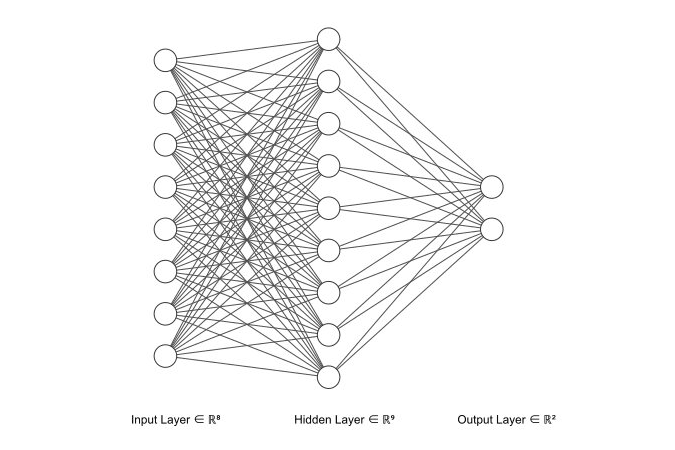
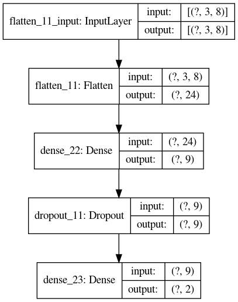
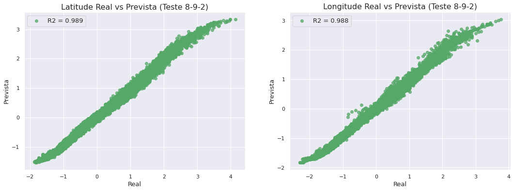
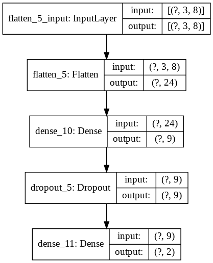
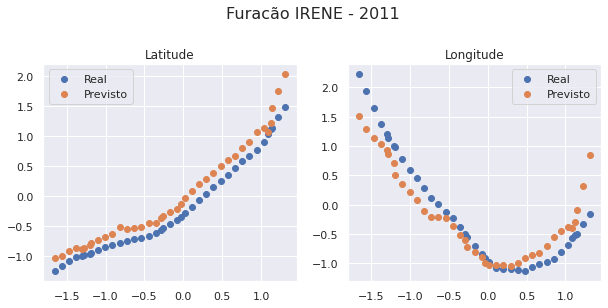
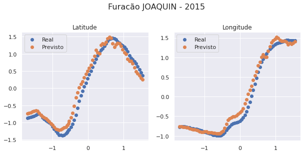
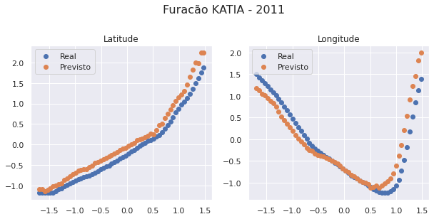

# Redes Neurais para Previsão de Trajetória

Além de todas as análises feitas, implementamos também uma rede neural que usa informações de um furacão de algumas horas atrás e do presente, e projeta a sua posição futura em coordenadas geográficas.


## Funcionamento da Predição

O input da rede é uma matriz do tipo:

$$\left[\begin{matrix}
x_1^{(t-2)} & x_2^{(t-2)} & ...& x_n^{(t-2)}\\
x_1^{(t-1)} & x_2^{(t-1)} & ...& x_n^{(t-1)}\\
x_1^{(t)} & x_2^{(t)} & ...& x_n^{(t)}\end{matrix}\right]$$

na qual:

- $x_1,~x_2, ~..., ~x_n$ representam os $n$ preditores usados. Testamos dois conjuntos de modelos, o primeiro com 4 preditores (Tempo, Latitude, Longitude e Velocidade de vento) e o segundo com 8 (anteriores mais Temperatura do mar, Umidade, Pressão e Nebulosidade). Fizemos uma comparação da função de perda entre eles para eleger o melhor conjunto de entrada, e usar 8 preditores apresentou melhores resultados.

- $x_i^{(k)}$ representa o preditor $i$ no registro de tempo $k$. Cada registro dos nossos dados está espaçado por 6 horas do próximo e do anterior. Sendo assim, pela matriz acima, usamos um conjunto de 3 registros sequenciais, que representam 18 horas.

Nossa saída é da forma:

O vetor $Y$ geral é composto por:

$[lat^{(t+1)},~ lon^{(t+1)}],$

que representa a latitude e longitude no registro $t+1$ ou seja, + horas depois do último ponto de treinamento.


### Treino, Validação e Teste

Para formatar os dados de treino, teste e validação, tivemos que fazer um tratamento diferenciado e manual, para que o treinamento e previsão ocorresse tempestade por tempestade e não misturasse dados.

Usamos uma divisão de 70% para treino, 20% para validação e 10% para teste. 
Para mais detalhes do processo veja o notebook [NN-TrackPrediction.ipynb](https://github.com/reneroliveira/Hurricane_Project/blob/master/Notebooks/NN-TrackPrediction.ipynb).


## Anatomia das redes e comparação dos modelos



Fizemos vários modelos com anatomias diferentes apesar de parecidas, elegemos o melhor através do MSE (Erros Médio Quadrático) nos dados de teste e validação.

A anatomia desse modelo campeão é a seguinte:

 - 8 variáveis de input (Tempo, Latitude, Longitude e Velocidade de vento, Temperatura do mar, Umidade, Pressão e Nebulosidade) para cada um dos registros passados. Como usamos 3 registros temos então **24 neurônios** de entrada. 

- 1 única camada interna com 9 neurônios e função de ativação sigmoidal.

- 2 neurônios para a camada de output, um para latitude e outro para longitude, com ativação linear.

- Camada de dropout de 15% para evitar overfitting.


<details>
<summary>Código</summary>
```python

model_892 = tf.keras.models.Sequential([
  tf.keras.layers.Flatten(input_shape=(3,8)),
  tf.keras.layers.Dense(9, activation='sigmoid'),
  tf.keras.layers.Dropout(0.15),
  tf.keras.layers.Dense(2, activation='linear')
])
```
</details>


    



  
## Performance 

```python
from sklearn.metrics import r2_score
ypred = model_892.predict(xtest2)

lat_r2 = r2_score(ytest2[:,0],ypred[:,0])
lon_r2 = r2_score(ytest2[:,1],ypred[:,1])
tot_r2 = r2_score(ytest2,ypred)

print(f"R2 Latitude Teste - {lat_r2}")
print(f"R2 Longitude Teste - {lon_r2}")
print(f"R2 Total Teste - {tot_r2}")

fig, (ax,ax1) = plt.subplots(1,2,figsize=(18,6))
ax.set_title("Latitude Real vs Prevista (Teste 8-9-2)",fontsize=16)
ax.set_xlabel("Real",fontsize = 13)
ax.set_ylabel("Prevista",fontsize = 13)
ax.scatter(ytest2[:,0],ypred[:,0],alpha = 0.75, color = 'g',label = f"R2 = {round(lat_r2,3)}")
ax.legend(loc='best', fontsize = 13)
ax1.set_title("Longitude Real vs Prevista (Teste 8-9-2)",fontsize=16)
ax1.set_xlabel("Real",fontsize = 13)
ax1.set_ylabel("Prevista",fontsize = 13)
ax1.scatter(ytest2[:,1],ypred[:,1],alpha = 0.75, color = 'g',label = f"R2 = {round(lon_r2,3)}")
ax1.legend(loc='best', fontsize = 13);
plt.savefig('../figs/lat_lon_teste.jpg')
```

    R2 Latitude Teste - 0.9890722375652974
    R2 Longitude Teste - 0.9879249013965508
    R2 Total Teste - 0.9884985694809241





Nos dados de teste, temos resultados muito bons! Abaixo vemos um esquema do modelo 8-9-2.


```python
tf.keras.utils.plot_model(
    model_892,
    to_file='../figs/model_892.png', 
    show_shapes=True, 
    show_layer_names=True,
    rankdir='TB',
    expand_nested=False,
    dpi=96
)
# plt.savefig('figs/model892.jpg')
```





## Previsões

Vamos testar a previsão para algumas tempestades específicas do conjunto de testes.


```python
splitted_data = split(data)
n = len(splitted_data)
test_storms = splitted_data[int(n*(0.9)):]
data_test = pd.concat(test_storms)
data_test.loc[:,'Hours'] = (data_test.loc[:,'Time_new']-pd.Timestamp(1951,1,1))/pd.Timedelta('1 hour')
data_test.head()
```


<div>
<style scoped>
    .dataframe tbody tr th:only-of-type {
        vertical-align: middle;
    }

    .dataframe tbody tr th {
        vertical-align: top;
    }

    .dataframe thead th {
        text-align: right;
    }
</style>
<table border="1" class="dataframe">
  <thead>
    <tr style="text-align: right;">
      <th></th>
      <th>ID</th>
      <th>Name</th>
      <th>Date</th>
      <th>Time</th>
      <th>Event</th>
      <th>Status</th>
      <th>Latitude</th>
      <th>Longitude</th>
      <th>Maximum Wind</th>
      <th>Minimum Pressure</th>
      <th>Date_c</th>
      <th>Year</th>
      <th>Month</th>
      <th>Day</th>
      <th>Latitude_c</th>
      <th>Longitude_c</th>
      <th>Duration</th>
      <th>sst</th>
      <th>rhum</th>
      <th>wspd</th>
      <th>slp</th>
      <th>cldc</th>
      <th>Time_new</th>
      <th>Hours</th>
    </tr>
  </thead>
  <tbody>
    <tr>
      <th>20259</th>
      <td>AL022011</td>
      <td>BRET</td>
      <td>2011-07-16</td>
      <td>600</td>
      <td>NaN</td>
      <td>LO</td>
      <td>30.7</td>
      <td>-79.7</td>
      <td>20</td>
      <td>1014</td>
      <td>2011-07-16</td>
      <td>2011</td>
      <td>7</td>
      <td>16</td>
      <td>30.7</td>
      <td>-79.7</td>
      <td>7</td>
      <td>29.212346</td>
      <td>81.503754</td>
      <td>81.503754</td>
      <td>1003.891696</td>
      <td>4.721866</td>
      <td>2011-07-16 06:00:00</td>
      <td>530670.0</td>
    </tr>
    <tr>
      <th>20260</th>
      <td>AL022011</td>
      <td>BRET</td>
      <td>2011-07-16</td>
      <td>1200</td>
      <td>NaN</td>
      <td>LO</td>
      <td>30.3</td>
      <td>-79.4</td>
      <td>20</td>
      <td>1014</td>
      <td>2011-07-16</td>
      <td>2011</td>
      <td>7</td>
      <td>16</td>
      <td>30.3</td>
      <td>-79.4</td>
      <td>7</td>
      <td>29.212489</td>
      <td>81.512076</td>
      <td>81.512076</td>
      <td>1003.897948</td>
      <td>4.720945</td>
      <td>2011-07-16 12:00:00</td>
      <td>530676.0</td>
    </tr>
    <tr>
      <th>20261</th>
      <td>AL022011</td>
      <td>BRET</td>
      <td>2011-07-16</td>
      <td>1800</td>
      <td>NaN</td>
      <td>LO</td>
      <td>29.8</td>
      <td>-79.1</td>
      <td>20</td>
      <td>1014</td>
      <td>2011-07-16</td>
      <td>2011</td>
      <td>7</td>
      <td>16</td>
      <td>29.8</td>
      <td>-79.1</td>
      <td>7</td>
      <td>29.141944</td>
      <td>82.018334</td>
      <td>82.018334</td>
      <td>1005.045524</td>
      <td>4.940012</td>
      <td>2011-07-16 18:00:00</td>
      <td>530682.0</td>
    </tr>
    <tr>
      <th>20262</th>
      <td>AL022011</td>
      <td>BRET</td>
      <td>2011-07-17</td>
      <td>0</td>
      <td>NaN</td>
      <td>LO</td>
      <td>29.3</td>
      <td>-78.8</td>
      <td>20</td>
      <td>1014</td>
      <td>2011-07-17</td>
      <td>2011</td>
      <td>7</td>
      <td>17</td>
      <td>29.3</td>
      <td>-78.8</td>
      <td>7</td>
      <td>28.998422</td>
      <td>82.957671</td>
      <td>82.957671</td>
      <td>1005.403854</td>
      <td>4.952418</td>
      <td>2011-07-17 00:00:00</td>
      <td>530688.0</td>
    </tr>
    <tr>
      <th>20263</th>
      <td>AL022011</td>
      <td>BRET</td>
      <td>2011-07-17</td>
      <td>600</td>
      <td>NaN</td>
      <td>LO</td>
      <td>28.8</td>
      <td>-78.5</td>
      <td>20</td>
      <td>1014</td>
      <td>2011-07-17</td>
      <td>2011</td>
      <td>7</td>
      <td>17</td>
      <td>28.8</td>
      <td>-78.5</td>
      <td>7</td>
      <td>28.999376</td>
      <td>82.953919</td>
      <td>82.953919</td>
      <td>1005.405851</td>
      <td>4.950652</td>
      <td>2011-07-17 06:00:00</td>
      <td>530694.0</td>
    </tr>
  </tbody>
</table>
</div>


```python
import warnings
warnings.simplefilter("ignore")
def predict(storm,model,shift=3,pred=1):
    storm = storm.set_index(np.arange(0,len(storm)))
    y_pred=[]
    for i in range(0,len(storm)-shift-1):
        x = []
        for j in range(i,i+shift):
            x.append(storm.loc[j,:])
#         if i == 0:
#             print(np.expand_dims(np.asarray(x), axis=0).shape)
#             print(np.expand_dims(np.asarray(x),axis=0)[0,0,0])
        y_pred.append(model.predict(np.expand_dims(np.asarray(x),axis=0)).ravel())
        del x
    return np.array(y_pred)
def predict_storm(ID):
    name = data_test[data_test.ID==ID].Name.iloc[0]
    year = data_test[data_test.ID==ID].Year.iloc[0]
    storm = data_test[data_test.ID==ID]
    storm.loc[:,cols2]=standard_scale(storm,cols2)
    st = storm.loc[:,cols2]
    st_pred = predict(st,model_892)
    st_plot = st.iloc[0:-4,:]
    
    fig,ax = plt.subplots(1,2,figsize=(10,4))
    fig.suptitle(f"Furacão {name} - {year}", fontsize=16,y=1.08)
    ax[0].set_title("Latitude")
    ax[1].set_title("Longitude")
    print(r2_score(st_plot.Latitude,st_pred[:,0]))
    print(r2_score(st_plot.Longitude,st_pred[:,1]))
    ax[0].scatter(st_plot.Hours,st_plot.Latitude,label = 'Real')
    ax[0].scatter(st_plot.Hours,st_pred[:,0],label = 'Previsto')
    ax[1].scatter(st_plot.Hours,st_plot.Longitude,label = 'Real')
    ax[1].scatter(st_plot.Hours,st_pred[:,1],label = 'Previsto')
    ax[0].legend(loc='best')
    ax[1].legend(loc='best')
    plt.savefig(f"../figs/NN-{name}.jpg")
```


```python
predict_storm('AL092011')
```

    0.912396866066715
    0.8587266243812284





```python
predict_storm('AL112015')
```

    0.9650855905600251
    0.9805961966628389





```python
# data_test[(data_test.Duration>7)&(data_test.Name!="IRENE")&(data_test.Name!="JOAQUIN")].sort_values(by='Maximum Wind',ascending=0)
```


```python
predict_storm('AL122011')
```

    0.9235033244762332
    0.8633440966820972




