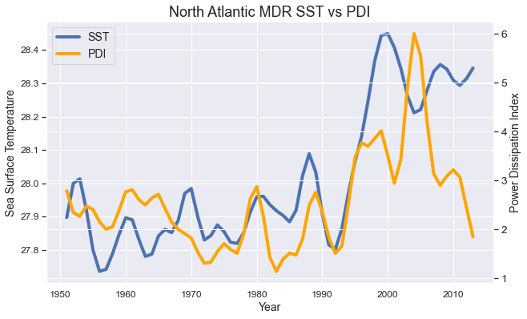
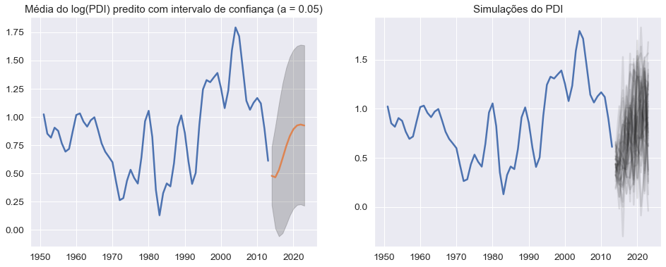

# Power Dissipation Index (PDI) Analysis

## Definitions 

PDI é um índice criado para medir a destrutividade de um furacão, levando em conta sua intensidade por meio de uma transformação velocidade máxima média, a sua duração e, caso estejamos medindo varios furacões, consideramos o número deles.

References: [Emanuel, 2005](ftp://texmex.mit.edu/pub/emanuel/PAPERS/NATURE03906.pdf) and [Emanuel, 2007](ftp://texmex.mit.edu/pub/emanuel/PAPERS/Factors.pdf)

Nas referências, Kerry Emanuel define o PDI como:

$$PDI\equiv\int_0^{\tau}V^3_{max}dt~,$$

onde $V_{max}$ é a velocidade tangencial máxima dos ventos do furacão e $\tau$ é o tempo de duração do furacão.


## The PDI Dataset

Vamos usar o PDI calculado pela [National Oceanic & Atmospheric Administration (NOAA)](https://www.noaa.gov) por meio do site [Our World in Data](https://ourworldindata.org/grapher/cyclone-power-dissipation-index). Esses dados cobrem todo o Atlântico Norte, o mar do Caribe e o Golfo do México. Esses dados passam por smooth de fazer média podendara de 5 observações próximas, filtro esse.

<details>
  <summary>Code</summary>
```python
fig,axs = plt.subplots(2,2, figsize=(15,9))
axs[0,0].set_title("Power Dissipation Index 1951 - 2013",fontsize = 18)
axs[0,0].set_ylabel("PDI",fontsize = 16)
axs[0,0].set_xlabel("Year",fontsize = 16)
axs[0,0].tick_params(axis='both', which='major', labelsize=12)
axs[0,0].tick_params(axis='both', which='minor', labelsize=12)
axs[0,0].plot(PDI.index, PDI.PDI, lw = 4);
axs[0,1].set_title("Logarithm of Power Dissipation Index 1951 - 2013",fontsize = 18)
axs[0,1].set_ylabel("log(PDI)",fontsize = 16)
axs[0,1].set_xlabel("Year",fontsize = 16)
axs[0,1].tick_params(axis='both', which='major', labelsize=12)
axs[0,1].tick_params(axis='both', which='minor', labelsize=12)
axs[0,1].plot(PDI.index, np.log(PDI.PDI),lw = 4)
sns.distplot(PDI.PDI, ax=axs[1,0])
sns.distplot(np.log(PDI.PDI), ax=axs[1,1])
```
</details>


## Analysing Correlation

   Uma hipótese comum diante das ideias cientificamente popularizadas é a de que as mudanças climáticas, ao provocarem aquecimento do mar, fazem com que os furacões fiquem mais intensos. De certo modo a intuição poderia falar nessa direção sabendo o processo de formação dos furacões; precisamos ver se essa ideia se mostra nos dados.
   
<details>
  <summary>Code</summary>
```python
# corr = mdr_annual.corr()
# corr.style.background_gradient(cmap='coolwarm')

# corr = df.corr()
# corr.style.background_gradient(cmap='coolwarm')
f,axs = plt.subplots(1,2,figsize=(14,5))
sns.set_context("notebook", font_scale=1.25, rc={"lines.linewidth": 2.5})
sns.heatmap(mdr_annual.corr().round(2),
    cmap='coolwarm',annot = True,annot_kws={"size": 13}, ax=axs[0]);

df = mdr_annual.copy()
df['PDI'] = np.log(df['PDI'])
df = df.rename(columns={"PDI":"logPDI"})
sns.set_context("notebook", font_scale=1.25, rc={"lines.linewidth": 2.5})
sns.heatmap(df.corr().round(2),
    cmap='coolwarm',annot = True,annot_kws={"size": 13}, ax=axs[1]);
plt.show()
```
</details>

Tanto o PDI quando o logPDI tiveram correlação de aproximadamente $0.64$.


<details>
  <summary>Code</summary>
```python
fig,ax = plt.subplots(figsize=(10,6))
plt.title("North Atlantic MDR SST vs PDI",fontsize = 18)

plt.xlabel("Year",fontsize = 14)

ax.tick_params(axis='both', which='major', labelsize=12)
ax.tick_params(axis='both', which='minor', labelsize=12)

ax2 = ax.twinx()
ax.plot(mdr_annual.sst,lw = 4,label = "SST");
ax.set_ylabel("Sea Surface Temperature",fontsize=14)

ax2.plot(mdr_annual.PDI,lw=4,label="PDI",color = 'orange');
ax2.set_ylabel("Power Dissipation Index",fontsize=14)

fig.legend(loc="upper left",fontsize=14,bbox_to_anchor=(0,1), bbox_transform=ax.transAxes);
```
</details>




## Modelos lineares

Quanto à trajetória do PDI, é observável uma leve tendência positiva tendo nos últimos 20 anos um comportamento bem irregular, o que pode ser explicado pela excepcionalidade da ENSO (El-Niño Southern Oscilation) nesse período.

<details>
  <summary>Code</summary>
```python
# Aparentemente o PDI cresceu:
X = mdr_annual.drop(columns="PDI") 
X = sm.add_constant(X)
Y = np.array(mdr_annual['PDI']).reshape(-1,1)
X['Year'] = np.array(X.index)
model = sm.OLS(Y, sm.add_constant(X['Year'])).fit()
plt.plot(PDI)
plt.plot(model.fittedvalues)
plt.title("Evolução do PDI com o tempo e a tendência de crescimento com uma reta")
```
</details>


Usando as covariáveis do dataset, podemos fazer um modelo onde achamos relação com a pressão ao nivel do mar (slp), a humidade (rhum) e a "cloudiness", ou nebulosidade (cldc).


<details>
  <summary>Code</summary>
  
```python
# X['sst'] = np.log(X['sst'])
(xtrain, xtest, ytrain, ytest)  = train_test_split(X.drop(columns=["sst", "wspd", "vwnd", "Year"]), np.log(Y))
model = sm.OLS(ytrain, xtrain).fit()
ypred = model.predict(xtest) 
print("R2 nos dados separados para teste:",r2_score(ytest,ypred))
print(model.summary())
```
</details>

    R2 nos dados separados para teste: 0.2268374488496503
                                OLS Regression Results                            
    ==============================================================================
    Dep. Variable:                      y   R-squared:                       0.781
    Model:                            OLS   Adj. R-squared:                  0.766
    Method:                 Least Squares   F-statistic:                     51.26
    Date:                Mon, 31 Aug 2020   Prob (F-statistic):           2.98e-14
    Time:                        10:22:52   Log-Likelihood:                 14.019
    No. Observations:                  47   AIC:                            -20.04
    Df Residuals:                      43   BIC:                            -12.64
    Df Model:                           3                                         
    Covariance Type:            nonrobust                                         
    ==============================================================================
                     coef    std err          t      P>|t|      [0.025      0.975]
    ------------------------------------------------------------------------------
    const       -484.2535    146.318     -3.310      0.002    -779.332    -189.175
    rhum           0.7547      0.079      9.497      0.000       0.594       0.915
    slp            0.4106      0.143      2.871      0.006       0.122       0.699
    cldc           1.9827      0.229      8.641      0.000       1.520       2.445
    ==============================================================================
    Omnibus:                        4.476   Durbin-Watson:                   2.046
    Prob(Omnibus):                  0.107   Jarque-Bera (JB):                3.413
    Skew:                          -0.468   Prob(JB):                        0.182
    Kurtosis:                       3.932   Cond. No.                     5.42e+06
    ==============================================================================


----

Pode parecer um pouco contraintuitivo a princípio não achar relação significativa da temperatura do mar e da intensidade (na verdade, a destrutibilidade, o PDI) dos furacões. Uma explicação plausivel para isso é que os dados de temperatura conseguem ser explicados pelas outras variáveis:

<details>
  <summary>Code</summary>

```python
model = sm.OLS(X['sst'], X.drop(columns=['vwnd','wspd', 'Year', 'sst'])).fit()
print(model.summary())
```
</details>

                                OLS Regression Results                            
    ==============================================================================
    Dep. Variable:                    sst   R-squared:                       0.749
    Model:                            OLS   Adj. R-squared:                  0.736
    Method:                 Least Squares   F-statistic:                     58.61
    Date:                Mon, 31 Aug 2020   Prob (F-statistic):           1.08e-17
    Time:                        10:22:52   Log-Likelihood:                 53.106
    No. Observations:                  63   AIC:                            -98.21
    Df Residuals:                      59   BIC:                            -89.64
    Df Model:                           3                                         
    Covariance Type:            nonrobust                                         
    ==============================================================================
                     coef    std err          t      P>|t|      [0.025      0.975]
    ------------------------------------------------------------------------------
    const       -177.9485     73.852     -2.410      0.019    -325.726     -30.171
    rhum           0.2643      0.040      6.528      0.000       0.183       0.345
    slp            0.1764      0.072      2.446      0.017       0.032       0.321
    cldc           1.3740      0.113     12.204      0.000       1.149       1.599
    ==============================================================================
    Omnibus:                        0.296   Durbin-Watson:                   0.473
    Prob(Omnibus):                  0.862   Jarque-Bera (JB):                0.479
    Skew:                          -0.023   Prob(JB):                        0.787
    Kurtosis:                       2.575   Cond. No.                     5.52e+06
    ==============================================================================

----

## Time series Analysis

 Não conseguimos modelar essas variações do PDI com o tempo muito bem com os modelos de regressão, embora ganhamos algum insight sobre como as outras variáveis climáticas estão relacionadas com ele. Sendo assim, agora vamos tratar a trajetória do PDI como uma série temporal; a relação dele com o tempo vai nos dar informação sobre se é esperado que ele cresça nos próximos anos. Inicialmente, vamos ajustar um modelo autorregressivo de ordem 2 sendo que essa ordem do modelo foi escolhida com critérios de informação:

<details>
  <summary>Code</summary>
```python
mod = sm.tsa.ARIMA(tsPDI, order=(2, 0, 0))
modfit = mod.fit()
# modfit.summary()
fig, axs = plt.subplots(1,2, figsize = (16,6))

# With CI:
axs[0].plot(tsPDI['PDI'])
# plt.plot(tsPDI['PDI'], axs = axs[0])
step = 10
forecast = modfit.forecast(step)
x = pd.date_range(dt.datetime(2013,1,1), freq="A", periods=step)
axs[0].plot(x, forecast[0])
axs[0].fill_between(x, forecast[2][:,0], forecast[2][:,1], 
                    color='k', alpha=.2)
#simulating some cenarios:
sims = np.zeros((500, step))
for i in range(500):
    sims[i] = np.random.normal(forecast[0], forecast[1])

axs[1].plot(tsPDI['PDI'])
for i in range(40):
    axs[1].plot(x, sims[i], color = "k", alpha=.1)

axs[0].set_title('Média das previsões com intervalo de confiança (a = 0.05)')
axs[1].set_title('Simulações do PDI')
plt.show()
```
</details>


Uma outra forma de modelar no tempo que facilita a análise do modelo é trabalhar com o log dessa série. Isso ajuda a diminuir o pico no crescimento da destrutibilidade e induz na escala original do PDI a não ter valores negativos, o que está de acordo com a definição do PDI.

<details>
  <summary>Code</summary>
```python
tsLogPDI = tsPDI.apply(np.log)
#sm.tsa.stattools.adfuller(tsLogPDI['PDI']) ainda não é estacionaria a 5% de significancia
mod2 = sm.tsa.ARIMA(tsLogPDI, order=(2, 0, 0))
modfit2 = mod2.fit()
# fig, axs = plt.subplots(2,2, figsize = (10,4))
# plot_acf(modfit2.resid, ax = axs[0, 0])
# plot_pacf(modfit2.resid, ax = axs[0, 1])
# sm.qqplot(modfit2.resid, dist=stats.norm, line="s", ax = axs[1, 0])
# sns.distplot(modfit2.resid, ax = axs[1, 1])
# plt.show()
fig, axs = plt.subplots(1,2, figsize = (16,6))

# With CI:
axs[0].plot(tsLogPDI['PDI'])
# plt.plot(tsPDI['PDI'], axs = axs[0])
step = 10
forecast = modfit2.forecast(step)
x = pd.date_range(dt.datetime(2013,1,1), freq="A", periods=step)
axs[0].plot(x, forecast[0])
axs[0].fill_between(x, forecast[2][:,0], forecast[2][:,1], 
                    color='k', alpha=.2)
#simulating some cenarios:
sims = np.zeros((500, step))
for i in range(500):
    sims[i] = np.random.normal(forecast[0], forecast[1])

axs[1].plot(tsLogPDI['PDI'])
for i in range(40):
    axs[1].plot(x, sims[i], color = "k", alpha=.1)

axs[0].set_title('Média do log(PDI) predito com intervalo de confiança (a = 0.05)')
axs[1].set_title('Simulações do PDI')
plt.show()
```
</details>




<details>
  <summary>Code</summary>
```python
fig, axs = plt.subplots(1,2, figsize = (16,6))

# With CI:
axs[0].plot(tsPDI['PDI'])
# plt.plot(tsPDI['PDI'], axs = axs[0])
step = 10
forecast = modfit2.forecast(step)
x = pd.date_range(dt.datetime(2013,1,1), freq="A", periods=step)

#simulating some cenarios:
sims = np.zeros((1000, step))
for i in range(1000):
    sims[i] = np.exp(np.random.normal(forecast[0], forecast[1]))
# computing some CIs:
CIs = np.zeros((step,3))
for i in range(step):
    CIs[i] = np.quantile(sims[:,i], [0.025, 0.5, 0.975])
axs[0].plot(x, CIs[:,1])
axs[0].fill_between(x, CIs[:,0], CIs[:,2], 
                    color='k', alpha=.2)

axs[1].plot(tsPDI['PDI'])
for i in range(30):
    axs[1].plot(x, sims[i], color = "k", alpha=.15) #teste de sanidade

axs[0].set_title('Média do PDI predito com intervalo de confiança (a = 0.05)')
axs[1].set_title('Simulações do PDI')
plt.show()
```
</details>


Além disso, conseguimos achar uma certa transformação nos dados que é estacionária; permitindo um bom ajuste do modelo ARIMA. Passando as predições para o espaço do PDI, temos as seguintes previsões:

<details>
  <summary>Code</summary>
```python
# plt.plot(np.log(np.diff(np.log(mdr_annual['PDI'])) + 1))
# sm.tsa.stattools.adfuller(np.log(np.diff(np.log(mdr_annual['PDI'])) + 1))
tsTr = np.log(np.diff(np.log(tsPDI['PDI']))+1)
# terceiro modelo: log(delta(log(PDI))+1) como ARMA(2,1)
mod3 = sm.tsa.ARIMA(tsTr, order=(2,0,1))
modfit3 = mod3.fit()
# modfit3.summary()
# fig, axs = plt.subplots(2,2, figsize = (10,4))
# plot_acf(modfit3.resid, ax = axs[0, 0])
# plot_pacf(modfit3.resid, ax = axs[0, 1])
# sm.qqplot(modfit3.resid, dist=stats.norm, line="s", ax = axs[1, 0])
# sns.distplot(modfit3.resid, ax = axs[1, 1])
# plt.show()
fig, axs = plt.subplots(1,2, figsize = (16,6))

# With CI:
axs[0].plot(tsTr)
# plt.plot(tsPDI['PDI'], axs = axs[0])
step = 10
forecast = modfit3.forecast(step)
x = range(len(tsTr), len(tsTr) + step)
axs[0].plot(x, forecast[0])
axs[0].fill_between(x, forecast[2][:,0], forecast[2][:,1], 
                    color='k', alpha=.2)
#simulating some cenarios:
sims = np.zeros((500, step))
for i in range(500):
    sims[i] = np.random.normal(forecast[0], forecast[1])

axs[1].plot(tsTr)
for i in range(40):
    axs[1].plot(x, sims[i], color = "k", alpha=.1) #teste de sanidade

axs[0].set_title('Média da transformação predita com intervalo de confiança (a = 0.05)')
axs[1].set_title('Simulações da transformação')
axs[0].plot(tsLogPDI['PDI'])
# plt.plot(tsPDI['PDI'], axs = axs[0])
step = 10
forecast = modfit3.forecast(step)
x = pd.date_range(dt.datetime(2013,1,1), freq="A", periods=step)

#simulating some cenarios:
dsims = np.zeros((1000, step))
for i in range(1000):
    dsims[i] = np.exp(np.random.normal(forecast[0], forecast[1])) - 1
last = tsLogPDI["PDI"].values[-1]
for i in range(len(dsims)):
    dsims[i] = last + np.cumsum(dsims[i])
# computing some CIs:
CIs = np.zeros((step,3))
for i in range(step):
    CIs[i] = np.quantile(dsims[:,i], [0.025, 0.5, 0.975])
axs[0].plot(x, CIs[:,1])
axs[0].fill_between(x, CIs[:,0], CIs[:,2], 
                    color='k', alpha=.2)

axs[1].plot(tsLogPDI['PDI'])
for i in range(50):
    axs[1].plot(x, dsims[i], color = "k", alpha=.1) #teste de sanidade
    
axs[0].set_title('Média do log(PDI) predito com intervalo de confiança (a = 0.05)')
axs[1].set_title('Simulações do log(PDI)')
plt.show()
fig, axs = plt.subplots(1,2, figsize = (16,6))

# With CI:
axs[0].plot(tsPDI['PDI'])
# plt.plot(tsPDI['PDI'], axs = axs[0])
step = 10
forecast = modfit3.forecast(step)
x = pd.date_range(dt.datetime(2013,1,1), freq="A", periods=step)

#simulating some cenarios:
dsims = np.zeros((1000, step))
for i in range(1000):
    dsims[i] = np.exp(np.random.normal(forecast[0], forecast[1])) - 1
last = tsLogPDI["PDI"].values[-1]
for i in range(len(dsims)):
    dsims[i] = np.exp(last + np.cumsum(dsims[i]))
# computing some CIs:
CIs = np.zeros((step,3))
for i in range(step):
    CIs[i] = np.quantile(dsims[:,i], [0.025, 0.5, 0.975])
axs[0].plot(x, CIs[:,1])
axs[0].fill_between(x, CIs[:,0], CIs[:,2], 
                    color='k', alpha=.2)

axs[1].plot(tsPDI['PDI'])
for i in range(40):
    axs[1].plot(x, dsims[i], color = "k", alpha=.1) #teste de sanidade

axs[0].set_title('Média do PDI predito com intervalo de confiança (a = 0.05)')
axs[1].set_title('Simulações do PDI')
plt.show()
```
</details>


Embora todos esses métodos tenham alguma razoabilidade, eles as previsões claramente tem uma variância muito grande, refletindo a dificuldade em prever esse dado dado que ele não tem nenhum padrão claro. 

----

## Count

  Medir destrutibilidade do furacão não é coisa trivial; não basta olhar o PDI visto que os nossos dados de PDI podem estar [errados](https://arxiv.org/abs/physics/0601050) por medições inconsistentes de velocidade até os anos 90, onde começamos a ter um comportamento anômalo do ENSO; além da dinâmica sazonal de correntes termosalínicas gerarem sazonalidade nas temperaturas entre decádas (Atlantic Multidecadal Oscilation, AMO). Outras alternativas comumente consideradas são a de contagem de furacões no ano e de tamanho de cada furacão; cada uma delas com seus problemas particulares. Abaixo, fazemos um modelo simples de GLM para contagem usando como preditores as covari
  
  
<details>
  <summary>Code</summary>
```python
data = pd.read_csv('../Datasets/data_atl_merged2.csv',parse_dates=['Date'])
data = data[['ID', 'Name', 'Date','Year', 'Time', 'Event', 'Status', 'Latitude',
       'Longitude', 'Maximum Wind', 'sst', 'rhum',
       'wspd', 'slp', 'cldc']]
def category(mw):
    if mw>=137:
        return "Category 5"
    elif mw>=113:
        return "Category 4"
    elif mw>=96:
        return "Category 3"
    elif mw>=83:
        return "Category 2"
    elif mw>=64:
        return "Category 1"
    elif mw>=34:
        return "Tropical Storm"
    else:
        return "Tropical Depression"
cat_id = data.groupby('ID')['Maximum Wind'].max().apply(category)
data.loc[:,'Category']=data.ID.apply(lambda x:cat_id[x])
# data.groupby('Category')['ID'].count().plot.bar();
major_df = data[data.Category.apply(lambda x: 0 if x[-1]=='m' else int(x[-1]))>=3]
#major_df.groupby('Year')['ID'].count().plot()
#sm.tsa.stattools.adfuller(count)
count = major_df.groupby("Year")["ID"].count()
X = pd.pivot_table(major_df, index="Year", values=["sst", "rhum", "wspd", "slp", "cldc"])
X['Y'] = X.index.values
countModel = sm.GLM(count, sm.add_constant(X), family=sm.families.NegativeBinomial())
countFit = countModel.fit()
print(countFit.summary()) #descomente para ver o sumario do ajuste
plt.plot(count)
plt.plot(countFit.predict(sm.add_constant(X)))
plt.show()
```
</details>

                     Generalized Linear Model Regression Results                  
    ==============================================================================
    Dep. Variable:                     ID   No. Observations:                   60
    Model:                            GLM   Df Residuals:                       54
    Model Family:        NegativeBinomial   Df Model:                            5
    Link Function:                    log   Scale:                          1.0000
    Method:                          IRLS   Log-Likelihood:                -347.61
    Date:                Mon, 31 Aug 2020   Deviance:                       26.626
    Time:                        10:22:58   Pearson chi2:                     26.3
    No. Iterations:                    12                                         
    Covariance Type:            nonrobust                                         
    ==============================================================================
                     coef    std err          z      P>|z|      [0.025      0.975]
    ------------------------------------------------------------------------------
    const       -146.2316    147.049     -0.994      0.320    -434.443     141.980
    cldc           0.1977      0.589      0.336      0.737      -0.956       1.351
    rhum           0.0182      0.067      0.271      0.786      -0.113       0.150
    slp            0.1338      0.142      0.940      0.347      -0.145       0.413
    sst            0.0952      0.132      0.723      0.470      -0.163       0.353
    wspd           0.0182      0.067      0.271      0.786      -0.113       0.150
    Y              0.0048      0.008      0.602      0.547      -0.011       0.020
    ==============================================================================


Olhando esse gráfico do ajuste e a tabela com as estatísticas do ajuste, vemos que o modelo da binomial negativa claramente não consegue capturar muitas informações relevantes que o número de furacões nos dá. Outra medida também comum de destrutividade dos furacões é o tamanho do raio, que não será analisado nesse trabalho.

